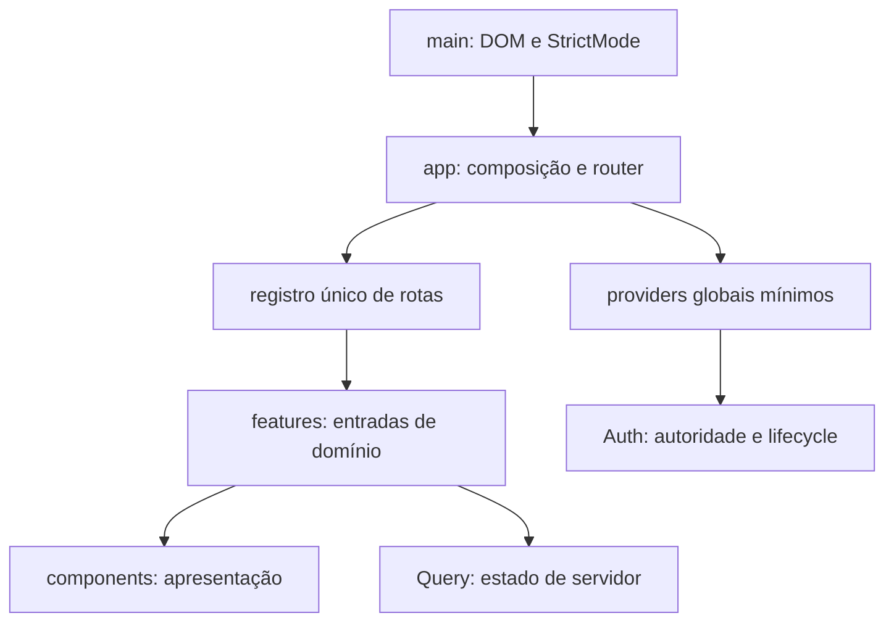

# Auditoria de auth, routing e composition root

Data: 27/09/2026, America/Sao_Paulo. Checkout de referência: `main`, commit `38e0e9c78d541529c5a4d502d2166596e71972f7`, após o merge do Header no PR #21. As evidências abaixo descrevem esse snapshot; a primeira implementação está registrada ao final.

## Conclusão e escopo

O frontend possui um scaffold de sessão testado, não uma integração real de autenticação. Há uma política explícita de páginas públicas, dados simulados no shell e nenhum cliente Supabase em `src` ou nas dependências. Portanto, a auditoria permite iniciar a reorganização do composition root, mas não comprova segurança de produção nem define por si só contratos de login, permissões ou MFA.

O objetivo é separar composição, apresentação, navegação e autoridade. A próxima migração deve respeitar a ordem do anexo: Header integrado; auditoria específica; estrutura base; depois Pages → Features. Os domínios de Clientes e Unidades não são migrados neste bloco.

## Perguntas e método

1. Quais responsabilidades atuais pertencem ao composition root, à apresentação e à futura feature Auth?
2. Quais contratos têm evidência comportamental e quais dependem de um backend ainda ausente?
3. Como preservar navegação, cache, cancelamento e recuperação durante a reorganização?
4. Quais decisões podem ser implementadas agora e quais requerem requisitos reais de autenticação?

Foi realizada leitura de todos os 23 arquivos de `src/app`, do bootstrap, dos consumidores relevantes e dos testes existentes de sessão, acesso, navegação e erros. A busca local utilizou `rg` para `SessionCommands`, `identityScoped`, `fresh-aal2`, `authenticationPath`, `returnTo`, `availability`, `supabase`, `createClient` e `onAuthStateChange`.

As fontes externas foram limitadas à documentação oficial de React, React Router, TanStack Query e Supabase. As páginas foram escolhidas por responsabilidade, não por exemplos de outro framework. A busca Supabase via MCP foi complementada pelas referências de API: a pesquisa ampla também retornou um tutorial Next.js, cujas convenções de SSR/cookies não foram aplicadas a esta SPA Vite.

O changelog Supabase foi consultado. As mudanças recentes sobre endpoints SAML em instalações próprias, templates de email e OAuth de plataforma não correspondem a integrações presentes neste checkout. A implantação futura deve refazer essa verificação para a versão e o projeto efetivamente escolhidos.

Não foram consultados projetos, usuários, tabelas, tokens, políticas RLS ou ambientes remotos Supabase. A ausência de integração neste repositório não é evidência sobre a segurança de um backend externo.

## Achados classificados

Os caminhos nesta tabela referem-se ao commit de referência. O [snapshot no GitHub](https://github.com/igornicoletti/rmc-estacionamento-layout/tree/38e0e9c78d541529c5a4d502d2166596e71972f7/src/app) permite verificar arquivos que forem movidos depois.

| ID | Classe | Evidência local | Implicação e decisão |
| --- | --- | --- | --- |
| A01 | Confirmado: scaffold | `session/session-commands.ts:21` retorna anônimo em get/refresh e resolve logout sem serviço externo; `session/session-provider.tsx:79` usa esse adaptador por padrão | Não descrever SessionCommands como contrato Supabase validado. Definir o adaptador real em uma etapa de Auth. |
| A02 | Confirmado: política pública | `config/app-config.ts:5` usa `authentication: "either"` em todas as 13 páginas; `/rmc` também aceita ambos os estados em `routing/routes.ts` | O acesso público é deliberado para o layout. Não tornar páginas privadas antes de existir o fluxo de entrada e o contrato de backend. |
| A03 | Confirmado: apresentação simulada | `shell/app-shell.tsx` recebe usuário e notificações de `shell/app-preview.ts`, mesmo quando uma sessão autenticada é injetada | Header e Sidebar não representam a identidade real. Remover esse preview na integração Auth e alimentar apresentação por contratos de domínio. |
| A04 | Confirmado: responsabilidade misturada | `config/app-config.ts` combina paths, acesso, disponibilidade, título e subtítulo; `config/app-copy.ts` combina marca, sidebar, ações e fallbacks | Criar registro de rotas único em `app/app-routes.ts`; distribuir conteúdo pelos consumidores e manter metadados globais mínimos separados. |
| A05 | Confirmado: disponibilidade inconsistente | Onze módulos `.layout.tsx` retornam `null`, incluindo páginas marcadas como `available` e `reserved`; `AppPageLayout` não é utilizado por esses onze módulos | `availability` não comprova entrega e nem garante fallback de módulo reservado. Retirar o campo do contrato final e representar explicitamente os estados de páginas. |
| A06 | Confirmado: nível local sem contrato real | `session/session-types.ts:3` e `routing/route-access.ts:35` incluem `fresh-aal2` como nível superior | A documentação Supabase consultada define `aal1`/`aal2`. Recência precisa de requisito e prova próprios; não converter automaticamente essa string em um nível do provedor. |
| A07 | Risco futuro: eventos de autenticação | Provider atual trabalha por comandos; não existe subscription para eventos do SDK | A integração real deve reconciliar sessão inicial, logout externo, renovação e atualização de usuário, além de remover a subscription na desmontagem. Não é uma falha demonstrada no modo atual, que não utiliza SDK. |
| A08 | Contrato útil, validado no scaffold | `session/session-provider.tsx:130` cancela/remove somente queries com `meta.identityScoped === true` e verifica operação atual antes de publicar estado | Preservar esses comportamentos ao redesenhar Auth; identificar cada query privada e também incluir identidade/abrangência nas keys quando necessário. A flag não é autorização. |
| A09 | Contrato útil, validado no scaffold | `routing/route-access.ts` nega políticas inválidas e hierarquia vazia; `route-access-boundary.tsx` preserva pathname/query/hash no redirect | Preservar negação por padrão e retorno de navegação. O modelo de capabilities, a rota de entrada e a validação de destinos precisam vir de requisitos reais. |
| A10 | Risco futuro: proteção de dados | O guard é um componente de renderização; não existem políticas de backend no checkout | O guard orienta UX. Loaders/serviços e RLS/backend precisam controlar dados. A execução paralela de loaders do Data Router não pode ser confundida com bloqueio por um componente pai. |
| A11 | Oportunidade: classificação de erro | `routing/route-error-boundary.tsx:50` usa o leitor genérico `readHttpStatus` em `useRouteError()` | Preferir `isRouteErrorResponse` para erros do router; tratar `Error`, Response bruta e valores arbitrários deliberadamente. O leitor atual não foi demonstrado como incorreto nos casos existentes. |
| A12 | Confirmado: boundary e apresentação acoplados | Fallbacks estão em `root/app-error-boundary`, `routing/route-error-boundary`, `session/session-boundary` e `layouts/app-root-layout`; conteúdo fica em `appCopy.feedback` | Separar apresentação em `components/fallback` e seleção por estado no responsável. Não criar um único fallback com conhecimento de sessão, queries e rotas. |
| A13 | Oportunidade: composition root | `root/app.tsx` compõe boundary/providers/router; `main.tsx:18` cria o Data Router; `root/query-client.ts` contém política técnica de cache/retry | Colocar App/providers/boundary diretamente em `app`, criação do router em `app-router.ts` e política Query em `lib/query/query-client.ts`. |

## Contrato de Auth a definir antes da integração

O adaptador futuro deve distinguir sessão ausente de falha de rede/serviço; tratar resultados obsoletos; observar mudanças de autoridade; fornecer operações de entrada/saída e explicitar a origem confiável das permissões. Context deve carregar somente identidade mínima, autoridade e lifecycle transversal. Perfil completo, notificações e registros de negócio pertencem às suas features e queries.

`getSession` fornece a sessão mantida pelo SDK; isso não equivale, sozinho, a validar identidade ou autorizar dados. `getClaims`/`getUser` têm finalidades distintas, e a decisão de usá-los deve acompanhar os requisitos de confirmação e atualização de identidade. A integração deve separar o estado de UX da validação de acesso no serviço. Fontes: [getSession](https://supabase.com/docs/reference/javascript/auth-getsession), [getClaims](https://supabase.com/docs/reference/javascript/auth-getclaims), [tutorial oficial React](https://supabase.com/docs/guides/getting-started/tutorials/with-react).

Eventos de autenticação precisam ser idempotentes e reconciliados com comandos pendentes. A subscription deve ser encerrada ao desmontar; novos eventos não podem restaurar autoridade ou cache de uma operação já substituída. Fonte: [onAuthStateChange](https://supabase.com/docs/reference/javascript/auth-onauthstatechange).

O botão Sair precisa de escopo definido: Supabase utiliza logout global por padrão, enquanto logout apenas da sessão atual exige `scope: "local"`. Revogar refresh tokens não invalida retroativamente o access token já emitido. Isso é uma decisão futura do produto/backend; o comando local atual não a resolve. Fonte: [signOut](https://supabase.com/docs/reference/javascript/auth-signout).

Permissões não devem vir de metadata editável pelo usuário. Claims administradas pelo backend também podem ficar desatualizadas até a renovação do JWT. O backend deve definir ownership, abrangência de unidades, capabilities e enforcement, sem depender de Sidebar, Header ou guard. Fonte: [RLS e metadata](https://supabase.com/docs/guides/database/postgres/row-level-security).

MFA fornece `aal1`/`aal2`; uma eventual exigência de autenticação recente deve ter regra própria e enforcement no backend. Não reutilizar a ordenação local `fresh-aal2` por conveniência. Fonte: [MFA](https://supabase.com/docs/guides/auth/auth-mfa).

Perfil aplicativo deve ser consultado como dado de domínio em tabela própria com privilégios e RLS adequados; o schema Auth não é exposto pela Data API. O nome de exibição não é prova de permissão. Fonte: [gerenciamento de usuários](https://supabase.com/docs/guides/auth/managing-user-data).

## Fronteiras de fallbacks

| Estado | Responsável pela decisão | Apresentação e recuperação |
| --- | --- | --- |
| Falha de renderização da aplicação | Error Boundary global | Página de falha com mensagem pública; recarregar. |
| Erro de loader/action/lazy | Error Boundary do router | Classificar erro; 403/404 ou erro inesperado. Recuperação compatível com o erro. |
| Rota inexistente | Registro de rotas | 404 fora do shell, preservando o comportamento atual. |
| Acesso negado | Política de navegação/autoridade | 403 ou fluxo de entrada quando houver destino definido. |
| Sessão inicial em confirmação | Lifecycle Auth | Estado ocupado anunciado; impedir apresentação dependente de identidade. |
| Autoridade indisponível | Lifecycle Auth | Erro de confirmação, retry sem duplicação. Não representar como logout. |
| Navegação pendente | Router | Feedback de navegação; não substituir por sessão em bootstrap. |
| Query inicial/erro/atualização | Feature e TanStack Query | Loading, erro com retry ou atualização local, preservando dados quando aplicável. |
| Query vazia | Feature | Empty por domínio, distinguindo ausência de registros de filtros sem resultados. |
| Módulo não implementado | Entrada de domínio | Fallback explícito local, sem campo de disponibilidade no layout visual. |

Error Boundary React e Error Boundary de rota atendem falhas diferentes e podem coexistir. O boundary global continua com `getDerivedStateFromError`/`componentDidCatch`; o de rota utiliza as APIs do router. Fontes: [React Component](https://react.dev/reference/react/Component#catching-rendering-errors-with-an-error-boundary), [isRouteErrorResponse](https://reactrouter.com/api/utils/isRouteErrorResponse).

## Direção estrutural e ordem de execução



O registro único deve concentrar IDs, paths, builders e metadados técnicos realmente necessários. Título/subtítulo de tela pertencem ao domínio. React Router permite `handle` com `useMatches`; essa API permanece, com contrato menor. Router deve ser criado uma vez fora da árvore React. Fontes: [useMatches](https://reactrouter.com/api/hooks/useMatches), [createBrowserRouter](https://reactrouter.com/api/data-routers/createBrowserRouter), [Route Object](https://reactrouter.com/start/data/route-object).

| Bloco | Entrega | Dependência | Estimativa inicial |
| --- | --- | --- | --- |
| 1 | App/providers/boundary no topo de app; router fora de main; Query em lib/query | Auditoria específica concluída | 2–4 h |
| 2 | Apresentação de fallback e layout compartilhado fora de app; conteúdo distribuído | Matriz de estados acima | 4–6 h |
| 3 | Registro único de rotas e metadados separados de conteúdo/availability; absorção de AppLayout | Preservar IDs, paths, lazy, títulos e 404 | 4–8 h |
| 4 | Contrato real de Auth, adaptador, eventos, escopo de logout, MFA e acesso por rota | Requisitos do produto e backend comprovados | Reestimar após definição do contrato |
| 5 | Conclusão da remoção de config/root/layouts e reorganização do shell | Blocos 2–4 | 3–6 h |

Essas estimativas são de planejamento, não tempo já executado. Clientes/Unidades → Features permanece uma branch posterior. A existência de uma pasta Auth não autoriza inventar nomes de capabilities, políticas RLS, fluxo de recuperação ou requisitos de MFA.

A limpeza seletiva do cache e o consumo de AbortSignal devem acompanhar queries privadas reais. Cancelar uma operação de UI não prova cancelamento da requisição de um SDK; resultados obsoletos também precisam ser descartados. Fontes: [Query cancellation](https://tanstack.com/query/latest/docs/framework/react/guides/query-cancellation) e comportamento local do provider.

## Validação e limitações

Antes de iniciar a reorganização, no commit de referência:

```powershell
node node_modules/vitest/vitest.mjs run tests/unit/app/session-provider.test.tsx tests/unit/app/route-access-policy.test.ts tests/integration/route-access-boundary.test.tsx tests/unit/app/session-fallbacks.test.tsx tests/unit/app/query-provider.test.ts tests/unit/app/app-error-boundary.test.tsx tests/integration/app-routing.test.tsx --maxWorkers=1 --pool=threads --reporter=verbose
```

Resultado: 7 arquivos, 48 testes aprovados, exit 0. Cobrem cancelamento, operações obsoletas, mudança de autoridade, limpeza seletiva, preservação em falhas, política de acesso, redirect com query/hash, fallback de sessão, boundary global, retry e navegação. Não cobrem Supabase, RLS, MFA real, OAuth, múltiplas abas ou login de produção.

O PR #21 foi validado localmente com lint, tipos, build, knip, 25 testes focados e 13 E2E Chromium antes do commit. O Actions da execução `36370793998` não iniciou nenhum step devido a bloqueio de faturamento da conta. CI hospedada não está verde.

## Primeiro bloco iniciado em refactor/app-architecture

Após a auditoria e com main limpa/sincronizada, a branch parte do commit de referência. App, AppProviders e AppErrorBoundary passam diretamente para `src/app`; a política de Query passa para `src/lib/query/query-client.ts`. `app/app-router.ts` cria o singleton do Data Router fora da árvore React, e main apenas o injeta no App ao montar o React.

Os testes continuam podendo injetar um router de memória e um QueryClient próprios. Os imports são atualizados sem arquivos de compatibilidade nos caminhos antigos. A definição das rotas e `root/app-layout.tsx` permanecem para o bloco de registro/metadata; a remoção completa de root ainda não está concluída.

As decisões de Auth continuam transitórias e identificadas como scaffold. O primeiro bloco não instala Supabase nem altera a política pública das rotas. Isso permite verificar a mudança de composição sem apresentá-la como integração de segurança.

A exceção de ESLint para permitir somente `Toaster` em AppProviders acompanha o novo caminho do arquivo; a restrição geral de importação do toast nativo continua ativa.

Validação do primeiro bloco: lint, tipos/build, knip e `git diff --check` aprovados; 59 testes focados em 10 arquivos aprovados; E2E Chromium 13/13 aprovado. Todos finalizaram com exit 0. A suíte unitária completa, cobertura, Firefox e WebKit não foram repetidos neste bloco.

## Reconstrução estrutural — bloco seguinte

Implementação sobre `91efa8c`, mantendo o diagnóstico anterior vinculado ao SHA de referência:

- `app/config`, `app/root`, `app/layouts`, `app/routing`, `app/session` e `app/shell` deixam de existir. App contém composição, registro único e metadata técnica.
- `app-routes.ts` concentra os paths/IDs, inclusive preview e detalhe, com builder que codifica o ID. Títulos/subtítulos de Clientes e Unidades pertencem ao domínio; labels de navegação pertencem ao Sidebar. `availability` é removido. Os 11 módulos vazios continuam vazios.
- `LayoutPage` recebe conteúdo e children sem fallback implícito; `LayoutShell` recebe navegação, identidade de apresentação, callbacks e destinos. Ambos ignoram os contratos de sessão.
- Os boundaries globais, de rota e de Auth continuam separados. Os componentes de fallback apenas apresentam o estado recebido. O de rota utiliza `isRouteErrorResponse`; Response bruta preserva classificação por status, enquanto Error/valores arbitrários recebem falha inesperada sem exposição de detalhes.
- A criação do router continua fora de React. O outlet/título antes chamados AppLayout são absorvidos na composição da rota raiz.
- O scaffold de Auth muda de localização e nomes de componentes para `features/auth/auth-*`; o comportamento de sessão, cancelamento, autoridade, cache e guard é preservado. Essa movimentação não valida SessionCommands, capabilities ou fresh-aal2 como contratos finais.
- O runtime de demonstração atual é explícito: a árvore monta `MockShellRoute` de `src/mocks`, que alimenta a apresentação com fixtures e simula notificações. Não foi introduzido um seletor de ambiente. O módulo mock deve desaparecer quando a integração real alimentar o shell.

Decisão do usuário nesta etapa: Auth real seguirá as definições de
`igornicoletti/rmc-estacionamento`, mas sua implementação é extensa e fica para
depois de auditoria específica desse projeto. Nenhum SDK, login, MFA, RLS ou
política real foi implementado neste bloco. Pages → Features permanece na branch
posterior, conforme a sequência da auditoria estrutural.

Validação da reconstrução: lint, tipos/build, Knip e diff check aprovados; suíte completa Vitest serial com 44 arquivos/161 testes aprovada; Chromium 13/13 aprovado. O teste ajustado de erros de rota foi repetido: 6/6 aprovado. Todos os comandos terminaram com exit 0. Cobertura, Firefox e WebKit não foram executados neste bloco.
