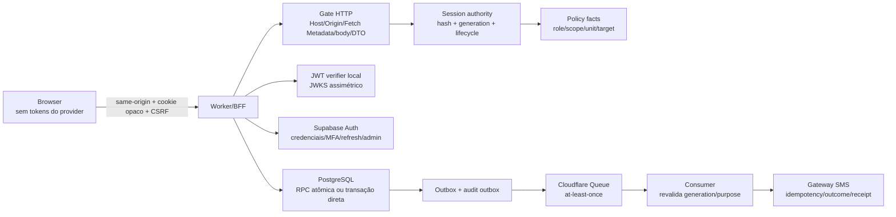
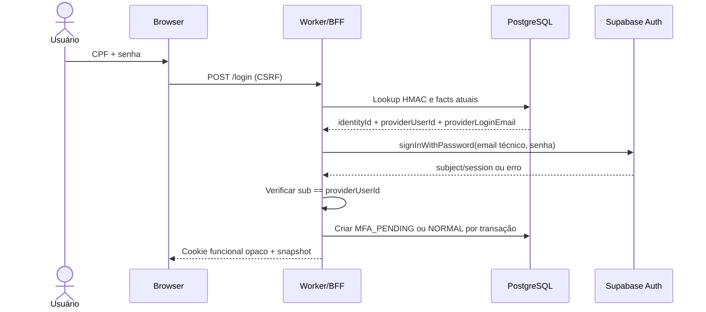
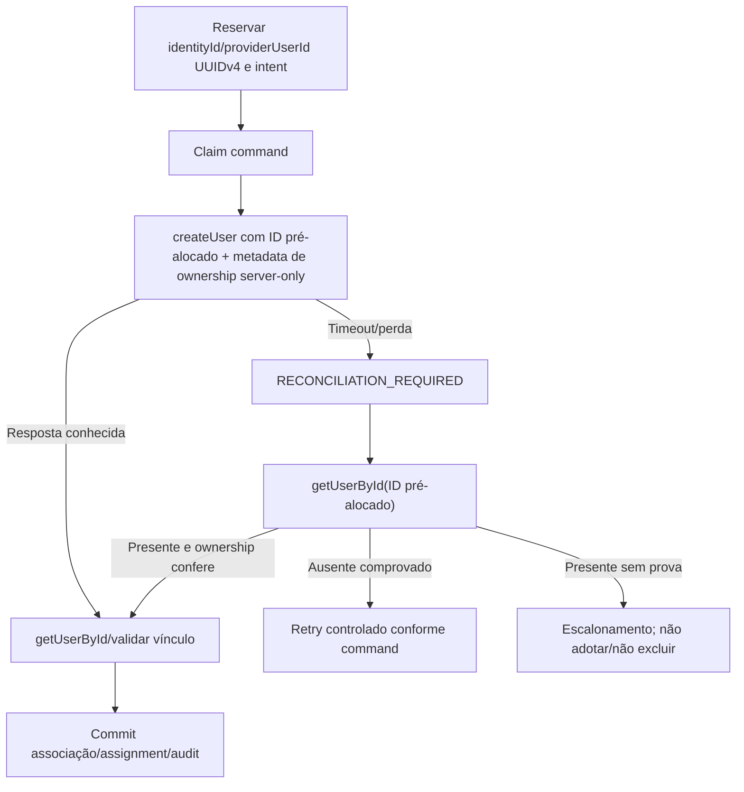

# Dossiê de auditoria crítica — contrato canônico de autenticação, sessão, autorização e acesso

## rmc-estacionamento-layout — revisão dupla contra documentação oficial

**Versão do dossiê:** 2.0  
**Data da revisão final:** 01/10/2026  
**Documento auditado:** `Contrato canônico de autenticação — rmc-estacionamento-layout — v1.0(4).md`  
**SHA-256 do documento auditado:** `74d7abc89647f2ad668c933c89821ee1d08c451a08c80e194909afb05afda148`  
**Extensão da fonte auditada:** 1.666 linhas; 16.877 palavras; 30 capítulos; 62 URLs HTTPS distintas; 11 blocos Mermaid.  
**Natureza desta entrega:** auditoria documental, arquitetural, de segurança, desempenho e verificabilidade.  
**Não realizado:** modificação do repositório, inspeção do código implementado, execução de migrations, testes do Worker, deploy, teste de SMS físico, acesso a secrets ou validação do ambiente hospedado.

---

## 1. Veredito executivo

### 1.1 Decisão

**NO-GO condicional para liberar os fluxos de autenticação abrangidos pelo contrato.**

Essa decisão **não afirma que uma implementação não inspecionada esteja vulnerável**. Afirma algo mais preciso: o contrato é forte, acima da média e cobre corretamente grande parte das ameaças relevantes, porém ainda contém lacunas de integração e ambiguidades normativas capazes de produzir uma implementação insegura, inconsistente ou excessivamente indisponível mesmo quando o implementador acredita estar obedecendo ao documento.

O próprio contrato declara que é uma especificação normativa, não certificação de implementação ou de segurança. Esta auditoria preserva esse limite. A liberação somente pode ocorrer depois que os bloqueios P0 deste dossiê forem incorporados ao contrato, implementados e comprovados nos ambientes local e target.

### 1.2 Síntese do resultado

A primeira revisão encontrou problemas de compatibilidade, fronteiras não fechadas e requisitos sem mecanismo executável. A segunda revisão foi realizada de forma adversarial: cada achado foi reaberto, confrontado novamente com fontes oficiais e tentado contra alternativas suportadas.

A segunda revisão:

1. **manteve** o bloqueio sobre a identidade técnica usada para login no Supabase;
2. **corrigiu** a interpretação de “usuário sem senha”: a implementação atual do Supabase Auth gera uma senha aleatória interna quando a Admin API não recebe senha nem hash;
3. **refinou** a reconciliação de provisionamento: é viável pré-alocar um UUID v4 e reconciliar por `getUserById`, desde que a versão escolhida suporte o campo administrativo `id` e haja prova de ownership;
4. **manteve, mas tornou tecnologicamente neutro**, o bloqueio de atomicidade: cada comando crítico pode usar uma RPC PostgreSQL estreita ou uma transação PostgreSQL direta; o proibido é prometer atomicidade sobre chamadas Data API independentes;
5. **corrigiu** o limite de senha: no código oficial atual, `len(password)` mede bytes UTF-8, embora a mensagem fale em caracteres;
6. **refinou** o step-up: `aal` e AMR verificados podem provar autenticação multifator, mas não substituem uma autorização transacional local, de uso único e vinculada à intenção;
7. **manteve** a recomendação de verificação local de JWT com chaves assimétricas, removendo `getUser()` do caminho crítico de toda requisição comum;
8. **manteve** o bloqueio da entrega por SMS: Cloudflare Queues é pelo menos uma vez; exatamente uma entrega depende de idempotência e consulta de resultado no gateway;
9. **adicionou** controles que o contrato não fecha: matriz de coexistência de cookies, bootstrap atômico, Host/upstream allowlist, formato de envelope cifrado, supply chain e recuperação de backup;
10. **confirmou** um defeito objetivo de controle de qualidade no capítulo 30: o documento declara 157 requisitos identificados, mas contém 160 IDs únicos.

### 1.3 O que já está tecnicamente correto

O contrato acerta ao:

- manter tokens do provedor fora do browser e usar sessão funcional opaca;
- distinguir `anonymous`, autoridade restrita, `NORMAL` e indisponibilidade;
- negar por padrão e reavaliar autorização no servidor;
- separar lifecycle, onboarding, role e assignment;
- impedir que AAL, role, scope ou upstream sejam escolhidos pelo cliente;
- usar synchronizer token, origem canônica e Fetch Metadata em mutations;
- tratar respostas perdidas como resultado indeterminado, não como sucesso ou falha presumidos;
- usar ledger, outbox, geração, CAS, reconciliação e compensação;
- reconhecer entrega pelo menos uma vez e exigir idempotência externa;
- proteger count, facets, export e paginação pelo dataset autorizado;
- distinguir cache de dados, estado de sessão e autorização;
- exigir decoders de runtime, limites de body durante leitura e erros sanitizados;
- não confundir RLS com contenção de `service_role`/`BYPASSRLS`;
- testar concorrência, TOCTOU, respostas tardias, falhas parciais e estado hospedado;
- recusar `PASS` sem SHA, ambiente, procedimento e resultado reproduzível.

Esses fundamentos devem ser preservados. A correção não é simplificar a arquitetura retirando garantias; é fechar os pontos onde as garantias ainda não têm mecanismo comprovável.

---

## 2. Escopo, limites e vocabulário da auditoria

### 2.1 Escopo efetivamente auditado

Foram revisados, do início ao fim:

- governança e precedência documental;
- baseline tecnológica;
- modelo de ameaça e invariantes;
- identidade, CPF, telefone, Units, lifecycle e provisioning;
- autoridades `PREAUTH`, `MFA_PENDING`, `BOOTSTRAP`, `RECOVERY` e `NORMAL`;
- parâmetros, cookies, CSRF, bootstrap e transporte HTTP;
- ativação, login, MFA, step-up, senha e recovery;
- sessão, refresh, inatividade, múltiplas abas e logout;
- autorização, escopo, hierarquia, TOCTOU e dados sensíveis;
- React Router Data Mode, loaders/actions, lazy e redirects;
- TanStack Query, cancelamento, epoch e limpeza;
- UI, acessibilidade, errors e boundaries;
- contrato de endpoints e Problem Details;
- PostgreSQL, RLS, grants, RPC, transações, outbox e ledger;
- Cloudflare Workers, Queues, DLQ, jobs e deployment;
- rate limit, anti-enumeração, SLO e capacidade;
- auditoria, observabilidade, runbooks, fases, testes e Definition of Done;
- organização recomendada, rastreabilidade, fontes e controle de qualidade.

### 2.2 O que não pode ser concluído sem código e ambiente

Esta auditoria não pode certificar:

- que a implementação atual corresponde ao contrato;
- que migrations e grants reais são seguros;
- que cookies e headers são emitidos corretamente;
- que o provider hospedado está configurado como descrito;
- que o SMS chega, é deduplicado ou fornece receipt confiável;
- que o Worker limita bodies comprimidos/chunked;
- que o bundle não contém secrets, mocks ou flags de preview;
- que SLOs e critérios anti-enumeração são atingidos;
- que jobs, DLQ, alertas, restore e rotação funcionam;
- que F00, F01 ou qualquer outra fase está concluída.

Consequentemente, expressões como “confirmado”, “falha” e “correção” neste dossiê se referem ao **contrato e à sua implementabilidade**, salvo quando uma evidência externa oficial é citada.

### 2.3 Classificação usada

| Marcador | Significado |
|---|---|
| **CONFIRMADO** | O texto e a fonte oficial são compatíveis, ou o defeito é observável no próprio artefato. |
| **CONTRADIÇÃO** | Duas regras do contrato, ou o contrato e a plataforma escolhida, não podem ser verdade simultaneamente sem uma decisão adicional. |
| **LACUNA DE PROVA** | A arquitetura pode ser válida, mas falta evidência no ambiente/versionamento real. |
| **CORREÇÃO NORMATIVA** | Texto que precisa entrar no contrato para eliminar interpretação insegura. |
| **RECOMENDAÇÃO** | Hardening ou otimização relevante, mas dependente de decisão de risco/custo. |
| **P0** | Bloqueia a fase ou release afetado. |
| **P1** | Alto risco; deve ser corrigido antes de produção, salvo aceitação formal e compensação. |
| **P2** | Melhoria mensurável de desempenho, operação ou manutenção. |

---

## 3. Método: duas revisões independentes

### 3.1 Primeira revisão — rastreabilidade e implementabilidade

A primeira passagem seguiu a ordem dos 30 capítulos e produziu:

- inventário de decisões, invariantes, requisitos e testes;
- confronto entre cada afirmação dependente de tecnologia e a documentação oficial;
- identificação de requisitos sem dono, transporte, armazenamento, transação ou prova;
- análise de consistência entre fluxos;
- análise de disponibilidade e desempenho induzidos pelas garantias;
- classificação P0/P1/P2.

### 3.2 Segunda revisão — red team documental

Antes de autorizar esta entrega, todos os P0 e os achados que dependiam de comportamento externo foram reabertos. A segunda passagem procurou ativamente derrubar as conclusões da primeira, com as perguntas:

1. Existe API oficial que torne o bloqueio falso?
2. O comportamento atribuído à plataforma é documentação contratual, implementação atual ou mera inferência?
3. A solução proposta preserva segurança após timeout, retry, duplicidade e concorrência?
4. Uma regra de segurança cria indisponibilidade desnecessária?
5. O controle funciona no Worker e no modo de conexão realmente recomendado?
6. O mesmo fato é verdadeiro na Admin API, no login, no refresh e nos caminhos de recovery?
7. Um estado externo pode ser reconciliado sem varredura, adoção de conta alheia ou repetição cega?
8. A evidência é pinada à versão que será implantada?
9. O requisito tem teste negativo reproduzível?
10. A correção cria nova fonte de verdade concorrente?

### 3.3 Alterações produzidas pela segunda revisão

| Tema | Conclusão inicial | Conclusão final após nova consulta |
|---|---|---|
| Reconciliação de `createUser` | Possível bloqueio por ausência de lookup seguro | Pré-alocar UUID v4 é suportado pelo código oficial atual; reconciliar por ID é viável, condicionado ao adapter/versionamento e ownership verificável. |
| Conta “sem senha” | Criar sem password poderia significar ausência de credencial | O código atual gera senha aleatória de 64 caracteres; corrigir a linguagem para “sem senha temporária conhecida, distribuída ou utilizável pelo fluxo funcional”. |
| Limite de senha | 72 caracteres | O código atual usa `len(string)` em Go: limite de bytes UTF-8, apesar da mensagem dizer caracteres. |
| Step-up | `aal2` não informa recência | `aal`/AMR verificados podem fornecer evidência temporal da autenticação, mas não autorizam por si uma intenção específica nem substituem consumo local one-time. |
| Banco | Exigir conexão PostgreSQL direta | RPC estreita e atômica também é válida. A exigência é uma fronteira transacional real, não uma tecnologia única. |
| Validação de sessão | `getUser()` em toda requisição como segurança máxima | Chave assimétrica + JWKS permite verificação local; a revogação imediata deve vir da sessão funcional/fence local. `getUser()` contínuo aumenta latência e blast radius. |
| MFA | Tratar múltiplos fatores apenas no login | A política de cardinalidade precisa ser aplicada antes e depois de enrollment/verify, serializando a jornada. |
| Queue | Ledger local poderia impedir duplicidade | Cloudflare é at-least-once; somente idempotência/consulta do gateway fecha o resultado externo. |

---

## 4. Fontes primárias que mudam decisões arquiteturais

As conclusões mais importantes foram confrontadas com:

- [Supabase Admin createUser](https://supabase.com/docs/reference/javascript/auth-admin-createuser)
- [Supabase signInWithPassword](https://supabase.com/docs/reference/javascript/auth-signinwithpassword)
- [Supabase getUserById](https://supabase.com/docs/reference/javascript/auth-admin-getuserbyid)
- [Supabase Auth `admin.go`](https://github.com/supabase/auth/blob/master/internal/api/admin.go)
- [Supabase Auth `password.go`](https://github.com/supabase/auth/blob/master/internal/api/password.go)
- [Supabase JWT signing keys](https://supabase.com/docs/guides/auth/signing-keys)
- [Supabase getClaims](https://supabase.com/docs/reference/javascript/auth-getclaims)
- [Supabase getUser](https://supabase.com/docs/reference/javascript/auth-getuser)
- [Supabase MFA](https://supabase.com/docs/guides/auth/auth-mfa)
- [Supabase password security](https://supabase.com/docs/guides/auth/password-security)
- [Supabase database connections](https://supabase.com/docs/guides/database/connecting-to-postgres)
- [React Router middleware](https://reactrouter.com/how-to/middleware)
- [React Router data strategy](https://reactrouter.com/how-to/data-strategy)
- [Cloudflare Queues delivery guarantees](https://developers.cloudflare.com/queues/reference/delivery-guarantees/)
- [Cloudflare Queues DLQ](https://developers.cloudflare.com/queues/configuration/dead-letter-queues/)
- [Cloudflare Queues batching/retries](https://developers.cloudflare.com/queues/configuration/batching-retries/)
- [NIST SP 800-63B-4](https://pages.nist.gov/800-63-4/sp800-63b.html)
- [OWASP Transaction Authorization](https://cheatsheetseries.owasp.org/cheatsheets/Transaction_Authorization_Cheat_Sheet.html)
- [OWASP CSRF Prevention](https://cheatsheetseries.owasp.org/cheatsheets/Cross-Site_Request_Forgery_Prevention_Cheat_Sheet.html)
- [OWASP Authorization](https://cheatsheetseries.owasp.org/cheatsheets/Authorization_Cheat_Sheet.html)
- [PostgreSQL Row Security](https://www.postgresql.org/docs/17/ddl-rowsecurity.html)
- [PostgreSQL CREATE FUNCTION](https://www.postgresql.org/docs/17/sql-createfunction.html)
- [PostgreSQL Explicit Locking](https://www.postgresql.org/docs/17/explicit-locking.html)
- [RFC 9457 — Problem Details](https://www.rfc-editor.org/rfc/rfc9457)
- [RFC 9110 — HTTP Semantics](https://www.rfc-editor.org/rfc/rfc9110)
- [RFC 9111 — HTTP Caching](https://www.rfc-editor.org/rfc/rfc9111)

Fontes evergreen foram usadas para direção arquitetural; comportamento interno foi tratado como evidência da versão/commit consultado, nunca como garantia eterna. O contrato corrigido deve registrar versão, commit ou release da plataforma usada no gate.

## 5. Matriz consolidada de riscos e prioridades

### 5.1 Critério de severidade

- **P0 — bloqueador:** a implementação pode conceder autoridade indevida, perder a capacidade de revogação, duplicar identidade ou efeito externo, expor segredo, declarar atomicidade inexistente ou liberar um fluxo cuja propriedade essencial ainda não foi provada.
- **P1 — alto:** não implica necessariamente comprometimento imediato, mas pode produzir enumeração, comportamento HTTP incorreto, indisponibilidade amplificada, falha operacional sem recuperação ou evidência insuficiente.
- **P2 — melhoria obrigatória antes de escala:** otimização ou hardening que precisa de métrica e aceite, sem criar uma nova autoridade ou atalho de segurança.
- **P3 — documental/manutenibilidade:** inconsistência ou lacuna de governança que não deve ser confundida com vulnerabilidade explorável, mas compromete rastreabilidade e revisão.

### 5.2 Bloqueadores P0

| ID | Achado | Por que é bloqueador | Capítulos afetados | Correção mínima antes da implementação dependente |
|---|---|---|---|---|
| P0-01 | **O identificador técnico do usuário no Supabase Auth não está definido.** O contrato proíbe CPF e e-mail corporativo como login, mas o provider aceita autenticação por e-mail ou telefone com senha. | Sem um mapeamento suportado, o fluxo CPF → credencial do provider fica indeterminado; implementações distintas podem usar telefone, e-mail real, e-mail sintético ou consulta ad hoc, alterando recuperação, unicidade, privacidade e enumeração. | 5, 9, 10, 13, 21 | Escolher e versionar um esquema de identidade do provider. Recomendação auditada: e-mail técnico não humano, derivado de UUID opaco em domínio controlado, conhecido somente pelo BFF; CPF continua lookup local por HMAC. Provar criação, atualização, login, ausência de entrega e não exposição. |
| P0-02 | **“Criar usuário sem senha” está semanticamente incorreto para o comportamento atual do provider.** | O código atual do Supabase Auth gera uma senha aleatória interna quando a Admin API recebe criação sem senha/hash. A conta não possui senha conhecida pelo usuário, mas não é literalmente “sem password verifier”. Uma implementação pode inferir propriedades falsas sobre login e ativação. | 5, 9, 24, 25 | Reescrever como: “nenhuma senha temporária conhecida, comunicada ou reutilizável; credencial interna aleatória nunca é revelada e não concede NORMAL”. Testar que o BFF nega a conta PENDING e que nenhum canal entrega a credencial interna. |
| P0-03 | **A reconciliação de `createUser` após perda de resposta não possui identidade determinística normativa.** | Repetir cegamente pode duplicar; adotar usuário encontrado por telefone/selector pode sequestrar identidade preexistente; listar todos os usuários é não limitado e ambíguo. | 5, 20, 23, 24 | Pré-alocar UUID v4 no banco, passá-lo como ID administrativo quando a versão escolhida suportar, gravar prova server-only de ownership e reconciliar por `getUserById`. Provar a versão/tipos do SDK ou usar adapter REST estreito. |
| P0-04 | **O transporte transacional Worker → PostgreSQL não está fechado.** | “Mesmo commit”, CAS, outbox e locks não existem se forem implementados como chamadas REST/Data API independentes. Uma aparência de transação pode deixar sessão, challenge, audit e outbox divergentes. | 5, 9, 13, 14, 15, 20, 24 | Para cada comando crítico, escolher uma RPC PostgreSQL estreita e atômica **ou** uma transação PostgreSQL direta. Proibir sequências de chamadas independentes como prova de atomicidade. Documentar isolation, locks, retries e pooler. |
| P0-05 | **Não há matriz normativa de coexistência e precedência dos cookies de PREAUTH, journey e NORMAL.** | Um navegador pode enviar simultaneamente cookies válidos de contextos diferentes. Sem regra única, endpoints podem promover, cancelar, renovar ou interpretar a autoridade errada. | 6, 8, 9, 10, 13, 14, 19 | Definir, por endpoint, cookies aceitos, cookie dominante, conflitos, rotação, limpeza e resposta. Conflito nunca faz merge de contextos nem escolhe o mais permissivo. |
| P0-06 | **Fresh step-up está descrito como prova do provider, mas não como artefato local de autorização transacional one-time.** | `aal2`/AMR comprovam autenticação multifator, não que o usuário autorizou aquele alvo e aqueles campos, naquele comando, uma única vez. Reuso pode autorizar intenção alterada. | 11, 15, 19, 20 | Criar prova local opaca, de uso único, ligada a sessão, identidade, generation, commandId, capability, alvo, versão e hash da intenção; consumir no mesmo claim/commit do comando. |
| P0-07 | **A política “no máximo um TOTP verificado” é detectada tarde.** | O Supabase suporta múltiplos fatores. Duas abas ou requests concorrentes podem verificar dois fatores antes de o login futuro entrar em reconciliação. | 10, 11, 20, 25 | Serializar enrollment por identidade; conferir fatores antes de enroll, antes de verify e após verify; vincular o factorId esperado; se o estado final não for exatamente o permitido, aplicar fence e reconciliar. |
| P0-08 | **Estratégia de assinatura e validação de JWT não está decidida.** | Chamar `getUser()` remotamente em toda request aumenta latência e transforma o Auth em ponto de indisponibilidade; apenas decodificar JWT é inseguro; chaves simétricas impedem validação pública local segura no BFF. | 3, 11, 14, 21, 22 | Exigir signing keys assimétricas, validação criptográfica local via JWKS para o hot path, cache/rotação de `kid`, issuer/audience/sub/session_id e fence funcional local. Reservar chamada remota para operações provider-sensitive e provas frescas. |
| P0-09 | **Política de senha combina 64 code points com limite físico atual de 72 bytes sem contrato de UX/decoder fechado.** | Uma senha Unicode perfeitamente válida pela política pode exceder 72 bytes e ser recusada pelo provider; mensagens atuais do provider podem dizer “caracteres”, embora o código use bytes. Isso gera divergência de credencial e UX enganosa. | 7, 9, 12, 13, 18, 25 | Validar NFC, code points e bytes UTF-8 no BFF e na UI; não truncar; manter mensagem precisa; provar a versão implantada e todos os caminhos de escrita, inclusive Admin API. |
| P0-10 | **A proteção de senha comprometida não está comprovada em todos os caminhos de escrita.** | A configuração hospedada e o comportamento de Admin API podem diferir de signup/change comuns; o código do provider pode operar fail-open conforme configuração. O contrato exige fail-closed. | 9, 12, 13, 21, 25 | Testar create/change/recovery/admin update no target. Quando o provider não aplicar a política exigida, usar verificador server-side suportado, minimizado e fail-closed, ou manter o caminho desabilitado. |
| P0-11 | **A rotação de HMAC de CPF conflita com a opção de não manter CPF recuperável.** | Sem plaintext/ciphertext recuperável ou índice dual previamente criado, não é possível recalcular o lookup com nova chave para todos os registros. A rotação pode quebrar lookup ou permitir duplicidade entre versões. | 5, 20, 21 | Escolher explicitamente: CPF cifrado recuperável em fronteira privada; ou estratégia de reidentificação assistida; ou chave estável protegida com procedimento excepcional. Definir índice lógico único entre versões e migração transacional. |
| P0-12 | **Idempotência e observabilidade do gateway SMS não foram demonstradas.** | Queue é at-least-once. Ledger local não impede segundo SMS quando a primeira resposta se perde; HTTP 2xx não prova entrega. | 9, 13, 20, 22, 23, 25 | Gate de fornecedor: idempotency key estável, consulta de outcome ou receipt/callback autenticado, janela de deduplicação compatível, quotas, timeout, retry e retenção conhecidos. Sem isso, o fluxo de SMS permanece desabilitado. |
| P0-13 | **A chave e a autoridade reais de Units continuam externas e não comprovadas.** | Roles unit-scoped não podem receber NORMAL/autorização se unidade, chave ERP, estado ou assignment forem fixtures ou suposições. | 5, 15, 20, 24, 25 | Provar fonte, chave, sincronização, override local, cardinalidade, estado e comportamento de divergência no ambiente alvo antes de habilitar manager/operator. |
| P0-14 | **Papéis privilegiados podem obter sessão operacional `aal1`.** | O contrato exige AAL2 por operação sensível, mas permite que superadmin/administrator entrem e naveguem com senha apenas. Isso aumenta a janela para roubo de sessão, leitura ampla e preparação de ataques, e é inferior ao hardening esperado para administração. | 10, 11, 15, 24, 26 | Política corrigida: S/A exigem TOTP verificado para concluir login NORMAL; R/M devem exigir MFA conforme avaliação/owner, com recomendação forte de obrigatoriedade; O pode permanecer opt-in no release inicial. Toda exceção precisa de aceite de risco explícito. |
| P0-15 | **O formato dos envelopes cifrados não está suficientemente especificado.** | Dizer “AES-GCM + AAD” não define versão, serialização, nonce, key id, limites, canonicalização, anti-confusion, reencrypt, comportamento em duplicidade ou retirada de chave. Implementações incompatíveis podem reutilizar nonce ou aceitar purpose errado. | 8, 9, 14, 20, 21, 23 | Definir codec versionado e test vectors: algoritmo, nonce aleatório por mensagem, keyVersion, purpose, context/generation/identity binding, AAD canônica, tamanho máximo, rejeição de campos extras, rotação e destruição. |
| P0-16 | **O bootstrap de contexto e sessão permite snapshot inconsistente se realizado em duas requests independentes.** | `GET context` pode retornar token CSRF de um contexto enquanto `GET session` observa outra geração/cookie; Set-Cookie concorrente e abas ampliam a corrida. | 6, 8, 14, 16, 19 | Preferir endpoint de bootstrap atômico que devolva snapshot + CSRF correspondente em uma mesma observação; ou definir versão/ETag/context generation e rejeitar composição cruzada. |
| P0-17 | **Supply chain e build reproduzível não são gates completos.** | A aplicação lida com credenciais e scripts no browser. Lockfile, versões exatas, integridade, SBOM, provenance, secret scan e revisão de scripts de instalação são parte da fronteira de segurança, não apenas DX. | 3, 21, 24–26 | Pins exatos no lockfile, `npm ci`, revisão de lifecycle scripts, SBOM, auditoria de dependências, secret scan, artefato assinado/atestado e correlação deployment↔SHA. |
| P0-18 | **Host/origin/upstream/TLS não formam ainda uma política de destino única.** | Origin exato sozinho não impede host-header confusion, SSRF via URL configurável, redirect de upstream ou conexão DB cifrada sem autenticação do servidor. | 8, 19, 21, 25 | Validar Host e origem canônica; upstreams como URLs estruturadas e allowlisted; negar redirects; remover credenciais ao cruzar origem; verificar TLS do banco (`verify-full`/CA quando suportado); provar rota `/api` antes do fallback SPA. |

### 5.3 Riscos P1

| ID | Achado | Consequência | Correção |
|---|---|---|---|
| P1-01 | Sem contrato explícito para `WWW-Authenticate` nas respostas 401. | Interoperabilidade e semântica HTTP ficam ambíguas; browser/client pode tratar todos os 401 como uma única classe. | Definir scheme/desafio aplicável ou registrar formalmente por que o endpoint de cookie não emite desafio; nunca usar 401 para indisponibilidade. |
| P1-02 | 404 de recurso oculto não exige explicitamente `Cache-Control: no-store`. | CDN/browser pode memorizar existência/ausência ou servir resposta entre contextos. | Aplicar no-store em toda resposta privada, inclusive 403/404/409/problem. |
| P1-03 | `GET /api/auth/context` pode criar estado PREAUTH. | Cross-site navigation/subresource e automação podem gerar cardinalidade/custo mesmo sem mutação. | Fetch Metadata, método/conteúdo estritos, rate limit, cookie curto, limites por IP edge confiável e coalescing. |
| P1-04 | Limite de 8 KiB não explicita corpo descomprimido. | Conteúdo comprimido/chunked pode exceder memória/custo depois da aceitação inicial. | Limitar bytes recebidos e bytes decodificados; recusar `Content-Encoding` não permitido; abortar stream e upstream. |
| P1-05 | Ledger menciona consulta/reconciliação, mas o registro de endpoints não fecha um status endpoint. | Resultado perdido fica sem caminho autorizado e idempotente para o cliente. | Definir status por intenção sob cookie/autoridade, sem lookup por commandId nu, com estados públicos minimizados. |
| P1-06 | Modo de implantação da CSP não está fechado. | Relaxamentos emergenciais (`unsafe-inline`, `unsafe-eval`) podem virar permanentes ou quebrar Base UI/Vite sem evidência. | Gerar CSP do build, começar report-only em ambiente controlado, eliminar violações, então enforce; testar todos os retornos Worker/asset. |
| P1-07 | Hooks/triggers de Auth não aparecem como dependência operacional. | Hook lento ou indisponível pode bloquear login/refresh e criar outage de autenticação. | Inventariar hooks, timeouts, ownership, alertas, bypass de emergência controlado e fault injection. |
| P1-08 | Restore/backup não possui RTO/RPO e prova de acesso às chaves. | Backup pode existir sem ser restaurável ou pode reativar autoridade antiga. | RTO/RPO aprovados, restore drill isolado, key escrow separado, fence pós-restore e checklist de reabertura. |
| P1-09 | Source maps, logs de browser e reportes CSP não estão classificados. | Stack, paths, payloads ou PII podem sair para serviços de observabilidade. | Source maps privados, upload separado, sanitização, sampling, contratos de processador e testes de redaction. |
| P1-10 | Retenção de logs/audit continua “proposta”. | Release pode começar sem base legal/finalidade/minimização aprovadas. | Registro de finalidade, owner, acesso, retenção, descarte e hold; aprovação antes do PASS_TARGET. |
| P1-11 | Máximo de dois superadmins e mínimo de um são decisões sem procedimento completo de break-glass. | Pode haver lockout organizacional ou concentração de privilégio. | Aprovação do owner, dupla responsabilidade, credenciais protegidas, drill e auditoria de uso excepcional. |
| P1-12 | Baseline usa ranges (`^`, `~`) ao mesmo tempo que exige pins. | O manifesto humano pode divergir do pacote efetivamente resolvido. | Lockfile é fonte da versão; relatório do pipeline registra versão resolvida e hash; upgrades por PR deliberado. |
| P1-13 | Falha do audit writer/outbox não tem regra uniforme. | Mutação crítica pode ocorrer sem trilha ou tornar todo o serviço indisponível de forma não planejada. | Classificar eventos obrigatórios; gravar audit outbox no mesmo commit; fail-closed para operações definidas; liveness e backpressure. |
| P1-14 | “IP confiável da edge” não define a origem concreta. | Header forjado ou cadeia de proxies pode permitir evasão/DoS seletivo. | Usar atributo fornecido/autenticado pela plataforma, ignorar forwarded headers arbitrários, pseudonimizar e limitar cardinalidade. |
| P1-15 | Anti-enumeração usa limiares simples de p50/p95. | Distribuições distinguíveis por tamanho, cookies, headers, caudas, taxa ou classificador podem passar. | Comparação multivariada, amostragem intercalada, classificadores simples, intervalos e revisão de efeitos externos. |
| P1-16 | Não há política explícita para atualização incompatível do frontend durante uma jornada. | Chunk antigo pode enviar contrato/step obsoleto e deixar journey presa. | Version negotiation, erro `CONTRACT_VERSION_UNSUPPORTED`, reload controlado uma vez e cancelamento seguro da jornada. |
| P1-17 | Revalidação remota do provider não tem circuit breaker e orçamento próprios. | Falha do Auth pode ocupar todos os slots do Worker e banco. | Deadlines curtos, bulkhead, métricas por operação, sem retry multiplicativo e sem converter para 401. |
| P1-18 | A política de exclusão/retensão de identidade não fecha relação com Auth, audit, CPF e backups. | Exclusão pode ser incompleta ou destruir evidência obrigatória. | Definir tombstone, anonimização, retenção, unlink do provider, backups e legal hold antes de expor delete. |

### 5.4 Melhorias P2 de desempenho e resiliência

| ID | Oportunidade | Justificativa e limite |
|---|---|---|
| P2-01 | Reutilizar um cliente DB em escopo de módulo com pool máximo 1 no Worker, quando compatível. | Reduz handshakes; não manter estado de usuário no cliente; transaction pooler exige prepared statements e pipelining desativados. |
| P2-02 | Consolidar facts de autorização por request em uma RPC/read boundary. | Reduz round trips para sessão, identity, role, scope e unidade; não criar cache cross-request de revogação. |
| P2-03 | Verificar JWT localmente com JWKS cacheável e rotação segura. | Remove chamada Auth do hot path; fence funcional e estado atual continuam no banco. |
| P2-04 | Criar bootstrap HTTP atômico. | Menos RTT e menos corrida entre contexto/session; não cachear resposta privada. |
| P2-05 | Manter índices parciais/compostos e batches bounded medidos. | Cookie hash, CPF HMAC, generation, lease, outbox e limiter são hotspots previsíveis; provar planos e cardinalidade. |
| P2-06 | Publicar outbox por fast path oportunista após commit, preservando dispatcher agendado. | Melhora latência de SMS sem trocar durabilidade por `waitUntil`; falha do fast path deixa item para o job. |
| P2-07 | Separar budgets por request, banco, provider e gateway. | Evita que retries em camadas diferentes ultrapassem os 12 s ou causem tempestade. |
| P2-08 | Fazer stage e backpressure de jobs. | Dispatcher, reconciler e DLQ não devem competir sem limite com login/refresh. |
| P2-09 | Decompor SLO por dependência e jornada. | Um p95 total sozinho não mostra gargalo do Auth, banco, Queue ou SMS. |
| P2-10 | Adotar Redis, Durable Objects, réplica ou SSR apenas após medição. | Nenhum deles deve decidir revogação imediata sem um novo contrato de consistência. |

### 5.5 Defeito P3 confirmado no controle de qualidade do próprio contrato

**QA-01 — contagem incorreta de requisitos identificados.** O capítulo 30 declara **157 declarações com identificadores únicos**. Uma varredura reproduzível do Markdown encontrou **160 IDs únicos**. A diferença é exatamente os três requisitos `PWD-CHANGE-01`, `PWD-CHANGE-02` e `PWD-CHANGE-03`, que provavelmente foram omitidos por uma expressão de contagem que não aceitava o hífen interno do prefixo.

Correção:

1. atualizar a contagem para 160 no documento original;  
2. substituir a regex de inventário por parser/expressão que aceite prefixos compostos;  
3. validar unicidade e referências cruzadas no CI;  
4. não tratar essa falha documental como evidência de falha funcional, mas corrigir antes de usar o capítulo 30 como prova automatizada.

---

## 6. Arquitetura-alvo corrigida

### 6.1 Fronteiras de autoridade



A arquitetura corrigida mantém a decisão central do contrato — browser sem tokens do provider e BFF próprio — mas acrescenta quatro fronteiras que não podem ficar implícitas:

1. **verificador JWT local**, separado da autoridade funcional da sessão;
2. **porta transacional explícita**, que produz atomicidade real;
3. **adapter de identidade do provider**, que mapeia UUID/selector técnico ao mecanismo suportado de e-mail ou telefone;
4. **codec de envelope versionado**, comum a CSRF reentregável, tokens server-side e payloads temporários de entrega.

### 6.2 Separação obrigatória entre provas

| Prova | O que demonstra | O que não demonstra |
|---|---|---|
| Senha aceita pelo Supabase | Conhecimento da credencial do provider para o subject retornado. | Lifecycle ACTIVE, assignment válido, scope, sessão funcional ou fresh step-up. |
| JWT com assinatura/claims válidos | Token emitido pelo issuer esperado, dentro da validade e com claims verificadas. | Sessão ainda corrente, ausência de fence, role/unidade atual ou revogação funcional imediata. |
| AAL2/AMR verificados | Ao menos um segundo fator no contexto do provider, conforme semântica da versão. | Consentimento para uma mutação específica, freshness do produto ou capability. |
| Cookie NORMAL válido | Posse do segredo opaco cujo hash aponta para sessão funcional. | Permissão sobre qualquer alvo sem avaliação atual. |
| Capability no snapshot | Projeção de UX. | Autorização do endpoint ou do commit. |
| Outbox committed | Intenção durável de produzir efeito. | Publicação na Queue, aceitação pelo gateway ou entrega física. |
| HTTP 2xx do gateway | Aceitação conforme contrato do fornecedor. | SMS recebido, ordem física ou ausência de duplicidade. |
| PASS_LOCAL | Propriedades reproduzidas no ambiente local do SHA. | Cookies, quotas, gateway, chaves, jobs e comportamento do target. |
| PASS_TARGET | Propriedades hospedadas realmente exercitadas. | Ausência eterna de vulnerabilidades ou mudanças futuras do provider. |

### 6.3 Estratégia de identidade recomendada

A escolha final depende de prova no ambiente, mas a alternativa mais coerente com as decisões atuais é:

- `identity_id`: UUID opaco do domínio RMC;
- `provider_user_id`: UUID v4 pré-alocado, preferencialmente igual ao ID administrativo passado ao Auth;
- `provider_login_email`: endereço técnico determinístico ou armazenado, em domínio controlado pela organização, não humano e não apresentado ao usuário;
- CPF: somente lookup local por HMAC versionado e, se a política de rotação exigir, ciphertext privado separado;
- e-mail corporativo: dado de perfil opcional, sem ser login ou recovery;
- telefone: canal provisionado/verificado para SMS do produto, sem ser escolhido como selector técnico por acidente;
- browser envia CPF e senha ao BFF; o BFF resolve CPF → `provider_login_email` e chama `signInWithPassword`, sem retornar o selector.

O endereço técnico não pode receber links/mensagens de autenticação por configuração acidental. O projeto precisa comprovar que criação e alteração administrativa não disparam entrega, que nenhum template usa esse endereço e que o valor é redigido de logs e erros.

### 6.4 Estratégia de sessão corrigida

1. Cookie opaco identifica somente a sessão funcional RMC.
2. O banco decide generation, ACTIVE, expiry absoluta, idle, role/scope/unit e fence.
3. Tokens do Supabase ficam cifrados server-side.
4. JWT do provider é verificado localmente com chave assimétrica/JWKS para o hot path.
5. Chamada remota a `getUser()` ou equivalente ocorre apenas quando a operação exige estado online do provider que não pode ser inferido com segurança: credencial, MFA, refresh, alteração administrativa, reconciliação ou validação explicitamente mais forte.
6. Falha do Auth não vira anonymous e não transforma um JWT inválido em válido; o endpoint responde indisponibilidade quando a dependência é realmente necessária.
7. Revogação imediata do produto depende da sessão funcional/fence local, não da expiração do JWT.

### 6.5 Porta transacional corrigida

Cada caso de uso crítico declara uma única operação atômica, por exemplo:

- `claim_activation_otp(...)`
- `complete_activation(...)`
- `claim_password_recovery(...)`
- `replace_current_session(...)`
- `claim_refresh_lease(...)`
- `commit_refresh_result(...)`
- `claim_admin_command(...)`
- `enqueue_delivery(...)`
- `consume_stepup_and_apply_command(...)`

A operação pode ser implementada como função/RPC PostgreSQL cuidadosamente revisada ou como transação direta do Worker. O contrato deve definir efeito, isolation, locks, versão esperada, resultado tipado e erros. É proibido chamar tabelas/REST em sequência e denominar o conjunto “transação”.

### 6.6 Matriz de cookies proposta

| Endpoint/classe | PREAUTH | JOURNEY | NORMAL | Regra de conflito |
|---|---:|---:|---:|---|
| Inicializar contexto/login/request activation/recovery | aceito/criado | rejeitado ou exige cancelamento explícito | NORMAL não é apagado implicitamente | Mais de uma autoridade aplicável exige resposta tipada; nunca escolher a mais permissiva. |
| Verify/resend de journey | não autoriza | obrigatório e purpose exato | não substitui journey | NORMAL coexistente não promove journey; política decide se operação é proibida ou exige troca explícita. |
| Bootstrap password/security setup | não autoriza | obrigatório BOOTSTRAP | não autoriza etapa | Cookie NORMAL antigo/stale deve falhar por generation; nenhum merge. |
| API normal | não autoriza | não autoriza | obrigatório | Journey nunca é fallback para NORMAL. |
| Logout NORMAL | irrelevante | preservado ou cancelado conforme intenção explícita | obrigatório ou idempotente já ausente | Limpar somente contexto alvo; resultado tardio não apaga sessão nova. |
| Cancel journey | irrelevante | obrigatório | preservado por padrão | Cancelar jornada não equivale a logout de NORMAL. |
| Bootstrap/session snapshot | pode existir | pode existir | pode existir | Servidor classifica uma projeção única por precedência fechada e retorna conflitos como estado seguro, não múltiplas autoridades. |

Essa tabela precisa ser convertida em testes de cada endpoint e em uma função central de parsing/rejeição de cookies duplicados.

## 7. Auditoria capítulo a capítulo

A classificação abaixo responde a quatro perguntas: o texto está correto perante as fontes oficiais; está implementável sem escolhas ocultas; possui prova verificável; e cria algum risco de segurança ou desempenho. “Aprovado com correção” não significa que a implementação existe.

### Capítulo 1 — Como usar esta fonte de verdade

**Avaliação:** forte, com correções de governança.

O contrato acerta ao declarar precedência, linguagem normativa, diferença entre especificação e ambiente validado e bloqueio por ausência de prova. Essa separação é essencial e deve ser mantida.

**Lacunas:**

- os dossiês anteriores citados como insumo não acompanham snapshots imutáveis nesta entrega;
- links evergreen não preservam o comportamento consultado;
- não há registro por requisito de “fonte normativa”, “decisão RMC”, “hipótese a provar” e “versão/commit observado”;
- a definição de “documento vigente” não inclui assinatura/hash em um índice de governança.

**Correção:** adicionar manifesto de fontes com URL, data, versão/commit, trecho/decisão suportada e hash do artefato quando aplicável. O contrato original deve conservar seu SHA e indicar explicitamente sua supersessão pelo contrato corrigido.

### Capítulo 2 — Decisões consolidadas

**Avaliação:** arquiteturalmente consistente, mas incompleta em decisões que alteram o sistema.

D01–D18 corrigem erros comuns: BFF, autoridade opaca, deny-by-default, decoders, outbox, cache por contexto e UI sem falso anonymous. A decisão de middleware em Data Mode é compatível com a documentação atual do React Router.

**Correções obrigatórias:**

- adicionar decisão sobre **identidade técnica do provider**;
- adicionar decisão sobre **porta transacional DB**;
- adicionar decisão sobre **chaves assimétricas/JWKS**;
- adicionar decisão sobre **MFA obrigatório para papéis privilegiados**;
- adicionar decisão sobre **UUID pré-alocado em provisioning**;
- adicionar decisão sobre **bootstrap atômico**;
- registrar que middleware Data Mode executado no browser não é controle de segurança servidor.

### Capítulo 3 — Baseline tecnológica e compatibilidade

**Avaliação:** boa disciplina, porém ranges de manifesto não são pins.

`^19.3.0`, `^8.4.0` ou `~6.0.2` descrevem intervalos. A versão efetiva é a do lockfile e do ambiente de CI. A referência ao `master` de um repositório externo não é uma baseline reproduzível.

**Correções:**

- registrar versões resolvidas e hashes do lockfile;
- pin do runtime Node/npm/Workers compatibility date;
- pin do SDK Supabase e do Auth hospedado/local quando observável;
- salvar commit/tag das fontes internas usadas para concluir comportamentos;
- gerar SBOM e provenance;
- testar compatibilidade de React Router, Base UI, TanStack Query e Workers no runtime real;
- impedir atualização indireta silenciosa em build de release.

### Capítulo 4 — Fronteiras, ameaças e invariantes

**Avaliação:** cobertura de ameaças acima da média.

SEC-01–20 são coerentes, especialmente a separação entre XSS e HttpOnly, o fence funcional e a rejeição de policy desconhecida.

**Ameaças adicionais a incorporar:**

- comprometimento de dependência/build e script de instalação;
- confusão de Host/origin e SSRF por upstream configurável;
- TLS que cifra sem autenticar o banco;
- abuso de criação GET de contexto PREAUTH;
- hooks de Auth indisponíveis ou maliciosos;
- exfiltração por source maps, CSP reports e observabilidade;
- rollback incompatível de schema/codec/key version;
- confusão entre múltiplos cookies/autoridades simultâneos.

### Capítulo 5 — Identidade, lifecycle, unidade e provisioning

**Avaliação:** contém os bloqueadores mais relevantes.

A modelagem de lifecycle/onboarding separados, assignments temporais e saga é correta. Contudo:

1. o selector técnico não está ligado a um método de login suportado;
2. “sem senha” não descreve o comportamento atual do Auth;
3. a reconciliação não aproveita UUID administrativo pré-alocado;
4. a rotação HMAC não é possível sem fonte recuperável ou estratégia alternativa;
5. o vínculo telefone/provider precisa distinguir canal do produto de identidade do provider;
6. a escolha de dois superadmins precisa de decisão organizacional e break-glass;
7. Units ainda é pré-condição externa, não fato.

**Correção normativa:** adotar `PROVIDER-ID-*`, `PROVISION-ID-*`, `PROVISION-PASSWORD-SEM-*` e `CPF-KEY-*` do capítulo 10 deste dossiê.

### Capítulo 6 — Contratos de estado e propriedade

**Avaliação:** máquina de estados bem desenhada.

`unavailable ≠ anonymous`, epoch monotônica, single-flight e DTO público mínimo são decisões corretas. O problema não é o estado React, mas a origem do snapshot.

**Lacunas:**

- precedência entre cookies;
- composição não atômica de context/session;
- regras de adoção de Set-Cookie tardio;
- versão do snapshot e compatibilidade de frontend;
- propriedade de uma operação quando controller é recriado por HMR/teste;
- formalização de “contextId público” para não virar correlator de longa duração.

**Correção:** endpoint atômico de bootstrap, `snapshotVersion`, `authorityGeneration`, regra central de cookies e teste de resposta tardia com Set-Cookie.

### Capítulo 7 — Parâmetros canônicos

**Avaliação:** útil e claramente classificado como política RMC.

Os valores não são garantias de biblioteca. Devem permanecer centralizados e versionados.

**Correções:**

- 8 KiB deve valer para bytes decodificados, além do stream bruto;
- estabelecer limites separados para response body do provider;
- documentar tamanho máximo do QR/data URI e problem details;
- orçamento de 12 s precisa reservar margem para persistir resultado e responder;
- valores de rate limit/SLO são candidatos até medição;
- retenções Queue/DLQ/outbox precisam vir do ambiente;
- password: mostrar simultaneamente code points e bytes UTF-8;
- clock skew e serverTime precisam de monitoramento de relógio.

### Capítulo 8 — Transporte seguro, cookies e bootstrap

**Avaliação:** direção correta com synchronizer token, same-origin e no-store.

**Pontos fortes:** leitura limitada, decoders, `redirect=error`, sem retries automáticos de mutation, Origin + CSRF + Fetch Metadata e cookies `__Host-`.

**Correções:**

- aceitar apenas URLs internas construídas por registry; validar `Host`;
- rejeitar `Content-Encoding` não suportado e limitar corpo pós-decompressão;
- `GET context` que cria PREAUTH requer mitigação de abuso;
- definir matriz de cookies e duplicidades;
- não depender de duas requests para formar snapshot coerente;
- definir binding criptográfico/canônico do token CSRF reentregável;
- não automatizar retry de mutation após erro CSRF sem provar não efeito;
- testar proxies/CDN que possam remover ou reescrever Fetch Metadata/Origin;
- padronizar `Vary` quando houver resposta dependente de headers, embora respostas privadas continuem no-store.

### Capítulo 9 — Primeiro acesso e ativação

**Avaliação:** fluxo durável e fail-closed, porém dependente de correções do provider.

Challenge/outbox no mesmo commit, OTP HMAC com binding, generation e commit final são sólidos.

**Bloqueios:**

- provider identity;
- semântica da credencial aleatória interna;
- prova da atualização administrativa de senha e leaked-password check;
- transação real no commit final;
- reconciliação por UUID pré-alocado;
- envelope criptográfico definido;
- SMS idempotente;
- comportamento quando Auth cria identidade de e-mail ao definir senha;
- política de fator único concorrente.

**Melhoria:** o commit final deve consumir BOOTSTRAP e criar NORMAL numa única transação local; efeitos Auth prévios ficam representados no ledger e nunca são “desfeitos” por suposição.

### Capítulo 10 — Login e exigência de MFA

**Avaliação:** anti-enumeração e separação MFA_PENDING/NORMAL são corretas.

**Correções:**

- resolver CPF para identificador provider definido;
- caminho dummy precisa ser medido e não deve chamar provider com valor que cause side effect;
- não exigir chamada remota `getUser()` em toda request após o login;
- impedir segundo fator antes de chegar ao login;
- S/A não devem concluir NORMAL operacional em aal1;
- resposta perdida deve adotar somente sessão funcional local coerente com a intenção;
- serialização no browser não substitui CAS/generation servidor;
- Set-Cookie tardio deve ser inválido por generation, mesmo que aplicado pelo browser.

### Capítulo 11 — Enrollment TOTP e fresh step-up

**Avaliação:** binding de fator e cautela com QR são adequados.

**Correção central:** separar três conceitos:

1. **MFA provider:** challenge/verify e AAL/AMR verificados;
2. **freshness RMC:** timestamp servidor dentro da janela e sessão/generation correntes;
3. **autorização transacional:** prova local one-time ligada à intenção.

A prova local deve ser criada somente após o provider validar o fator, armazenada como hash, expirar em até 300 s, não ampliar capability e ser consumida atomicamente. Enrollment precisa de lock por identidade e pós-condição de cardinalidade.

### Capítulo 12 — Política consolidada de senha

**Avaliação:** alinhamento conceitual com NIST é forte; a integração física precisa de ajuste.

NIST recomenda comprimento, blocklist, paste/autofill, ausência de composição e normalização. O provider atual limita a 72 **bytes** no código consultado. Portanto:

- política de produto pode permitir até 64 code points;
- implementação deve rejeitar qualquer valor NFC >72 bytes;
- não prometer que toda senha de 64 caracteres Unicode é aceita;
- erro deve explicar o limite real sem expor detalhes desnecessários;
- login aplica exatamente a mesma normalização da criação;
- testes incluem combining characters, emoji e espaços;
- leaked-password protection precisa ser comprovada em cada caminho;
- nenhuma regra client-side substitui o BFF.

### Capítulo 13 — Recuperação e mudança de senha

**Avaliação:** boa separação entre RECOVERY e NORMAL e boa decisão de não auto-login.

**Correções:**

- o fence local deve ocorrer antes da chamada externa e sobreviver à incerteza;
- `global sign-out` não invalida instantaneamente todos os JWTs; o contrato já reconhece isso e deve manter a autoridade local;
- prova de commit por reautenticação depende do identificador provider;
- novo password check e limite de bytes seguem o mesmo adapter;
- command/status precisa existir para resultado perdido;
- admin MFA recovery exige dupla responsabilidade para superadmin;
- notificação não pode depender do canal comprometido como única evidência.

### Capítulo 14 — Sessão normal, refresh, atividade e logout

**Avaliação:** um dos capítulos mais fortes, com uma correção importante de performance.

É correto manter uma sessão funcional corrente por identidade, usar generation/fence, coordenar refresh no banco e não confiar em JWT para revogação imediata.

**Correções:**

- retirar `getUser()` remoto do caminho ordinário;
- verificar JWT localmente com signing key assimétrica/JWKS;
- definir envelope completo dos tokens;
- transaction pooler não preserva advisory lock de sessão; usar row lock/CAS/transação;
- lease nunca permanece numa transação aberta durante fetch;
- refresh failure não é 401 quando a sessão funcional ainda é conhecida e a dependência está indisponível;
- activity endpoint precisa de rate limit e não aceitar timestamp client;
- pageshow/BFCache precisa de teste em navegadores alvo;
- logout status probe deve ser especificado;
- erro de decrypt aplica fence/reconciliação sem logar ciphertext.

### Capítulo 15 — Autorização

**Avaliação:** algoritmo e scope-before-query são sólidos.

Pontos especialmente corretos: não usar user metadata para role, policy pura, default deny, revalidar target/estado resultante e evitar filtrar global no browser.

**Correções:**

- S/A com leitura global em aal1 é risco elevado; exigir MFA para sessão operacional;
- `403` versus `404` precisa de tabela por endpoint e no-store;
- capability catalog deve ser gerado/validado em build;
- facts por request podem ser consolidados, mas não cacheados cross-request sem protocolo de invalidação;
- operation claim para side effect externo precisa congelar exatamente o efeito autorizado;
- audit de `cpf.reveal` deve ser obrigatório no mesmo commit;
- cardinalidade de superadmin e manager precisa de constraints/transação reais;
- policyVersion incompatível exige rebootstrap.

### Capítulo 16 — Roteamento e proteção antes de carregar dados

**Avaliação:** correto para React Router 8.4, com ressalva de confiança.

A documentação confirma middleware em Data Mode. Em browser, middleware é client middleware. Ele evita fetch prematuro e organiza UX, mas não protege a API.

**Correções:**

- pin exato da versão que oferece a API adotada;
- policy estática disponível antes do lazy chunk;
- nenhum module side effect faz fetch;
- cada loader/action usa assertion derivada do gate;
- BFF repete autorização;
- teste de loaders paralelos;
- returnTo usa parser único, catálogo e revalidação pós-login;
- validar `Host`, não apenas URL relativa;
- HTTP 404 real é preocupação de edge/assets; 404 visual no SPA não muda status do documento.

### Capítulo 17 — Cache, cancelamento e memorização

**Avaliação:** boa separação de donos e lifecycle.

**Correções/melhorias:**

- query key inclui versão de contrato/policy/context;
- todos os fetchers realmente consomem `signal`;
- mutações sensíveis nunca persistem variables em devtools/persistence;
- service worker deve estar ausente ou provar que não cacheia API/private shell;
- cleanup precisa ocorrer antes de renderizar identidade nova;
- teste de late write deve observar cache, DOM e object URLs;
- mutation cache deve ser limpo seletivamente sem apagar operação de identidade nova;
- `contextId` não substitui autorização.

### Capítulo 18 — UI, erros, boundaries e acessibilidade

**Avaliação:** alinhado às primitives e à separação de responsabilidades.

**Correções:**

- critérios de acessibilidade devem apontar também para WCAG/WAI-ARIA aplicáveis, não somente docs do componente;
- mensagens de erro de credencial permanecem genéricas mas precisam ser programaticamente associadas;
- OTP deve aceitar paste/autofill sem criar inputs frágeis;
- revelar senha não muda o valor nem desabilita password manager;
- `aria-live` não anuncia contador a cada segundo;
- foco não deve ir automaticamente a toast;
- fallback de indisponibilidade não expõe conteúdo privado anterior;
- `chunk error` possui um único reload controlado, evitando loop;
- UI não afirma “SMS enviado” quando só foi aceito para processamento.

### Capítulo 19 — HTTP de erros e endpoints

**Avaliação:** RFC 9457 e taxonomia são boas.

**Correções:**

- decidir `WWW-Authenticate` para 401 ou registrar a semântica cookie-only;
- problem response privada sempre no-store/nosniff;
- 404 oculto também no-store;
- endpoint de status/reconciliação por intenção está ausente;
- body/response limit pós-decompressão;
- headers de segurança em qualquer exception;
- media type e charset estritos;
- `requestId` deve ser opaco, bounded e jamais aceito cegamente do caller;
- `Retry-After` sanitizado;
- nenhuma resposta de Auth usa redirect para HTML;
- endpoint de bootstrap atômico deve substituir ou versionar context/session separados.

### Capítulo 20 — Persistência, RLS, idempotência e efeitos duráveis

**Avaliação:** excelente intenção, bloqueada pela falta da porta transacional.

O tratamento de grants, RLS, definer, bypassrls, constraints, ledger e outbox está correto.

**Correções:**

- especificar RPC/transação por comando;
- RLS não é alegada como contenção do service role;
- funções definer têm `search_path` fixo/vazio e nomes qualificados;
- transaction pooler não usa prepared statements ou session advisory locks;
- isolation e retry de serialization/deadlock são por operação local idempotente;
- outbox fast path é opcional e nunca substitui job;
- Queue duplicate é esperada;
- gateway precisa de dedup/outcome;
- DLQ retention e max retries reais entram no manifesto;
- audit outbox obrigatório é parte do commit.

### Capítulo 21 — Configuração, secrets e deployment

**Avaliação:** boa base, com quatro lacunas transversais.

**Lacunas:**

1. supply chain/provenance;
2. política Host/upstream/TLS;
3. codec de envelope;
4. modo de implantação CSP.

**Correções:**

- secret é binding/env, nunca bundle;
- validar config por schema na admissão do fluxo;
- separar flags de ambiente de estágio;
- URL upstream parseada e allowlisted;
- redirects manuais/negados;
- DB TLS autentica servidor;
- CSP gerada/testada e sem relaxamentos;
- HTML revalida, asset fingerprint immutable, API no-store;
- source maps privados;
- signing keys assimétricas e rotação testada;
- restore não revive sessões;
- key retirement considera Queue/DLQ/outbox.

### Capítulo 22 — Rate limiting, enumeração, disponibilidade e escala

**Avaliação:** políticas iniciais sensatas, não resultados.

**Correções:**

- IP somente da edge autenticada;
- buckets bounded e cleanup;
- limiter indisponível falha fechado no fluxo dependente;
- comparar não apenas timing, mas status, tamanho, cookies, Retry-After, efeitos e distribuição;
- usar testes intercalados/warm/cold e classificador simples;
- CAPTCHA é camada adicional e acessível;
- quotas do Supabase/gateway reais entram no target gate;
- SLO de login separa tempo humano/SMS;
- carga não usa usuários reais;
- rate limit de PREAUTH GET e status probe;
- evitar sleeps artificiais longos.

### Capítulo 23 — Auditoria, observabilidade, jobs e operação

**Avaliação:** boa separação de audit e log, com operational gaps.

**Correções:**

- definir quais operações falham fechado se audit outbox não puder ser gravada;
- source maps/report CSP/redaction;
- hooks de Auth como dependência monitorada;
- métricas sem CPF/telefone/IP integral;
- RTO/RPO e restore drill;
- alertas com owner e runbook exercitado;
- circuit breaker por dependência;
- liveness de cron baseada em último sucesso, não mera declaração;
- DLQ não é reprocessada sem revalidação;
- prazo de retenção precisa de aprovação;
- geração de alerta não inclui segredo nos labels.

### Capítulo 24 — Fases de implementação

**Avaliação:** ordem geral correta; gates críticos precisam ser antecipados.

**Revisão proposta:**

- F00: acrescentar source pins, provider identity ADR, signing-key mode, Units identity, threat model de supply chain;
- F01: incluir adapters puros de provider ID, envelope, cookie matrix e transaction port;
- F02: escolher/provar RPC ou direct transaction e pooler;
- F03: bootstrap atômico, Host/upstream/body decoded, problem/no-store;
- F04: UUID pré-alocado e semântica da credencial interna;
- F05: gateway idempotency/outcome e retenção real;
- F06/F07: password-byte/HIBP e cardinalidade MFA;
- F08: JWKS local e outage matrix;
- F10: privileged MFA e Units real;
- F12: supply-chain, classifier anti-enum, hooks/fault;
- F13: CSP enforce, SMS receipt, restore/key rotation/cron/capacity;
- F14: break-glass e owner sign-off.

### Capítulo 25 — Plano de testes e evidência

**Avaliação:** excelente estrutura e boa rejeição de “quantidade de testes = cobertura”.

**Correções:**

- adicionar T39–T63 deste dossiê;
- registrar versão/commit de fonte/provider usada;
- executar testes de runtime Worker real;
- provar DB em pooler escolhido;
- separar candidate, PASS_LOCAL e PASS_TARGET;
- nenhum teste skipped/not started compõe PASS;
- sanitizar artefatos e verificar sanitização;
- incluir hashes de migrations, lockfile, bundle e SBOM;
- verificar headers e cookies em HTTP real;
- reexecutar anti-enum após mudança de provider/rate limiter;
- revisão manual de evidências P0 por responsável nomeado.

### Capítulo 26 — Definition of Done

**Avaliação:** forte, mas incompleto sem os novos bloqueadores.

Adicionar explicitamente:

- provider identity comprovado;
- UUID/reconciliação de provisioning;
- porta transacional real;
- cookie precedence;
- signing key/JWKS;
- step-up local one-time;
- fator único serializado;
- privileged MFA;
- password bytes/HIBP;
- CPF key rotation;
- SMS outcome/idempotency;
- envelope versionado;
- bootstrap atômico;
- supply-chain/provenance;
- Host/upstream/TLS;
- QA do próprio contrato.

### Capítulo 27 — Organização recomendada

**Avaliação:** boa separação de responsabilidades.

Adicionar:

```text
shared/auth/provider-identity/   tipos e derivação sem I/O
shared/crypto/envelope/          codec/version/AAD/test vectors
worker/db/transaction-port/      interface de operações atômicas
worker/auth/jwt-verifier/        JWKS/issuer/audience/kid
worker/auth/provider-identity/   adapter e-mail/telefone técnico
worker/http/cookie-authority/    parsing, precedência e conflito
worker/auth/step-up-proof/       emissão/consumo local one-time
worker/jobs/command-status/      projeção sanitizada/reconciliação
```

Não criar abstrações genéricas além desses contratos reais.

### Capítulo 28 — Rastreabilidade anterior

**Avaliação:** útil, porém precisa receber os novos achados.

Adicionar P0-01–P0-18, P1-01–P1-18, os requisitos corrigidos e T39–T63. A tabela deve indicar: origem do achado, revisão 1, decisão da revisão 2, correção final, fase, teste e evidência.

### Capítulo 29 — Fontes e método

**Avaliação:** repertório oficial sólido.

**Correções:**

- links evergreen precisam de data e, para comportamento interno, tag/commit;
- não misturar recomendação de documentação com comportamento observado em source code;
- política RMC precisa ser rotulada como tal;
- registrar fontes que contradizem ou limitam o contrato;
- preservar cópia/hash das evidências permitidas;
- documentar que NIST AAL e Supabase `aal` não são equivalentes automaticamente;
- nenhuma fonte oficial substitui teste do plano/configuração hospedados.

### Capítulo 30 — Controle de qualidade

**Avaliação:** contém uma inconsistência reproduzível.

A declaração de 157 requisitos identificados está errada; o arquivo possui 160 IDs únicos em negrito quando prefixos compostos são contados. A validação de Mermaid e Markdown relatada é evidência de forma do artefato original, não do sistema.

**Correções:**

- corrigir 157 → 160;
- publicar script/versão/comando de validação;
- aceitar prefixos com hífen;
- comparar sumário/âncoras/fences/tabelas/IDs em CI;
- registrar hash do arquivo validado;
- não elevar parser/render de Mermaid a PASS de arquitetura.

---

## 8. Análises críticas dos bloqueadores

### 8.1 Identidade do provider: o contrato atual não fecha o login

O usuário informa CPF, mas o Supabase `signInWithPassword` trabalha com e-mail ou telefone. O contrato veta CPF legível e e-mail corporativo como login, e também trata telefone como canal provisionado de posse. Falta, portanto, uma tradução normativa.

#### Alternativas avaliadas

| Alternativa | Vantagens | Riscos | Decisão |
|---|---|---|---|
| Telefone real como login provider | API nativa; coincide com canal. | Acopla identidade ao telefone mutável; conflitos de unicidade; recuperação/rebind mais arriscados; pode expor diferenciação; contradiz selector técnico separado. | Não recomendada sem revisão ampla do contrato. |
| E-mail corporativo como login | API nativa; legível. | Campo opcional/não único no contrato; pode mudar; vira canal de recovery acidental; revela organização. | Rejeitada no desenho atual. |
| CPF convertido em e-mail técnico | Simples. | Codificação previsível; CPF pode vazar em logs/erros; enumeração; domínio de dados sensíveis. | Rejeitada. |
| E-mail técnico opaco em domínio controlado | API nativa; estável; separa contato de identidade; servidor resolve CPF localmente. | Exige domínio/configuração; impedir entrega; proteger logs; provar comportamento em updates. | **Recomendação auditada.** |
| Adapter Auth customizado fora de Supabase password | Controle total. | Aumenta superfície criptográfica e operacional; muda decisão de arquitetura. | Fora do release inicial. |

#### Fluxo corrigido



O `providerLoginEmail` não aparece em DTO, URL, analytics ou mensagem. O caminho inexistente usa trabalho dummy mensurado sem chamar uma identidade real de terceiro.

### 8.2 Provisioning: credencial interna e UUID determinístico

A expressão “sem senha” precisa ser substituída por uma propriedade verificável. No comportamento atual consultado, a criação administrativa sem senha/hash gera uma senha aleatória interna. A segurança do produto vem de:

- credencial não conhecida nem entregue;
- conta funcional PENDING;
- BFF sem NORMAL antes da ativação;
- selector técnico privado;
- senha escolhida pelo usuário posteriormente;
- reautenticação para confirmar o efeito;
- fence/reconciliação em incerteza.

Para perda de resposta, o UUID do provider deve ser alocado antes da chamada:



A implementação não pode depender de `listUsers` ou “buscar por telefone e assumir”. Se a versão do SDK não expuser o campo ID que a API suporta, o adapter pode usar uma chamada administrativa REST estreita, tipada e pinada; isso é preferível a perder determinismo.

### 8.3 Atomicidade: o texto precisa nomear o mecanismo

Uma sequência:

1. inserir challenge;
2. inserir outbox;
3. gravar audit;
4. atualizar journey;

não é atômica quando feita por quatro requests Data API. O mesmo vale para substituir sessão, consumir step-up e aplicar comando.

#### Opção A — RPC PostgreSQL estreita

Indicada quando o comando cabe em uma função com entradas/saídas pequenas e invariantes no banco. A função:

- valida formato e estado novamente;
- usa objetos qualificados;
- preferencialmente `SECURITY INVOKER`;
- se `DEFINER`, fixa `search_path`, restringe EXECUTE e não confia no caller;
- bloqueia linhas na ordem definida;
- grava tudo ou nada;
- retorna enum/record tipado, sem detalhes sensíveis.

#### Opção B — conexão PostgreSQL direta

Indicada quando a lógica exige várias consultas transacionais controladas pelo Worker. Requisitos:

- transaction pooler em serverless/edge;
- pool local máximo 1 por isolate conforme orientação do provider;
- prepared statements e query pipelining desativados quando incompatíveis;
- nenhuma dependência de estado de sessão entre transações;
- row locks/CAS, não advisory locks de sessão;
- TLS com verificação de servidor;
- deadline e rollback;
- retry apenas para falha de serialização/deadlock de transação local idempotente.

Nenhuma opção permite manter transação aberta durante chamada Auth/SMS.

### 8.4 JWT e autoridade funcional

O contrato original mistura “validar o provider” com “consultar o provider”. São operações diferentes.

#### Caminho ordinário

- validar assinatura JWT localmente com JWKS;
- verificar `alg`, `kid`, issuer, audience, expiry, not-before quando aplicável, subject e session claim esperado;
- consultar sessão funcional local corrente;
- verificar generation/fence/lifecycle/idle/absolute expiry;
- carregar facts de autorização atuais.

#### Caminho provider-sensitive

- password sign-in/reauth;
- MFA enroll/challenge/verify;
- refresh;
- admin create/update/delete;
- investigação/reconciliação;
- operação que explicitamente requeira estado online do provider.

Nesses casos, indisponibilidade é 502/503/504 conforme natureza; não 401. Um `kid` desconhecido provoca uma atualização bounded do JWKS; se continuar desconhecido, falha fechado.

### 8.5 Step-up: autenticação não é autorização da transação

A prova do provider deve originar uma prova RMC:

```text
StepUpProof {
  proofId,
  sessionId,
  identityId,
  sessionGeneration,
  capability,
  targetType,
  targetId,
  commandId,
  intentionHash,
  verifiedAt,
  expiresAt,
  consumedAt?,
  providerAal,
  providerAmrDigest
}
```

Somente o hash do segredo opaco entregue ao browser é armazenado. O endpoint final consome a prova na mesma transação em que claima/aplica a intenção. Mudança em qualquer campo relevante invalida. Um proof usado, expirado, de outra sessão, outra generation ou outro alvo falha. AAL2 não dá capability e proof não prorroga sessão.

### 8.6 MFA único: pós-condição, não suposição

A política de um único TOTP é do produto, não do Supabase. O fluxo precisa:

1. lock/claim de enrollment por identidade;
2. listar fatores atuais;
3. negar/reconciliar se já houver verified ou estado inesperado;
4. criar unverified e guardar factorId;
5. verificar apenas esse factorId na mesma sessão/purpose;
6. listar novamente;
7. exigir exatamente um verified permitido e nenhum concorrente;
8. confirmar estado local;
9. em anomalia, fence e procedimento, sem escolher fator aleatório.

### 8.7 Senha: code points, bytes e proteção contra vazamento

Algoritmo uniforme:

1. receber string Unicode válida;
2. normalizar NFC exatamente uma vez;
3. contar code points;
4. calcular bytes UTF-8;
5. exigir `15 ≤ codePoints ≤ 64`;
6. exigir `utf8Bytes ≤ providerMaxBytes` comprovado para a versão;
7. executar blocklist contextual;
8. executar verificação de comprometimento fail-closed;
9. chamar provider com o mesmo valor normalizado;
10. nunca trim/lower/truncate;
11. usar exatamente o mesmo adapter no login.

A UI pode mostrar requisitos e bytes quando necessário, mas o BFF decide. Uma alteração de limite do provider exige versionamento e testes, não edição silenciosa de constante.

### 8.8 CPF e rotação de HMAC

Um HMAC de espaço previsível protege contra ataque offline sem a chave, mas não resolve rotação sozinho. Existem três estratégias legítimas:

- **ciphertext recuperável privado:** permite recalcular HMAC; exige key management, acesso estrito e finalidade;
- **dual-write antecipado:** somente funciona quando a nova chave já existe enquanto ainda há acesso ao CPF de entrada; não retroage para registros antigos sem fonte;
- **reidentificação assistida:** cada usuário recadastra/prova CPF; impraticável para rotação emergencial completa e precisa controlar duplicidade.

O contrato deve escolher. A recomendação para este domínio é ciphertext autenticado privado, separado do índice, com acesso não concedido ao caminho comum e reveal por capability/fresh step-up. Rotação:

1. criar coluna/index da nova versão;
2. backfill por decryption controlada;
3. detectar conflitos;
4. bloquear escrita incompatível ou dual-write;
5. criar constraint/registry de unicidade lógica;
6. trocar versão de lookup;
7. remover índice antigo só após prova;
8. manter key de decrypt conforme retenção/rollback aprovado.

### 8.9 SMS, Queue e exatamente uma intenção

Cloudflare Queue pode entregar mais de uma vez. O consumer deve ser idempotente e também lidar com perda de resposta do gateway.

- `idempotencyKey = transactionId:generation`;
- antes de enviar, revalidar challenge/generation/expiry/lifecycle;
- persistir attempt/claim;
- gateway deve deduplicar a mesma chave ou fornecer consulta por chave/message ID;
- resposta perdida fica UNKNOWN, não FAILED;
- UNKNOWN não é reenviado cegamente;
- callback usa assinatura, timestamp, replay cache e schema;
- `ack` só depois de outcome durável;
- stale conhecida pode ser ack sem enviar;
- failure transitória usa retry explícito com delay;
- DLQ tem retenção e runbook;
- SMS já em trânsito não pode ser “desenviado”; apenas OTP stale é negado.

### 8.10 Papéis privilegiados e MFA

O contrato atual permite NORMAL aal1 e exige step-up por operação. Isso reduz fricção, mas deixa leitura ampla e sessão administrativa preparatória dependentes de senha única. Política recomendada:

| Papel | Login NORMAL | Operação sensível |
|---|---|---|
| superadmin | TOTP obrigatório; sem fator → jornada de configuração controlada, não app normal | fresh aal2 + proof local one-time + dupla responsabilidade quando definido |
| administrator | TOTP obrigatório | fresh aal2 + proof local |
| auditor | TOTP obrigatório recomendado; decisão do owner deve ser explícita | aal2 para audit sensível/export |
| manager | TOTP obrigatório recomendado, especialmente gestão de operadores | aal2/fresh conforme matriz |
| operator | senha permitida no release inicial; TOTP opt-in | não recebe gestão administrativa |

A organização pode escolher outra política, mas não deve fazê-lo por omissão. Supabase `aal2` não significa conformidade automática com NIST AAL2, e TOTP não é phishing-resistant.

### 8.11 Envelope criptográfico versionado

Formato mínimo conceitual:

```json
{
  "v": 1,
  "kid": "delivery-2026-10",
  "alg": "A256GCM",
  "purpose": "DELIVERY_OTP",
  "nonce": "<base64url 96-bit>",
  "ciphertext": "<base64url bounded>",
  "tag": "<base64url>",
  "createdAt": "<server timestamp>"
}
```

AAD canônica inclui `v`, `kid`, `purpose`, object type, identity/session/transaction ID quando aplicável, generation e deployment/tenant. Cada encryption usa nonce aleatório novo. Decoder rejeita versão/alg/purpose/size/canonicalization inesperados antes de decrypt. Erro de autenticação nunca revela se `kid`, tag ou AAD falhou. Test vectors cobrem troca de campo, replay, nonce repetido detectado em testes, key version desconhecida e reencrypt.

### 8.12 Bootstrap atômico

Recomendação:

`GET /api/auth/bootstrap`

Resposta discriminada:

```typescript
type AuthBootstrap =
  | { kind: "anonymous"; contextVersion: string; csrfToken: string; serverTime: string }
  | { kind: "restricted"; contextVersion: string; csrfToken: string; journey: SafeJourney; serverTime: string }
  | { kind: "authenticated"; contextVersion: string; csrfToken: string; session: PublicSession; serverTime: string }
  | { kind: "conflict"; recoveryAction: "restart-context" | "explicit-context-switch" };
```

O servidor observa cookies numa única request, rejeita duplicidades, classifica uma autoridade única e entrega CSRF ligado à mesma geração. A resposta é no-store. Se o projeto mantiver dois endpoints, ambos precisam devolver version/generation e o cliente só compõe valores coincidentes.

### 8.13 Supply chain e artefato de release

O gate de release deve incluir:

- lockfile íntegro e `npm ci`;
- versões de Node/npm e package manager fixadas;
- scripts de lifecycle revisados ou bloqueados no estágio apropriado;
- dependabot/Renovate ou processo equivalente com revisão humana;
- SCA e advisories avaliados, sem “zero findings” como única política;
- SBOM por artefato;
- secret scan no repo/bundle/source maps;
- bundle inspection para flags/mocks/secrets;
- provenance/attestation e hash;
- deployment vinculado ao SHA;
- política de rollback compatível com schema/contract/key versions;
- CSP e asset hashes coerentes com o build.

### 8.14 Host, origem, upstream e TLS

A proteção de destino deve ser central:

- `Host`/URL pública esperados por ambiente;
- Origin exata para mutations;
- Fetch Metadata;
- paths internos por registry;
- URLs de Auth/SMS/DB vindas de configuração validada, não request;
- scheme HTTPS obrigatório fora de local;
- hostname/port allowlist;
- DNS/private-address policy conforme risco;
- redirects upstream negados ou seguidos manualmente com nova validação;
- cookies/Authorization nunca encaminhados genericamente;
- timeout, tamanho de response e content type;
- banco com autenticação de certificado;
- logs não exibem URL com credenciais.

---

## 9. Correções normativas propostas

As declarações abaixo são destinadas a uma versão 1.1/2.0 do contrato. A numeração é nova para não reescrever silenciosamente IDs existentes.

### 9.1 Provider identity

- **PROVIDER-ID-01:** o contrato DEVE escolher exatamente um mecanismo suportado de credencial do provider para password sign-in: e-mail técnico ou telefone. Não existe “selector abstrato” sem mapeamento.
- **PROVIDER-ID-02:** CPF, e-mail corporativo opcional e telefone de contato NÃO DEVEM virar identificador provider por conveniência.
- **PROVIDER-ID-03:** adotando e-mail técnico, ele DEVE ser opaco, estável, único, de domínio controlado, não humano, não exibido e não usado como canal de recovery.
- **PROVIDER-ID-04:** o BFF DEVE resolver CPF HMAC → identidade → identifier do provider; o browser nunca recebe nem escolhe esse identifier.
- **PROVIDER-ID-05:** subject retornado pelo provider DEVE corresponder ao `provider_user_id` reservado.
- **PROVIDER-ID-06:** criação/update/login DEVEM provar ausência de envio indesejado ao endereço técnico e redaction em logs/erros.
- **PROVIDER-ID-07:** mudança do esquema de identifier é migration de identidade com reconciliação; não é refactor transparente.

### 9.2 Provisioning determinístico

- **PROVISION-ID-01:** `provider_user_id` UUID v4 DEVE ser pré-alocado antes do efeito externo e gravado na intenção.
- **PROVISION-ID-02:** a criação administrativa DEVE usar esse ID quando a versão pinada suportar; suporte precisa de PoC do SDK/API.
- **PROVISION-ID-03:** ownership server-only DEVE vincular command, identity e provider ID sem aceitar metadata do browser.
- **PROVISION-ID-04:** resposta perdida DEVE reconciliar por lookup bounded pelo ID; listagem global ou adoção por telefone/e-mail não prova ownership.
- **PROVISION-ID-05:** usuário encontrado sem prova de ownership entra em escalonamento; não é adotado nem excluído automaticamente.

### 9.3 Semântica da credencial inicial

- **PROVISION-PASSWORD-SEM-01:** “sem senha temporária” significa nenhuma credencial conhecida, comunicada ou reutilizável pelo usuário/operador; não significa necessariamente ausência física de verifier no provider.
- **PROVISION-PASSWORD-SEM-02:** qualquer credencial aleatória interna gerada pelo provider NÃO DEVE ser logada, recuperada, enviada ou usada para NORMAL.
- **PROVISION-PASSWORD-SEM-03:** elegibilidade funcional permanece PENDING e é verificada no BFF independentemente do estado interno do provider.

### 9.4 Porta transacional

- **DB-TRX-01:** cada invariante multiobjeto DEVE ser implementada por uma única transação PostgreSQL real.
- **DB-TRX-02:** o desenho DEVE registrar se cada comando usa RPC estreita ou conexão direta; múltiplas requests Data API não constituem transação.
- **DB-TRX-03:** locks, isolation, ordem, version/CAS, deadlock/serialization retry e deadline DEVEM ser especificados por comando.
- **DB-TRX-04:** nenhuma transação de banco permanece aberta durante chamada de rede externa.
- **DB-TRX-05:** transaction pooler NÃO DEVE depender de prepared statements, pipelining ou estado de sessão não suportados; a configuração efetiva é testada.

### 9.5 Cookies e autoridade

- **COOKIE-AUTH-01:** cada endpoint declara quais cookies aceita e qual authority exige.
- **COOKIE-AUTH-02:** cookies duplicados, malformed ou autoridades concorrentes ambíguas falham antes do efeito.
- **COOKIE-AUTH-03:** PREAUTH, JOURNEY e NORMAL nunca são reinterpretados entre purposes nem combinados para produzir autoridade maior.
- **COOKIE-AUTH-04:** cancel/logout limpa somente o contexto definido e não apaga sessão nova por resposta tardia.
- **COOKIE-AUTH-05:** parser, precedência, `Set-Cookie` e deletion attributes são centralizados e testados.

### 9.6 JWT e provider validation

- **JWT-VERIFY-01:** produção DEVE usar signing key assimétrica compatível com verificação local por JWKS, salvo exceção formal bloqueante.
- **JWT-VERIFY-02:** verifier valida algoritmo allowlisted, assinatura, issuer, audience, expiry, subject, session binding e claims requeridas.
- **JWT-VERIFY-03:** `kid` desconhecido causa uma atualização bounded do JWKS; persistindo desconhecido, falha fechado.
- **JWT-VERIFY-04:** verificação local não substitui sessão funcional, generation, lifecycle ou authorization atuais.
- **JWT-VERIFY-05:** chamada online ao provider é exigida apenas nos fluxos provider-sensitive declarados; outage é indisponibilidade, não anonymous.
- **JWT-VERIFY-06:** cache JWKS possui TTL/rotação e não aceita chave de origem não allowlisted.

### 9.7 MFA cardinality

- **MFA-CARD-01:** a política do release permite no máximo um TOTP verified por identidade.
- **MFA-CARD-02:** enrollment é serializado por identidade e ligado à session/purpose/transaction.
- **MFA-CARD-03:** fatores são verificados antes do enroll, antes do verify e como pós-condição.
- **MFA-CARD-04:** somente o factorId criado pela transação pode ser verificado/cancelado.
- **MFA-CARD-05:** cardinalidade inesperada aplica fence/reconciliação; nenhum fator é escolhido arbitrariamente.

### 9.8 Step-up local

- **STEPUP-LOCAL-01:** AAL/AMR verificados são entrada, não autorização final da transação.
- **STEPUP-LOCAL-02:** prova local de uso único liga session, identity, generation, commandId, capability, target, version e intentionHash.
- **STEPUP-LOCAL-03:** o segredo da prova é opaco; banco armazena somente hash e metadados.
- **STEPUP-LOCAL-04:** emissão usa relógio servidor; expiry/future skew seguem política.
- **STEPUP-LOCAL-05:** prova é consumida no mesmo claim/commit da operação e replay falha.
- **STEPUP-LOCAL-06:** mudar intenção/alvo exige nova prova; proof não amplia capability nem TTL da sessão.

### 9.9 MFA privilegiado

- **PRIV-MFA-01:** superadmin e administrator DEVEM possuir fator verified para obter NORMAL operacional.
- **PRIV-MFA-02:** auditor e manager têm decisão explícita do owner; recomendação padrão é MFA obrigatório.
- **PRIV-MFA-03:** exceção/break-glass possui dupla responsabilidade, duração curta, escopo mínimo, audit e drill.

### 9.10 Password bytes e comprometimento

- **PWD-BYTES-01:** senha é NFC e validada por code points e bytes UTF-8 antes do provider.
- **PWD-BYTES-02:** nenhum caminho trunca ou transforma além de NFC; login reutiliza o mesmo adapter.
- **PWD-BYTES-03:** limite físico vem da versão pinada do provider e é provado com multibyte.
- **PWD-BYTES-04:** compromised-password check fail-closed é provado em create/change/recovery/admin update ou o caminho permanece desabilitado.

### 9.11 CPF/key rotation

- **CPF-KEY-01:** estratégia de rotação declara a fonte recuperável necessária ao backfill ou reconhece sua ausência.
- **CPF-KEY-02:** versões de lookup coexistem sob unicidade lógica; não permitem dois registros para o mesmo CPF.
- **CPF-KEY-03:** ciphertext, quando adotado, usa envelope/purpose próprios e acesso separado.
- **CPF-KEY-04:** backfill detecta conflito antes de trocar o índice canônico.
- **CPF-KEY-05:** writers fazem dual-write somente durante janela versionada e testada.
- **CPF-KEY-06:** retirada de chave antiga ocorre após prova de migração, rollback e backups.

### 9.12 HTTP, PREAUTH e body

- **HTTP-AUTH-01:** 401, 403, 404 e indisponibilidade mantêm semânticas distintas e no-store quando privados.
- **HTTP-AUTH-02:** política de `WWW-Authenticate` é definida e testada.
- **HTTP-AUTH-03:** erro privado não é cacheável e não reflete provider/SQL/stack.
- **HTTP-AUTH-04:** status endpoint exige autoridade/intenção vinculada; commandId isolado não é bearer credential.
- **PREAUTH-CONTEXT-01:** criação de PREAUTH por GET é limitada, same-origin orientada e protegida contra abuso de subresource/cross-site.
- **PREAUTH-CONTEXT-02:** Fetch Metadata incompatível é negado segundo política documentada.
- **PREAUTH-CONTEXT-03:** contextos anônimos são bounded por TTL/cardinalidade e cleanup.
- **PREAUTH-CONTEXT-04:** GET não envia SMS, cria NORMAL, renova idle nem executa mutação de domínio.
- **BODY-DECODE-01:** limite vale durante stream bruto e após qualquer decoding permitido.
- **BODY-DECODE-02:** `Content-Encoding` fora da allowlist é rejeitado; não há decompression bomb.
- **BODY-DECODE-03:** responses upstream também têm limite, tipo e prazo.

### 9.13 Bootstrap atômico

- **BOOTSTRAP-HTTP-01:** snapshot e CSRF devem vir da mesma observação de autoridade ou carregar versões que impeçam composição cruzada.
- **BOOTSTRAP-HTTP-02:** resposta é discriminada, runtime-decoded e no-store.
- **BOOTSTRAP-HTTP-03:** conflito de cookies/contextos retorna estado seguro; não escolhe authority permissiva.
- **BOOTSTRAP-HTTP-04:** frontend aplica snapshot somente na época/contextVersion proprietária.

### 9.14 Queue, fast path e outcome

- **QUEUE-FAST-01:** publicação oportunista só ocorre após commit e não remove a responsabilidade do dispatcher.
- **QUEUE-FAST-02:** falha/timeout do fast path deixa outbox pendente para processamento durável.
- **QUEUE-FAST-03:** consumer faz ack/retry por mensagem e persiste outcome antes de ack.
- **QUEUE-FAST-04:** gateway precisa de dedup/outcome/receipt compatíveis; caso contrário o fluxo não passa target gate.

### 9.15 CSP e supply chain

- **CSP-BUILD-01:** CSP é derivada/testada com o build real e aplicada a HTML/Worker responses.
- **CSP-BUILD-02:** `unsafe-inline` e `unsafe-eval` não são liberados por conveniência.
- **CSP-BUILD-03:** report-only é fase de observação, não estado final indefinido.
- **CSP-BUILD-04:** endpoints de report sanitizam e limitam payload.
- **CSP-BUILD-05:** assets fingerprinted e HTML/API seguem políticas de cache distintas.
- **SUPPLY-01:** lockfile e versões de runtime/package manager são fontes do release.
- **SUPPLY-02:** build usa instalação reprodutível e registra hashes.
- **SUPPLY-03:** SBOM, secret scan e bundle inspection compõem o gate.
- **SUPPLY-04:** lifecycle scripts/dependências novas passam por revisão.
- **SUPPLY-05:** artefato/deployment é correlacionado ao SHA e, quando disponível, atestado.
- **SUPPLY-06:** rollback preserva compatibilidade de contrato/schema/key version.

### 9.16 Enumeração e hooks

- **ENUM-MEASURE-01:** casos elegível, inelegível, inexistente e inválido são amostrados de forma aleatória/intercalada.
- **ENUM-MEASURE-02:** comparar status, body, tamanho, headers, cookies, Retry-After, timing e efeitos observáveis.
- **ENUM-MEASURE-03:** usar intervalos e classificador simples além de percentis.
- **ENUM-MEASURE-04:** mudança de provider/rate limit/cache exige reexecução.
- **ENUM-MEASURE-05:** mitigação não usa sleep ilimitado nem custo desbounded.
- **HOOK-01:** todos os Auth hooks/triggers e dependências são inventariados.
- **HOOK-02:** timeout/falha de hook é testado por jornada.
- **HOOK-03:** kill switch/bypass emergencial, se existir, é restrito, temporário e auditado.
- **HOOK-04:** hook não recebe/loga segredo além do estritamente necessário.

### 9.17 Privacidade, envelopes e backup

- **PRIVACY-01:** cada dado/evento possui finalidade, owner, acesso e retenção aprovados.
- **PRIVACY-02:** logs, audit, CSP reports, source maps e backups são classificados separadamente.
- **PRIVACY-03:** redaction é testada com payloads sintéticos de senha, OTP, JWT, cookie, CPF e telefone.
- **PRIVACY-04:** export/reveal é minimizado e auditado.
- **PRIVACY-05:** deleção/anonimização considera provider, banco, audit e backups.
- **ENVELOPE-01:** todo ciphertext tem codec/version/alg/kid/purpose explícitos.
- **ENVELOPE-02:** nonce é único e aleatório por encryption conforme o algoritmo.
- **ENVELOPE-03:** AAD canônica liga contexto, generation e purpose.
- **ENVELOPE-04:** decoder aplica limites e rejeita unknown/mismatch antes de uso.
- **ENVELOPE-05:** rotação/reencrypt/retirement considera dados, Queue, DLQ e backups.
- **ENVELOPE-06:** test vectors e negative tests são versionados.
- **BACKUP-01:** RTO/RPO são aprovados.
- **BACKUP-02:** restore drill usa ambiente isolado e comprova acesso às chaves.
- **BACKUP-03:** restore aplica fence a sessions/challenges antes de tráfego.
- **BACKUP-04:** migrations/contract/key versions são reconciliados.
- **BACKUP-05:** reabertura exige gate e registro responsável.

### 9.18 Sources, host e audit durability

- **SOURCE-PIN-01:** comportamento interno depende de tag/commit/version, não apenas URL evergreen.
- **SOURCE-PIN-02:** manifesto liga fonte à decisão/requisito.
- **SOURCE-PIN-03:** mudança de versão dispara revisão dos contratos afetados.
- **SOURCE-PIN-04:** documentação oficial não substitui PoC do ambiente/plano.
- **HOST-UPSTREAM-01:** Host/origin e domínio canônico são validados por ambiente.
- **HOST-UPSTREAM-02:** upstream URLs são parseadas, HTTPS e allowlisted; request não escolhe destino.
- **HOST-UPSTREAM-03:** redirects e propagação de credential são negados/manualizados.
- **HOST-UPSTREAM-04:** conexão DB verifica o servidor, não apenas cifra.
- **COMMAND-STATUS-01:** resultado indeterminado possui consulta vinculada a authority e intention.
- **COMMAND-STATUS-02:** status público é minimizado e nunca revela existência de terceiro.
- **COMMAND-STATUS-03:** repetição usa mesma idempotency key/intenção.
- **COMMAND-STATUS-04:** status não executa novamente o side effect.
- **AUDIT-DURABILITY-01:** eventos obrigatórios são escritos em audit outbox na transação do comando.
- **AUDIT-DURABILITY-02:** incapacidade de gravar evento obrigatório falha fechado para a operação classificada.
- **AUDIT-DURABILITY-03:** dispatcher de audit tem liveness, backpressure, retry e alertas.

## 10. Plano de implementação corrigido

O plano abaixo não substitui F00–F14; ele corrige seus gates para impedir que uma fase “passe” com uma decisão essencial ainda implícita.

### F00-R — baseline, fontes e decisões bloqueantes

**Entregas:**

- hash e versão do contrato vigente;
- lockfile, runtimes, SDKs, Workers compatibility date e versões do ambiente;
- ADR de provider identity;
- ADR de porta transacional;
- ADR de signing keys/JWKS;
- ADR de política MFA por papel;
- ADR de CPF recuperável/rotação;
- matriz Host/origin/upstreams/TLS;
- threat model atualizado com supply chain, hooks e múltiplos cookies;
- catálogo de requisitos e script de inventário corrigido.

**Critério de saída:** nenhuma decisão P0 permanece “a escolher durante a implementação”; fontes comportamentais têm tag/commit; Units e SMS ainda podem estar “não comprovados”, mas os fluxos dependentes ficam explicitamente disabled.

### F01-R — contratos puros

**Entregas:**

- DTOs e decoders;
- `ProviderIdentity`;
- `CookieAuthorityResolution`;
- `AuthBootstrap`;
- `StepUpIntent`/`StepUpProof`;
- codec de envelope e test vectors;
- catálogo role/capability/requiredAal/fresh;
- problem codes;
- interface `AuthProviderPort`;
- interface `AuthTransactionPort`;
- clocks, bytes/code points e normalização;
- source/version manifest types.

**Critério de saída:** malformed/unknown/purpose mismatch falham fechado; shared não importa React/Worker/SDK; nenhuma senha/OTP/CPF aparece em DTO público.

### F02-R — banco, grants e atomicidade

**Entregas:**

- schema de identities, provider binding, sessions, journeys, challenges, step-up proofs, ledger, outboxes, assignments, limiter e jobs;
- constraints de unicidade lógica;
- RPCs/transações para operações críticas;
- migrations reconstruíveis;
- grants/RLS/default privileges/definer review;
- índices e planos;
- pooler/config escolhidos;
- pgTAP/concorrência/fault tests.

**Critério de saída:** crash em cada fronteira transacional não produz estado parcial; múltiplas Data API calls não são apresentadas como commit; pooler e TLS são provados.

### F03-R — fronteira HTTP e bootstrap

**Entregas:**

- Host/origin/Fetch Metadata;
- body/response bounded bruto e decodificado;
- parser único de cookies;
- CSRF synchronizer;
- bootstrap atômico;
- problem serializer/no-store;
- upstream allowlist/redirect policy;
- command status;
- headers/CSP candidate;
- rate limit PREAUTH.

**Critério de saída:** matriz de cookies completa; conflito nunca promove authority; cross-site context abuse limitado; 401/403/404/5xx e cache observados em HTTP real.

### F04-R — provisioning determinístico

**Entregas:**

- UUID pré-alocado;
- technical identifier;
- createUser adapter;
- ownership metadata;
- getUserById reconciliation;
- ledger/compensation;
- day-zero;
- semântica testada da credencial aleatória interna.

**Critério de saída:** perda de resposta não duplica nem adota terceiro; nenhum user-known temporary password; PENDING nunca obtém NORMAL; SDK/API version pinada.

### F05-R — outbox, Queue e SMS

**Entregas:**

- delivery envelope;
- dispatcher agendado;
- fast path opcional;
- consumer per-message ack/retry;
- gateway idempotency/outcome/receipt;
- webhook verification;
- DLQ/runbook;
- retention/key rotation/cost limits.

**Critério de saída:** duplicate, stale, out-of-order, lost response e DLQ não concedem authority nem produzem retry cego; target gateway atende ao contrato.

### F06-R — ativação

**Entregas:**

- decoy;
- challenge/OTP budgets;
- BOOTSTRAP;
- password adapter;
- HIBP/blocklist/bytes;
- security setup;
- commit final atômico;
- reconciliation/status.

**Critério de saída:** interrupção em qualquer passo mantém authority restrita; novo password é provado; não há NORMAL antes de ACTIVE+COMPLETE no commit.

### F07-R — login, MFA e step-up

**Entregas:**

- CPF → provider identity;
- password login;
- MFA_PENDING;
- cardinalidade single-TOTP;
- privileged MFA;
- step-up provider + prova local;
- enrollment cleanup.

**Critério de saída:** S/A sem fator não obtêm NORMAL operacional; fator de terceiro/múltiplo falha; proof alterada/repetida expira ou é negada.

### F08-R — sessão, JWT, refresh e logout

**Entregas:**

- verifier JWKS;
- issuer/audience/kid rotation;
- sessão funcional;
- token envelope;
- refresh lease/CAS;
- idle/tabs/BFCache;
- logout/status/fence;
- provider outage matrix.

**Critério de saída:** request ordinária não depende de Auth remoto; refresh concorrente único; JWT válido não vence fence; logout perdido reconcilia; key rotation é testada.

### F09-R — recovery/change/MFA recovery

**Entregas:** RECOVERY, password proof, fence, signout, status/reconciliation, notifications, admin MFA runbook, break-glass.

**Critério de saída:** recovery não cria NORMAL, não remove fator e não libera fence em incerteza; superadmin recovery tem dupla responsabilidade.

### F10-R — authorization e Units

**Entregas:** facts boundary, policy catalog, scope-before-query, target/resulting-state checks, Units real, assignments, private 404/no-store, audit reveal.

**Critério de saída:** fixtures não autorizam papéis unit-scoped; manager/superadmin cardinality e mutations concorrentes passam contraprovas.

### F11-R — frontend runtime e acessibilidade

**Entregas:** controller único, router policies, bootstrap, forms, fallbacks, cache classification, dialogs, focus, password manager, OTP paste, chunk recovery.

**Critério de saída:** nenhum private fetch antes do gate; unavailable não vira anonymous; late result não repopula; composição a11y é testada.

### F12-R — prova local e supply chain

**Entregas:** build/lint/types/unit/integration/Worker/DB/provider-local/E2E, SBOM, secret scan, bundle inspection, provenance candidate, anti-enum, fault/capacity.

**Critério de saída:** PASS_LOCAL no SHA; zero testes obrigatórios skipped/not-started; artefatos sanitizados e hashes registrados.

### F13-R — prova target

**Entregas:** HTTPS/cookies/Host/CSP enforce, signing keys/JWKS, Auth config/hooks, DB TLS/pooler, SMS físico/receipt, Queue/DLQ/cron, key rotation, restore drill, capacity/quotas/alerts.

**Critério de saída:** cada propriedade hospedada tem procedimento e evidência; nenhum candidate é promovido por edição de flag.

### F14-R — GO e operação

**Entregas:** manifesto final, owner sign-off, rollout por coorte, alertas, break-glass, rollback compatível, on-call/runbooks e decisão de risco residual.

**Critério de saída:** todos os P0 fechados; P1 residual explicitamente aceito com owner/prazo; rollback não reabre endpoint/credential antigo.

---

## 11. Plano de segurança por defesa em profundidade

### 11.1 Browser e UI

- nenhum token do provider, OTP, senha, CPF integral ou ciphertext em storage, URL, analytics ou error boundary;
- autocomplete correto (`username`, `current-password`, `new-password`, `one-time-code`);
- paste e password manager preservados;
- formulário com trava síncrona e pending imediato;
- retry de render/query não repete mutation;
- CSP enforce sem `unsafe-*`;
- nenhum script de terceiro em páginas Auth sem revisão e finalidade;
- cache privado desabilitado no HTTP e removido no app;
- focus/BFCache/reload revalidam authority;
- BroadcastChannel apenas invalida; nunca autentica;
- frontend rejeita response contract/version desconhecido.

### 11.2 Worker/BFF

- roteamento `/api` anterior ao SPA fallback;
- Host, Origin, Fetch Metadata, CSRF, content type e body bounds;
- DTO runtime decoding de request e response;
- cookie parser único;
- provider identifier privado;
- JWKS local e fence local;
- nenhuma credencial propagada genericamente;
- budgets e circuit breakers por upstream;
- problem details sanitizado;
- audit/request IDs opacos;
- source maps fora do público;
- secrets apenas bindings;
- feature stages fail-closed.

### 11.3 PostgreSQL

- grants mínimos;
- private schema sem USAGE público;
- RLS e grants testados separadamente;
- definer excepcional com search path seguro;
- constraints para unicidade/generation/one-time/cardinality;
- transaction port real;
- row lock/CAS;
- índices medidos;
- audit/outbox no commit;
- backup/restore/fence;
- TLS verificado;
- nenhuma transação aberta durante rede.

### 11.4 Supabase Auth

- public signup/social/anonymous desabilitados;
- identifier técnico escolhido;
- Admin API server-only;
- signing keys assimétricas;
- session/MFA/refresh behavior pinado;
- leaked password protection comprovada;
- TOTP policy/cardinalidade local;
- hooks inventariados;
- provider errors sanitizados;
- tokens cifrados server-side;
- global sign-out tratado como efeito externo, não fence único.

### 11.5 Queue/SMS

- outbox transacional;
- envelope versionado;
- at-least-once assumido;
- idempotency key estável;
- stale check antes do outbound;
- outcome persistido antes do ack;
- retry bounded e DLQ;
- webhook autenticado/replay-safe;
- quotas e custo global;
- key retention compatível;
- texto sem PII desnecessária;
- aceitação não descrita como entrega.

### 11.6 Operação

- logs allowlisted e redigidos;
- audit imutável/durável;
- alertas com owner;
- runbooks exercitados;
- cron liveness;
- config drift;
- key rotation/incident response;
- break-glass;
- release/rollback manifests;
- RTO/RPO;
- reconciliação com prazo;
- revisão periódica de fonte/provider.

---

## 12. Plano de desempenho e disponibilidade

### 12.1 Eliminar o Auth remoto do hot path

A maior melhoria segura é validar JWT localmente, mantendo a autorização funcional no banco. Isso reduz:

- uma chamada de rede por request;
- dependência de disponibilidade do Auth para leitura ordinária;
- latência de cauda;
- consumo de quota;
- amplificação de retries.

Não remove a consulta ao banco de sessão/facts. Para reduzir round trips, uma RPC/read boundary pode devolver em uma observação:

```text
session_state
identity_lifecycle
role
scope
unit_state/version
policy_version
provider_binding/session claim expected
```

Essa projeção vale apenas para a request corrente.

### 12.2 Conexões de banco em Workers

Para conexão direta:

- criar cliente em module scope quando a biblioteca/runtime suportar;
- limitar pool por isolate a 1;
- transaction pooler;
- prepared statements/pipelining desativados conforme a documentação;
- idle timeout/broken connection handling;
- deadline por query/transação;
- não manter `SET ROLE`, temp table, advisory lock de sessão ou variável de usuário entre transações;
- TLS com verificação;
- métricas de acquire/connect/query/transaction;
- fallback explícito, nunca Data API parcial que quebre atomicidade.

RPC via Data API pode reduzir gestão de conexão, desde que cada operação crítica seja uma única função transacional e o response seja bounded/decoded.

### 12.3 Orçamento de latência

Exemplo de budget candidato para uma request de login sem MFA, a calibrar no target:

| Etapa | Budget máximo candidato | Observação |
|---|---:|---|
| Gate HTTP/body/DTO/rate precheck | 250 ms | inclui limiter local/DB |
| Facts/lookup inicial | 600 ms | uma boundary |
| Supabase sign-in | 5.000 ms | chamada necessária |
| Revalidação/commit sessão | 1.000 ms | transação local |
| Encoding/resposta | 150 ms | margem |
| Reserva para falha/persistência | 2.000 ms | não iniciar upstream sem reserva |
| Total síncrono | ≤ 9.000 ms | abaixo do budget de 12 s |

Não aplicar retry automático de password sign-in. Para GET idempotente, no máximo uma repetição dentro do budget total, sem retry multiplicativo no SDK e no client.

### 12.4 Bootstrap

Um endpoint atômico reduz duas viagens e evita composição inconsistente. Medir:

- TTFB;
- p50/p95/p99;
- tamanho;
- JWKS cache hit;
- facts query;
- taxa unavailable;
- conflito de cookie;
- rebootstrap por focus/BFCache;
- storm control entre abas.

### 12.5 Refresh

Métricas:

- lease claims/wins/losses;
- uma chamada provider por generation;
- wait time de perdedores;
- refresh latency;
- CAS failure;
- unknown outcome;
- 401/5xx sob concorrência nominal;
- token reuse detection;
- backlog de reconciliação.

Nenhum mutex in-memory ou Durable Object é necessário enquanto o banco cumprir a coordenação e as métricas. Introdução futura exige benchmark e contrato de consistência.

### 12.6 Outbox e SMS

O fast path pós-commit pode diminuir a latência aparente, mas:

- não marca outbox concluída antes de resultado;
- não responde “entregue”;
- não remove dispatcher;
- tem deadline curto;
- respeita backpressure;
- não faz retry cego;
- usa a mesma idempotency key.

Medir commit→publish, publish→consume, consume→gateway accept, receipt físico, duplicidade, stale discard, DLQ age e custo.

### 12.7 Cache

- JWKS público: cache conforme headers/rotação, com refresh bounded por `kid`;
- sessão/facts: somente request scope, salvo novo protocolo invalidável;
- TanStack: context-scoped;
- HTML: revalidate;
- assets fingerprinted: immutable;
- API privada: no-store;
- problem privado: no-store;
- nenhum provider token em Cache API/KV/browser;
- réplica não decide revogação imediata.

### 12.8 Índices e planos mínimos

Validar com volume representativo:

- `functional_sessions(token_hash)` unique;
- current session por identity/generation;
- `identities(cpf_lookup_version, cpf_lookup_hmac)` com unicidade lógica;
- `journey_transactions(secret_hash, purpose, generation, state)`;
- `challenges(transaction_id, generation, state, expires_at)`;
- `step_up_proofs(secret_hash, session_id, consumed_at, expires_at)`;
- `command_ledger(idempotency_key, request_hash)`;
- outboxes por `(state, next_attempt_at, created_at)`;
- leases por owner/expiry/generation;
- assignments correntes parciais;
- limiter bucket key/expiry bounded;
- reconciliation por state/nextAttempt.

Index não substitui constraint nem evita hot key. Testar contenção por mesma identidade e distribuição por identidades diferentes.

### 12.9 Capacidade e fault injection

Perfis:

- nominal;
- 2× pico;
- burst 10× nominal com rate limiting;
- login/refresh concentrado após deploy;
- 50 requests na mesma sessão;
- muitas identidades atrás do mesmo NAT;
- Queue backlog;
- Auth lento/fora;
- DB pool exaurido;
- SMS timeout;
- JWKS rotation;
- cron parado;
- audit sink lento.

Critério de segurança sob falha: erro explícito, fence/estado íntegro e reconciliação; nunca sucesso fictício ou bypass. Critério de desempenho nominal: SLO aprovado sem 401/5xx espúrios.

---

## 13. Matriz de testes adicional — T39 a T63

| ID | Contraprova obrigatória | Resultado esperado | Requisitos principais |
|---|---|---|---|
| T39 | Criar usuário com identifier técnico, sem senha fornecida; definir senha; login; observar canais. | Nenhuma senha temporária conhecida/entregue; identifier não vaza; PENDING não obtém NORMAL; login só funciona com senha escolhida após ativação. | PROVIDER-ID, PROVISION-PASSWORD-SEM |
| T40 | Perder resposta após createUser com UUID pré-alocado; repetir/reconciliar. | `getUserById` encontra ou confirma ausência; nenhuma duplicidade/list scan/adoção por telefone; ownership divergente escala. | PROVISION-ID |
| T41 | Enviar combinações PREAUTH/JOURNEY/NORMAL, cookies duplicados, stale e malformed a cada classe de endpoint. | Authority única conforme matriz; conflito falha antes do efeito; cancel/logout não apaga contexto indevido. | COOKIE-AUTH |
| T42 | JWT válido/inválido, alg inesperado, issuer/audience errados, `kid` novo/desconhecido, JWKS rotacionado. | Verificação local correta; uma atualização bounded; persistindo unknown, deny; nenhuma decodificação sem assinatura. | JWT-VERIFY |
| T43 | Auth indisponível durante GET normal, refresh, MFA e admin update. | Request ordinária usa verificação local + estado funcional; operações provider-sensitive retornam indisponibilidade; nenhuma vira anonymous/401 fictício. | JWT-VERIFY, SES |
| T44 | Duas abas iniciam enrollment e verify concorrentes. | Lock/claim impede dois verified; fator concorrente inesperado gera fence/reconciliação; cancel remove somente o próprio unverified. | MFA-CARD |
| T45 | Reutilizar proof de step-up; trocar alvo/campo/capability/command/session/generation. | Qualquer mismatch/replay/expiry é negado; proof é consumida junto ao comando. | STEPUP-LOCAL |
| T46 | Senhas em limites de code point/UTF-8, NFC/NFD, emoji, espaços, 72/73 bytes; HIBP indisponível em todos os caminhos. | Sem truncamento/divergência; mensagem correta; fail-closed; login aceita exatamente o valor normalizado criado. | PWD-BYTES |
| T47 | Exercitar 401/403/private 404/5xx e caches intermediários. | Sem logout em 403/5xx; desafio HTTP conforme política; private errors no-store; nenhum cross-context cache. | HTTP-AUTH |
| T48 | Body chunked sem length, gzip/brotli não permitido, bomba de compressão, response upstream excessiva. | Stream abortado no limite bruto/decodificado; 413/415/502 adequado; memória bounded. | BODY-DECODE |
| T49 | Crash entre cada statement lógico de activation/session/outbox/audit/step-up. | RPC/transação commit tudo ou nada; nenhuma autoridade/side effect parcial. | DB-TRX, AUDIT-DURABILITY |
| T50 | Executar no transaction pooler com prepared statements/pipelining/session state/advisory lock de sessão. | Configuração proibida detectada; implementação não depende desse estado; row lock/CAS funciona. | DB-TRX |
| T51 | Build/rotas/dialogs/toast com CSP report-only e enforce. | Sem `unsafe-inline/eval`; violações eliminadas; report bounded; todas as responses aplicam policy. | CSP-BUILD |
| T52 | Recriar build do lockfile; gerar SBOM; procurar secrets/mocks/preview; conferir deployment SHA. | Artefato reproduzível dentro do procedimento; nenhum secret/bypass; provenance/hash registrados. | SUPPLY |
| T53 | Commit outbox, falhar fast path, parar/reiniciar dispatcher. | Item permanece durável e é publicado uma vez logicamente; duplicata física é tolerada; nenhum item perdido. | QUEUE-FAST |
| T54 | Anti-enumeração multivariada com casos intercalados, warm/cold, NAT e classificador. | Nenhum sinal material explorável aceito sem análise; diferenças bloqueiam/revisam risco. | ENUM-MEASURE |
| T55 | Hook Auth lento, erro, timeout, resposta malformed e kill switch. | Falha conhecida por jornada; sem fail-open; alerta/runbook; bypass, se usado, é auditado e temporário. | HOOK |
| T56 | Rotacionar key com outbox/Queue/DLQ em voo e executar restore. | Mensagens vigentes ainda decryptam conforme política; unknown key falha; restore aplica fence; retirada só após prova. | ENVELOPE, BACKUP |
| T57 | S/A sem fator, fator unverified/removido, TOTP válido e break-glass. | Sem NORMAL operacional sem MFA; break-glass é curto, mínimo e auditado; sessão antiga revogada. | PRIV-MFA |
| T58 | Corrida `context`/`session`, Set-Cookie tardio e duas abas; comparar bootstrap atômico. | Snapshot e CSRF da mesma generation; resposta antiga descartada; sem composição cruzada. | BOOTSTRAP-HTTP |
| T59 | Rotação de CPF HMAC com dados existentes, conflito intencional, dual-write e rollback. | Nenhuma duplicidade lógica; backfill completo; lookup novo/antigo conforme fase; conflito bloqueia cutover. | CPF-KEY |
| T60 | Carregar GET context via cross-site navigation, image/script/fetch e alta cardinalidade. | Política bloqueia ou limita criação; nenhum SMS/NORMAL/idle; storage bounded. | PREAUTH-CONTEXT |
| T61 | Inspecionar provider/admin/logs após criação sem password. | Credencial interna aleatória nunca é exposta ou usada pelo produto; provider state não supera PENDING local. | PROVISION-PASSWORD-SEM |
| T62 | Host inválido, origin variante, upstream redirect, URL maliciosa, DNS/port fora da allowlist e DB cert inválido. | Rejeição antes de credencial/efeito; nenhum redirect com cookie; TLS sem verificação não passa target gate. | HOST-UPSTREAM |
| T63 | Perda simultânea de acesso de superadmin, dual control e recovery drill. | Procedimento recupera acesso sem endpoint permanente/default password; evidência e revogação completas. | PRIV-MFA, BACKUP, runbooks |

### 13.1 Testes existentes que precisam ser alterados

- T06 deve distinguir assinatura JWT, binding de provider e sessão funcional local.
- T08 precisa incluir concorrência/cardinalidade de enrollment, não apenas fator de outro usuário.
- T14 precisa rodar sobre a porta DB/pooler real.
- T18 deve incluir abuso de GET context.
- T27 precisa executar tanto com roles comuns quanto service/definer/bypassrls.
- T28–T30 precisam usar o contrato real do gateway, não mock que sempre deduplica.
- T31 precisa afirmar bytes UTF-8 e comportamento de HIBP por caminho.
- T35 precisa cobrir Host/TLS/CSP/401 challenge/private no-store.
- T36 precisa registrar RTO/RPO e restore com key access.
- T37 precisa incorporar SBOM/provenance/source map scan.
- T38 deve corrigir a contagem de 160 requisitos no contrato v1.0.

---

## 14. Critérios GO/NO-GO revisados

### 14.1 NO-GO automático

O fluxo afetado permanece desabilitado se qualquer condição abaixo existir:

- provider identifier não escolhido/provado;
- UUID determinístico/reconciliação ausente;
- “atomicidade” construída por requests independentes;
- cookie conflict sem regra;
- assinatura JWT não verificada;
- signing key inadequada à estratégia adotada;
- privileged MFA não decidido/aplicado;
- step-up sem binding one-time à intenção;
- possibilidade de dois fatores verified fora da política;
- password byte cap/HIBP não comprovados;
- CPF rotation logic impossível;
- SMS gateway sem idempotência/outcome;
- Units fictícia para papel unit-scoped;
- envelope sem versão/AAD/nonce/key lifecycle;
- bootstrap inconsistente;
- build não rastreável ao SHA;
- Host/upstream/TLS permissivo;
- teste obrigatório não iniciado;
- target property declarada por flag, sem evidência.

### 14.2 PASS_LOCAL

Deve registrar, para o SHA:

- lint/typecheck/build;
- unit/policy/decoder/crypto vectors;
- browser integration;
- Worker runtime;
- banco reconstruído e pgTAP;
- provider production-like;
- faults e concorrência;
- anti-enumeração local;
- load candidate;
- T01–T63 aplicáveis;
- SBOM/secret scan/bundle inspection;
- hashes e logs sanitizados;
- lista explícita de propriedades que só podem passar no target.

### 14.3 PASS_TARGET

Deve provar:

- domínio/HTTPS/Host/cookies/CSP;
- signing keys/JWKS e rotation;
- configuração Auth e hooks;
- plano/leaked-password protection;
- DB connection/pooler/TLS;
- Units real;
- SMS físico, idempotência/outcome/receipt;
- Queue/DLQ/retry/retention;
- cron/liveness;
- keys/rotation/restore;
- audit sink/alerts;
- quotas/capacity/SLO;
- rollback;
- break-glass;
- E2E final.

### 14.4 GO

GO é decisão humana registrada após PASS_LOCAL e PASS_TARGET. O manifesto contém:

- contractVersion;
- SHA;
- artifact/build hashes;
- deployment IDs;
- versions;
- migrations;
- feature scope/endpoints;
- owners;
- riscos residuais;
- rollback;
- janela/coorte;
- observability links;
- assinatura/aprovação.

“Validated” em configuração não é GO.

---

## 15. Checklist executivo de correção do contrato

### Identidade e provider

- [ ] Escolher identifier técnico suportado.
- [ ] Provar criação/login/update sem entrega/vazamento.
- [ ] Pré-alocar UUID e reconciliar por ID.
- [ ] Corrigir “sem senha” para “sem senha temporária conhecida”.
- [ ] Separar provider ID, identity ID, CPF e telefone.

### Sessão e MFA

- [ ] Signing keys assimétricas/JWKS.
- [ ] Verificação local + fence local.
- [ ] Matriz de cookies.
- [ ] Bootstrap atômico.
- [ ] Single-TOTP serializado.
- [ ] MFA obrigatório para S/A.
- [ ] Step-up local one-time.

### Banco

- [ ] Escolher RPC/transação por comando.
- [ ] Provar pooler/TLS.
- [ ] Eliminar dependência de session state.
- [ ] Constraints/locks/CAS.
- [ ] Audit/outbox no commit.
- [ ] Restore/fence.

### Senha/CPF/crypto

- [ ] Code points + 72-byte cap pinado.
- [ ] HIBP fail-closed por caminho.
- [ ] CPF rotation executável.
- [ ] Envelope codec/test vectors.
- [ ] Key retirement cobre filas/backups.

### HTTP/browser

- [ ] Host/Origin/Fetch Metadata/CSRF.
- [ ] Body bruto e decoded bounded.
- [ ] 401/403/404/5xx/no-store.
- [ ] Command status.
- [ ] CSP enforce.
- [ ] Cache/late response/service worker.
- [ ] A11y/password manager/OTP paste.

### Operação/release

- [ ] Gateway idempotency/outcome.
- [ ] Queue/DLQ/retention.
- [ ] Hooks/fault.
- [ ] Anti-enum multivariado.
- [ ] SBOM/provenance/secret scan.
- [ ] RTO/RPO/restore drill.
- [ ] Break-glass.
- [ ] T01–T63.
- [ ] Corrigir QA 157 → 160.

## 16. Registro de fontes oficiais e conclusões suportadas

As fontes abaixo foram lidas na primeira revisão e reabertas nos pontos críticos da segunda. Links de documentação são evergreen; a implementação deve salvar a versão/commit efetivamente usada no gate. Código em `master` demonstra o comportamento observado na data da revisão, não uma garantia permanente.

| Fonte oficial/primária | Conclusão usada | Limite da conclusão |
|---|---|---|
| [Supabase — `createUser`](https://supabase.com/docs/reference/javascript/auth-admin-createuser) | Admin API é server-only e cria usuário com campos de identidade suportados. | A página pública pode não expor todos os campos internos da API/versão; provar tipos e request efetivos. |
| [Supabase — `signInWithPassword`](https://supabase.com/docs/reference/javascript/auth-signinwithpassword) | Password sign-in usa e-mail+senha ou telefone+senha; não há login nativo por selector abstrato/CPF. | Adapter/versão pinada ainda precisa de teste. |
| [Supabase — `getUserById`](https://supabase.com/docs/reference/javascript/auth-admin-getuserbyid) | Reconciliação administrativa pode ser bounded por UID. | Não prova ownership por si; validar metadata/binding server-only. |
| [Supabase Auth — `internal/api/admin.go`](https://github.com/supabase/auth/blob/master/internal/api/admin.go) | Código observado aceita UUID v4 administrativo e gera password aleatória quando password/hash não são fornecidos; criação exige e-mail ou telefone. | `master` pode mudar; salvar commit/tag e testar release implantada. |
| [Supabase Auth — `internal/api/password.go`](https://github.com/supabase/auth/blob/master/internal/api/password.go) | Limite observado é 72 via `len(password)`, isto é, bytes da string Go; proteção contra senha vazada tem comportamento configurável. | Revalidar na versão implantada; mensagem do provider pode usar terminologia “caracteres”. |
| [Supabase — JWT signing keys](https://supabase.com/docs/guides/auth/signing-keys) | Chaves assimétricas permitem validação local rápida por JWKS; depender do Auth em toda request amplia latência/indisponibilidade. | A autoridade funcional do produto continua no banco. |
| [Supabase — `getClaims`](https://supabase.com/docs/reference/javascript/auth-getclaims) | Verifica JWT e pode usar JWKS/cache local com chaves assimétricas. | Configuração, issuer/audience e rotation precisam de teste. |
| [Supabase — `getUser`](https://supabase.com/docs/reference/javascript/auth-getuser) | Realiza request ao servidor Auth para obter usuário autêntico. | Útil em fluxos provider-sensitive; não recomendado como único hot path sem avaliar custo. |
| [Supabase — MFA](https://supabase.com/docs/guides/auth/auth-mfa) | Supabase suporta enrollment/challenge/verify e múltiplos fatores; AAL2 decorre de ao menos um segundo fator verificado. | A política “um TOTP” e a autorização transacional são do produto. |
| [Supabase — password security](https://supabase.com/docs/guides/auth/password-security) | Configurações de força/leaked passwords dependem de plano/configuração. | Não prova Admin API e cada caminho; target PoC obrigatório. |
| [Supabase — database connections](https://supabase.com/docs/guides/database/connecting-to-postgres) | Em serverless/edge, transaction pooler é apropriado; prepared statements e certos estados de sessão são incompatíveis; pool local pequeno. | Driver/runtime escolhido pode impor detalhes adicionais. |
| [React Router — middleware](https://reactrouter.com/how-to/middleware) | v8.4 documenta middleware em Data Mode; no browser é client middleware. | Não é enforcement do BFF. |
| [React Router — data strategy](https://reactrouter.com/how-to/data-strategy) | Loaders/matches podem demandar coordenação explícita; custom strategy não deve ser adotada sem necessidade. | Comportamento deve ser testado na versão pinada. |
| [React Router — race conditions](https://reactrouter.com/explanation/race-conditions) | Cancelamento client reduz efeitos locais, mas não desfaz request/efeito já processado no servidor. | Fence/idempotência server-side continuam obrigatórios. |
| [TanStack Query — cancellation](https://tanstack.com/query/latest/docs/framework/react/guides/query-cancellation) | Query function precisa consumir o signal para cancelamento efetivo. | Cancelamento não reverte side effect externo. |
| [Cloudflare Queues — delivery guarantees](https://developers.cloudflare.com/queues/reference/delivery-guarantees/) | Entrega é at-least-once; duplicatas devem ser esperadas; ID único/idempotência são necessários. | Não fornece exactly-once no gateway SMS. |
| [Cloudflare Queues — dead-letter queues](https://developers.cloudflare.com/queues/configuration/dead-letter-queues/) | DLQ/retries/retention têm comportamento e defaults a registrar. | Valores reais da configuração target prevalecem. |
| [Cloudflare Queues — batching and retries](https://developers.cloudflare.com/queues/configuration/batching-retries/) | Ack/retry individual evita redelivery desnecessária do lote; falha não tratada pode redeliver. | Consumer precisa persistir outcome antes de ack. |
| [Cloudflare Workers — best practices](https://developers.cloudflare.com/workers/best-practices/workers-best-practices/) | Bindings, estado request-scoped, streaming e `waitUntil` têm limites; efeito obrigatório não deve depender apenas de trabalho oportunista. | Configuração do deployment precisa de prova. |
| [NIST SP 800-63B-4](https://pages.nist.gov/800-63-4/sp800-63b.html) | Comprimento, blocklist, Unicode/NFC, paste, ausência de composição/rotação arbitrária e requisitos AAL. | O projeto não pode declarar conformidade formal só por copiar recomendações; Supabase `aal2` não é automaticamente NIST AAL2. |
| [OWASP Transaction Authorization](https://cheatsheetseries.owasp.org/cheatsheets/Transaction_Authorization_Cheat_Sheet.html) | Autorização deve mostrar/vincular dados relevantes, ser única por operação e ser gate final server-side. | Interface concreta precisa ser adaptada ao risco do produto. |
| [OWASP CSRF Prevention](https://cheatsheetseries.owasp.org/cheatsheets/Cross-Site_Request_Forgery_Prevention_Cheat_Sheet.html) | Synchronizer token, SameSite, Origin e Fetch Metadata formam defesa em profundidade; XSS ainda pode agir pela sessão. | Fetch Metadata ausente exige fallback definido; não é controle único. |
| [OWASP Authorization](https://cheatsheetseries.owasp.org/cheatsheets/Authorization_Cheat_Sheet.html) | Deny-by-default, validação em toda request e prevenção de IDOR/BOLA. | Matriz de negócio continua responsabilidade RMC. |
| [OWASP Session Management](https://cheatsheetseries.owasp.org/cheatsheets/Session_Management_Cheat_Sheet.html) | Tokens aleatórios, cookies seguros, renovação e revogação. | Valores de TTL são políticas do produto. |
| [OWASP Forgot Password](https://cheatsheetseries.owasp.org/cheatsheets/Forgot_Password_Cheat_Sheet.html) | Respostas uniformes, tokens one-time, não auto-login e revogação adequada. | Uniformidade precisa de medição local. |
| [OWASP Secrets Management](https://cheatsheetseries.owasp.org/cheatsheets/Secrets_Management_Cheat_Sheet.html) | Separação de finalidade, rotação, acesso e resposta a incidente. | Não prescreve o codec exato do projeto. |
| [PostgreSQL — Row Security](https://www.postgresql.org/docs/17/ddl-rowsecurity.html) | RLS e bypass/ownership têm semântica própria; service/bypass não é contido como usuário comum. | Grants/roles reais precisam de contraprovas. |
| [PostgreSQL — CREATE FUNCTION](https://www.postgresql.org/docs/17/sql-createfunction.html) | `SECURITY DEFINER`, `search_path` e privilégios exigem hardening. | Funções concretas precisam de revisão. |
| [PostgreSQL — explicit locking](https://www.postgresql.org/docs/17/explicit-locking.html) | Row/table locks e deadlocks exigem ordem/retry. | Isolation e lock por comando devem ser especificados. |
| [RFC 9457 — Problem Details](https://www.rfc-editor.org/rfc/rfc9457) | Estrutura canônica de problemas HTTP e extensão por membros próprios. | Não define os códigos de negócio do RMC. |
| [RFC 9110 — HTTP Semantics](https://www.rfc-editor.org/rfc/rfc9110) | Semântica de 401/403/404, autenticação e headers. | Política cookie-only/`WWW-Authenticate` precisa ser decidida. |
| [RFC 9111 — HTTP Caching](https://www.rfc-editor.org/rfc/rfc9111) | Respostas privadas/sensíveis precisam de diretivas adequadas. | CDN/proxy target deve ser observado em HTTP real. |
| [MDN — Set-Cookie](https://developer.mozilla.org/en-US/docs/Web/HTTP/Reference/Headers/Set-Cookie) | Atributos `Secure`, `HttpOnly`, `SameSite`, `Path`, prefixo `__Host-`. | Comportamento final depende de HTTPS/domínio/browser. |
| [W3C WCAG 2.2](https://www.w3.org/TR/WCAG22/) | Critérios para foco, teclado, status, erros e autenticação acessível. | Componentes precisam de teste integrado; biblioteca não certifica o app. |
| [Testing Library — queries](https://testing-library.com/docs/queries/about/) | Queries semânticas por role/label e comportamento observável. | Não elimina testes E2E/manuais de leitor de tela. |

### 16.1 Divergências entre fonte e política RMC

| Tema | Fonte/plataforma | Política RMC final |
|---|---|---|
| Password composition | Supabase pode oferecer regras configuráveis. | Sem composição arbitrária; NIST + blocklist. |
| Password maximum | Código Auth observado limita 72 bytes. | Até 64 code points, desde que também ≤ limite em bytes comprovado. |
| MFA factors | Provider suporta múltiplos. | No máximo um TOTP verified no release. |
| AAL2 | Provider indica segundo fator. | É input; operação sensível ainda requer capability, freshness e proof local. |
| Session revocation | Provider/JWT possui semântica própria. | Fence funcional local é autoridade imediata do BFF. |
| Queue delivery | At-least-once. | Efeito lógico idempotente; não prometer exactly-once físico. |
| Public signup/social/passkey | Plataforma pode suportar. | Desabilitados no release inicial. |
| Privileged login | Provider não conhece roles RMC. | S/A exigem MFA para NORMAL. |
| CPF login | Não nativo. | CPF é lookup local; BFF usa identifier técnico privado. |

---

## 17. Registro da segunda revisão crítica

A segunda revisão não foi uma releitura editorial. Cada P0 foi submetido a quatro testes:

1. **contraprova de documentação:** existe uma API oficial que elimina o bloqueio?;
2. **contraprova de source code:** o comportamento presumido corresponde à versão observada?;
3. **alternativa menos complexa:** é possível preservar a propriedade sem impor tecnologia desnecessária?;
4. **teste operacional:** a proposta é observável e reproduzível no target?

### 17.1 Decisões alteradas pela segunda revisão

| Tema | Conclusão preliminar | Evidência adversarial | Conclusão final |
|---|---|---|---|
| Perda de resposta em createUser | Parecia não haver lookup bounded seguro. | Source atual aceita ID administrativo e docs oferecem `getUserById`. | Pré-alocar UUID e reconciliar por ID; bloqueio muda de “impossível” para “contrato obrigatório a provar”. |
| Conta sem senha | Interpretação literal de ausência de password. | Source atual gera password aleatória interna. | Propriedade correta é ausência de senha temporária conhecida/entregue e inelegibilidade funcional. |
| Transação DB | Tendência a impor conexão direta. | RPC PostgreSQL também pode executar um comando inteiro atomicamente. | Contrato é technology-neutral: RPC estreita ou direct transaction; proíbe atomicidade fictícia. |
| Validação provider | Tendência a exigir `getUser` sempre. | Docs recomendam validação local com chaves assimétricas/JWKS e alertam para custo de chamadas remotas. | Hot path local + authority funcional DB; remoto somente quando necessário. |
| Limite de senha | “72 caracteres”. | Go usa `len(string)`, que mede bytes UTF-8. | Limite observado é 72 bytes; revalidar versão e mensagens. |
| AAL/fresh | AAL2 parecia suficiente com timestamp. | AAL prova fator, não intenção; OWASP exige vínculo da transação. | Proof local one-time vinculada e consumida no commit. |
| Multiple MFA | Reconciliação no login parecia suficiente. | Provider suporta vários fatores e concorrência pode criá-los. | Impedir/serializar no enrollment e verificar pós-condição. |
| Queue/SMS | Ledger local parecia próximo de dedup. | At-least-once + resposta perdida do gateway ainda duplica efeito. | Dedup/outcome do gateway é gate obrigatório. |
| Middleware Router | Correto como gate. | Docs deixam claro que em Data Mode/browser é client middleware. | Mantido para UX/fetch ordering; nunca descrito como firewall. |
| CPF HMAC rotation | Dual lookup parecia suficiente. | Sem CPF recuperável, registros antigos não podem ser recalculados. | Escolher ciphertext privado ou estratégia explícita; dual-write sozinho não resolve histórico. |

### 17.2 Achados que resistiram sem redução de severidade

- provider identifier não definido;
- porta transacional não definida;
- cookie precedence ausente;
- privileged MFA omisso;
- password/HIBP target proof;
- SMS provider contract;
- Units real;
- envelope format;
- bootstrap consistency;
- supply chain;
- Host/upstream/TLS.

### 17.3 Achados removidos ou evitados

A versão final **não** afirma:

- que o Supabase não permite UUID administrativo;
- que toda criação sem password produz usuário fisicamente sem verifier;
- que somente conexão PostgreSQL direta pode dar atomicidade;
- que toda request protegida deve chamar `getUser`;
- que `aal2` do Supabase equivale automaticamente a conformidade NIST;
- que Queue ou ledger local garantem exactly-once SMS;
- que middleware do Router protege API;
- que `sslmode=require` autentica o servidor;
- que uma contagem de testes comprova cobertura;
- que o contrato original certifica a implementação.

---

## 18. Limitações remanescentes e evidências ainda indisponíveis

Este dossiê não inspecionou o repositório nem confrontou F00/F01/F02 implementadas com o contrato. Logo, os seguintes itens continuam **não avaliados**:

- presença real de arquivos, imports, branches e SHAs;
- versões efetivamente resolvidas pelo lockfile;
- migrations/RLS/grants/functions;
- Worker routes/body parsing/cookies;
- SessionController/router/query cache;
- adapters Supabase/DB/SMS;
- testes e resultados;
- configuração local/hospedada;
- domínio/HTTPS/CSP;
- secrets/keyrings;
- Queue/DLQ/cron;
- gateway SMS;
- Units/ERP;
- métricas/SLO/capacidade;
- observabilidade/audit;
- deploy/rollback.

Por isso, o veredito é uma auditoria do **contrato**, não uma certificação do **código**. O próprio documento auditado faz essa distinção, e ela permanece válida.

---

## 19. Conclusão final

O contrato canônico v1.0 é uma base arquitetural incomumente cuidadosa: evita tokens no browser, separa autoridades, trata falhas parciais, usa fence funcional, exige decoders, default deny, outbox, reconciliação, scope-before-query e evidência por fase. Não deve ser descartado nem substituído por um fluxo simplificado.

Entretanto, antes de servir como instrução completa de implementação, ele precisa incorporar as correções deste dossiê. Os riscos mais graves não são “falta de mais segurança genérica”, mas **interfaces semânticas ainda abertas**:

- qual identidade o Supabase autentica;
- o que “sem senha” significa de fato;
- como uma criação perdida é reconciliada;
- onde a transação PostgreSQL realmente começa e termina;
- qual cookie representa a authority de cada endpoint;
- como AAL vira autorização one-time da intenção;
- como o fator único é garantido sob concorrência;
- como validar JWT sem tornar Auth um gargalo;
- como conciliar code points e bytes de senha;
- como rotacionar CPF sem perder unicidade;
- como lidar com Queue/SMS at-least-once;
- como provar Units, keys, build, Host e TLS.

**Recomendação final:** publicar uma versão revisada do contrato que absorva `PROVIDER-ID-*`, `PROVISION-ID-*`, `DB-TRX-*`, `COOKIE-AUTH-*`, `JWT-VERIFY-*`, `MFA-CARD-*`, `STEPUP-LOCAL-*`, `PRIV-MFA-*`, `PWD-BYTES-*` e os demais requisitos novos; reordenar F00–F14 conforme o plano corrigido; ampliar a matriz para T01–T63; e manter os fluxos dependentes desabilitados até PASS_LOCAL e PASS_TARGET do SHA final.

---

## 20. Controle de qualidade deste dossiê

### 20.1 Verificações executadas antes da entrega

| Verificação | Resultado |
|---|---|
| Documento de entrada | SHA-256 conferido: `74d7abc89647f2ad668c933c89821ee1d08c451a08c80e194909afb05afda148`. |
| Cobertura estrutural | PASS: capítulos 1–30 auditados exatamente uma vez. |
| Severidades | PASS: 18 P0, 18 P1 e 10 P2 enumerados. |
| Requisitos corretivos | PASS: 125 declarações novas com IDs únicos; nenhuma duplicidade de declaração. |
| Testes adicionais | PASS: T39–T63 presentes exatamente uma vez na matriz. |
| Markdown | PASS: 16 marcadores de fence, formando 8 blocos fechados. |
| Referências | PASS: 35 URLs HTTPS oficiais/primárias distintas no dossiê. |
| Placeholders | PASS: nenhum marcador explícito de pendência, continuação ou campo incompleto; ocorrências da palavra portuguesa “todo” não representam pendência. |
| Inspeção manual | PASS: capa, veredito, matrizes, capítulos 1–30, requisitos, testes, fontes, segunda revisão, limitações e conclusão relidos. |
| Integridade da entrega | SHA-256 do dossiê registrado em arquivo sidecar `.sha256`, calculado somente depois da gravação final. |

### 20.2 Status probatório

- **Auditoria documental:** concluída em duas passagens.
- **Confronto com fontes oficiais/primárias:** concluído para os domínios críticos listados.
- **Correções arquiteturais:** propostas e rastreadas.
- **Validação do código/ambiente:** não executada.
- **Certificação de segurança:** não declarada.
- **Decisão de implementação:** NO-GO condicional até fechamento dos bloqueadores aplicáveis.
