# Contrato canônico de autenticação, sessão, autorização e acesso
## rmc-estacionamento-layout — especificação consolidada para implementação do zero

**Versão:** 1.0  
**Data de consolidação e consulta das fontes:** 28/09/2026  
**Natureza:** especificação normativa de implementação; não é declaração de implementação concluída ou certificação de segurança.  
**Destino:** novo domínio funcional de autenticação do projeto denominado pelo solicitante rmc/estacionamento-layout; checkout de referência encontrado como rmc-estacionamento-layout.  
**Stack de referência:** React + TypeScript + React Router Data Mode + shadcn/Base UI + TanStack Query + Cloudflare Workers/Queues + Supabase Auth/PostgreSQL.  
**Escopo da entrega:** documento independente. Nenhum código, configuração ou documento dos repositórios foi alterado.

---

### Sumário navegável

- [1. Como usar esta fonte de verdade](#c01)
- [2. Decisões consolidadas e correções dos dossiês](#c02)
- [3. Baseline tecnológica e compatibilidade](#c03)
- [4. Fronteiras, ameaças e invariantes](#c04)
- [5. Identidade, lifecycle, unidade e provisioning](#c05)
- [6. Contratos de estado e propriedade](#c06)
- [7. Parâmetros canônicos](#c07)
- [8. Transporte seguro, cookies e bootstrap](#c08)
- [9. Primeiro acesso e ativação](#c09)
- [10. Login e exigência de MFA](#c10)
- [11. Enrollment TOTP e fresh step-up](#c11)
- [12. Política consolidada de senha](#c12)
- [13. Recuperação e mudança de senha](#c13)
- [14. Sessão normal, refresh, atividade e logout](#c14)
- [15. Autorização: matriz e enforcement](#c15)
- [16. Roteamento e proteção antes de carregar dados](#c16)
- [17. Cache, cancelamento e memorização](#c17)
- [18. UI, erros, boundaries e acessibilidade](#c18)
- [19. Contrato HTTP de erros e endpoints](#c19)
- [20. Persistência, RLS, idempotência e efeitos duráveis](#c20)
- [21. Configuração, secrets e segurança de deployment](#c21)
- [22. Rate limiting, enumeração, disponibilidade e escala](#c22)
- [23. Auditoria, observabilidade, jobs e operação](#c23)
- [24. Fases de implementação e critérios de saída](#c24)
- [25. Plano de testes e evidência reproduzível](#c25)
- [26. Definition of Done e checklist de liberação](#c26)
- [27. Organização recomendada da implementação](#c27)
- [28. Rastreabilidade dos achados da auditoria anterior](#c28)
- [29. Fontes, justificativas e registro da pesquisa](#c29)
- [30. Controle de qualidade desta entrega](#c30)

---

<a id="c01"></a>

## 1. Como usar esta fonte de verdade

Este documento fecha a arquitetura e os contratos a implementar. As fases do capítulo 24 são a ordem de execução; os requisitos identificados, os diagramas e a matriz de testes são os critérios de revisão. Uma fase somente termina quando sua evidência corresponde ao código e ao ambiente usados.

**DEVE** indica requisito obrigatório. **NÃO DEVE** indica comportamento proibido. **PODE** indica alternativa permitida dentro do contrato. Valores definidos como **política RMC** são decisões desta especificação, não limites impostos pelas bibliotecas ou por uma norma externa.

A consolidação parte de:

- Dossiê de auditoria documental e técnica — rmc-estacionamento, compartilhado nesta conversa em 28/09/2026; baseline 55acbf6e65bd2e554af61f01a49e89ec1837d655.
- Dossiê técnico — Autenticação, autorização, proteção de rotas, erros e fallbacks em React + TypeScript + shadcn-ui.md, de 18/09/2026, fornecido pelo solicitante.
- Contratos de autenticação, autorização, Units e evidência do projeto anterior, confrontados com suas supersessões.
- Documentação oficial consultada nesta consolidação.

O anexo foi tratado como fonte a analisar. Seus exemplos e recomendações não foram executados como instruções e não foram copiados sem revisão.

**Precedência:** obrigações aplicáveis e decisões explícitas posteriores do responsável; este contrato vigente; especificações técnicas versionadas derivadas dele; implementação e evidência. Código não muda o contrato silenciosamente. Documentação antiga dos outros projetos é histórico de pesquisa e não pode reintroduzir decisões substituídas.

Mudanças de requisito exigem revisão de versão, justificativa, impacto, testes e registro de supersessão. Não manter duas descrições simultâneas de “estado atual”. Uma ADR derivada deve apontar para o requisito correspondente, sem criar outra matriz de permissões.

**Especificação final não significa ambiente validado.** Identidade externa de Units, domínio HTTPS, plano Supabase, capacidade, retenção operacional e contrato do gateway são entradas reais que precisam ser comprovadas nas fases previstas. A regra para ausência de prova está fechada: o fluxo dependente permanece desabilitado.

### 1.1 O que está e o que não está no release inicial

| Incluído | Tratamento |
|---|---|
| Provisionamento administrativo | Conta sem senha temporária, ledger, compensação e reconciliação. |
| Primeiro acesso | SMS próprio, BOOTSTRAP, senha escolhida e configuração opcional TOTP. |
| Login | CPF + senha; TOTP obrigatório quando já houver fator verificado. |
| Sessão | Autoridade NORMAL opaca, única por identidade, 12 horas absolutas e 30 minutos de inatividade. |
| Recuperação de senha | SMS no telefone provisionado, RECOVERY, fence, troca e retorno ao login. |
| Gestão da sessão | Refresh coordenado, atividade, logout, múltiplas abas e revogação. |
| Autorização | Capability, hierarquia, estado atual e unidade, com enforcement servidor. |
| Mudança de senha autenticada | Senha atual e provas adicionais previstas no capítulo 13. |
| Recuperação administrativa de MFA | Procedimento operacional restrito e auditado; não é password recovery. |
| Rotas, HTTP, erros, cache e UI | Contratos do bootstrap à recuperação de falhas. |

Ficam **desabilitados no release inicial**: signup público, login por email, social login, autenticação anônima, passkeys, rebind de telefone self-service, remoção self-service de fator verificado e mutações de domínios sem contrato aprovado. Um item reservado não recebe endpoint, botão funcional ou fallback permissivo.

A API Users somente é exposta na parcela em que seus próprios gates estiverem aprovados. O lançamento de Auth não concede automaticamente prontidão a toda gestão de usuários.

<a id="c02"></a>

## 2. Decisões consolidadas e correções dos dossiês

| ID | Decisão final | Justificativa e consequência |
|---|---|---|
| D01 | SPA em Data Mode; BFF próprio no Worker. | Mantém o frontend atual e concentra integração privilegiada. Não adotar Framework Mode apenas para obter middleware. |
| D02 | Middleware nativo do Router, policies puras e loaders/actions autorizados. | React Router 8.4 documenta middleware também em Data Mode. Não assumir que loader pai bloqueia loaders filhos paralelos. |
| D03 | Sessão opaca no cookie; tokens do provedor somente no servidor. | O browser não integra diretamente com Supabase Auth/Data API neste desenho. |
| D04 | Uma autoridade funcional para todos os papéis. | Role altera autorização, não o mecanismo de login. |
| D05 | Estados discriminados e autoridade restrita por jornada. | BOOTSTRAP, RECOVERY e MFA_PENDING não abrem dados normais. |
| D06 | Enforce estado atual em cada operação relevante. | JWT e cache de frontend não restauram papel, unidade ou lifecycle removidos. |
| D07 | Refresh com coordenação durável distribuída. | Promise por aba/isolate não é lock entre instâncias. |
| D08 | Outbox transacional para publicar desafios e efeitos duráveis. | Fecha a lacuna banco–Queue; não promete transação distribuída com Supabase Auth ou SMS. |
| D09 | DTOs decodificados; body limitado durante a leitura. | Elimina cast de sucesso e buffering ilimitado identificados na auditoria. |
| D10 | Um transporte e um contrato de erro. | Não manter helpers HTTP paralelos para onboarding e sessão. |
| D11 | Cache privado por contexto de sessão e escopo. | Logout, fence e troca de contexto cancelam e removem dados privados. |
| D12 | CSRF por token sincronizador vinculado à autoridade. | Evita double-submit simples e dispensa cookie CSRF legível por JavaScript. |
| D13 | Componentes visuais na camada components/app. | Preserva a convenção real do layout e mantém primitives sem domínio. |
| D14 | UI de erros e carregamentos explícita. | Nenhum bootstrap privado retorna tela vazia; indisponibilidade não vira anonymous. |
| D15 | Testes de integração incluem composição acessível. | Não retestar internals da biblioteca; testar foco, teclado, labels e ações do produto. |
| D16 | Prova e status separados. | candidate/validated são estágios; local/hosted são ambientes; PASS exige SHA e procedimento. |
| D17 | Contrato de entrega por integração. | HTTP 2xx do gateway não prova SMS físico; Queue entrega ao menos uma vez. |
| D18 | Recurso desconhecido falha fechado. | Policy ausente, capability nova ou unidade não resolvida não recebem acesso por herança. |

**Correções específicas do anexo:** um filtro de returnTo baseado apenas em startsWith("/") é insuficiente; middleware não exige Framework Mode na baseline verificada; um loader pai não serializa automaticamente seus filhos; uma variável refreshPromise não resolve concorrência distribuída; throw de 404 no browser não altera o status HTTP do documento SPA; Suspense não controla fetch arbitrário; testes de acessibilidade da composição do produto continuam necessários.

Fontes: [middleware do React Router](https://reactrouter.com/how-to/middleware), [execução paralela e data strategy](https://reactrouter.com/how-to/data-strategy), [BFF](https://reactrouter.com/explanation/backend-for-frontend) e [concorrência](https://reactrouter.com/explanation/race-conditions).

<a id="c03"></a>

## 3. Baseline tecnológica e compatibilidade

O checkout de referência do layout estava em main, SHA **349721f790faa0b490a52673dba49f24fa1fbeb7**, sem modificações locais. Isso é contexto, não prova da implementação futura.

| Item | Verificado no projeto/consulta | Contrato para a implementação |
|---|---|---|
| React / React DOM | Manifesto ^19.3.0; docs oficiais 19.3. | Mesma versão resolvida de React e React DOM; lockfile obrigatório. |
| React Router | Manifesto ^8.4.0; docs oficiais 8.4.0. | Baseline Data Mode 8.4; APIs gerais em react-router e RouterProvider DOM em react-router/dom. |
| TypeScript / Vite | Manifesto ~6.0.2 / ^8.3.0. | Validar tipos, build e compatibilidade com a versão efetivamente resolvida. |
| TanStack Query | Manifesto ^5.103.2. | Pin exato da versão escolhida para estabilizar contratos de tipos; atualização deliberada. |
| shadcn | Manifesto ^4.21.0; CLI info consultado. | Versão do CLI não representa versão única dos fontes instalados. |
| Base UI | Manifesto ^1.8.0; base=base confirmado. | Composição por render, não copiar asChild de Radix. |
| UI | Vite, Tailwind v4, base-luma, Lucide. | components/ui para primitives; components/app para contratos visuais compartilhados. |
| Node / npm | Engines ^24.18.1; npm@11.6.0 no manifesto. | Registrar versão de execução do pipeline; não inferir instalação pelo manifesto. |
| Supabase SDK/CLI/Auth | Não há versão nova escolhida neste documento. | Escolher versões estáveis suportadas, piná-las e provar o adapter. Não copiar números do projeto antigo como se fossem atuais. |
| Workers | Tipos oficiais consultados: 5.20260928.1. | Gerar Env pela configuração real; compatibility date e flags verificadas por release. |
| PostgreSQL | Linha 17 como referência de contrato. | Registrar major/minor real e extensões; revisar changelog antes das migrations. |

Fontes: [versões React](https://react.dev/versions), [requisitos/imports Router v8](https://reactrouter.com/upgrading/v7), [instalação Data Mode](https://reactrouter.com/start/data/installation) e [changelog Supabase PostgreSQL](https://supabase.com/changelog/postgres-15-19-17-11-breaking-changes).

Não existe instrução de atualizar os repositórios nesta entrega. A escolha dos pins novos é um gate de implementação.

<a id="c04"></a>

## 4. Fronteiras, ameaças e invariantes

### 4.1 Arquitetura de referência

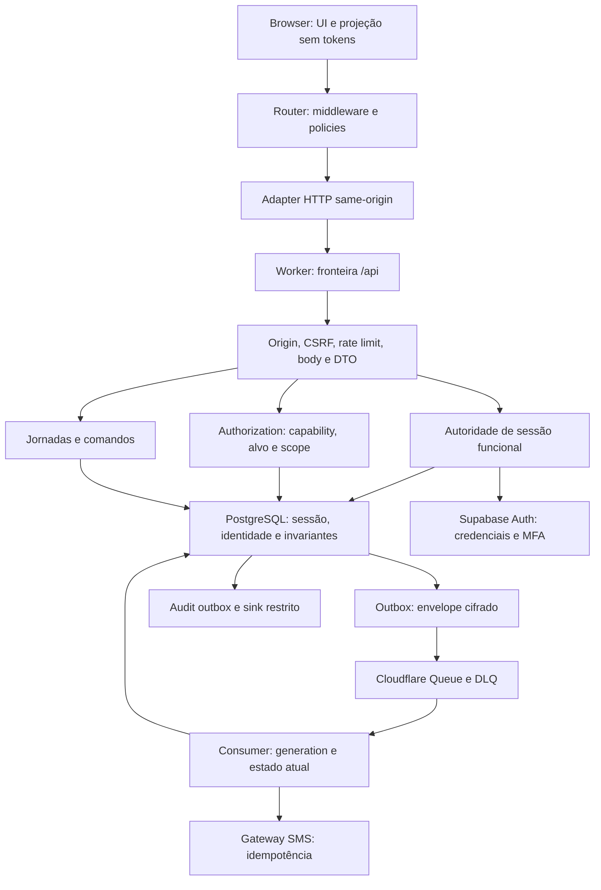

**Onde a confiança muda:** browser→BFF; BFF→Auth/banco; banco→Queue; consumer→SMS. Cada fronteira possui schema, prazo, tratamento de falha e evidência. Um serviço interno não é endpoint público.

### 4.2 Requisitos centrais

| ID | Invariante obrigatória |
|---|---|
| SEC-01 | Nenhum access token, refresh token, secret, senha ou OTP em Web Storage, URL, logs, analytics ou evidência. |
| SEC-02 | O browser nunca escolhe upstream, papel, AAL ou scope autoritativo. |
| SEC-03 | NORMAL somente após prova completa de credencial e fator exigido. |
| SEC-04 | Autoridades restritas falham antes da avaliação de capabilities normais. |
| SEC-05 | Conta diferente de ACTIVE não executa operação normal. |
| SEC-06 | Cada operação protegida verifica sessão e autorização no servidor. |
| SEC-07 | Mutação sensível revalida os invariantes no commit/claim durável. |
| SEC-08 | Revogação/fence funcional impede novas operações sem esperar expiração do JWT. |
| SEC-09 | Resultado externo incerto nunca é convertido em sucesso por suposição ou retry cego. |
| SEC-10 | CSRF, Origin e Fetch Metadata protegem mutations, inclusive login e jornadas públicas. |
| SEC-11 | Tamanho de body é limitado durante leitura, inclusive em prechecks de rate limit. |
| SEC-12 | Resposta de sucesso é unknown até decoding em runtime. |
| SEC-13 | Um resultado antigo não pode restaurar identidade, cache ou navegação mais recente. |
| SEC-14 | Ausência/erro de policy produz DENY ou indisponibilidade, nunca ALLOW. |
| SEC-15 | Sessões e desafios usam aleatoriedade criptográfica; OTP tem budget persistente. |
| SEC-16 | Side effect privilegiado possui identidade operacional, idempotência e reconciliação. |
| SEC-17 | Estado inválido de unidade impede operações unit-scoped. |
| SEC-18 | RLS não é assumida como contenção do secret/service role. |
| SEC-19 | Uma mensagem duplicada/stale não concede autoridade nem dispara efeito indevido. |
| SEC-20 | Configuração não comprovada mantém o fluxo desabilitado. |

Ameaças cobertas: credential stuffing, enumeração, CSRF/login CSRF, XSS com ações na sessão, fixation, replay, BOLA/IDOR, escalada horizontal/vertical, corrida de refresh, resposta tardia, abuso de SMS, esgotamento de memória, privilege bypass, perda de mensagens e revogação incompleta.

HttpOnly protege leitura direta do cookie, mas não impede que XSS execute requisições em nome do usuário. CSP, renderização segura, dependências e redução de scripts terceiros continuam obrigatórias.

Base externa: [autorização OWASP](https://cheatsheetseries.owasp.org/cheatsheets/Authorization_Cheat_Sheet.html) e [gestão de sessão OWASP](https://cheatsheetseries.owasp.org/cheatsheets/Session_Management_Cheat_Sheet.html).

<a id="c05"></a>

## 5. Identidade, lifecycle, unidade e provisioning

### 5.1 Identidade

- ID interno opaco e imutável como referência de usuário.
- CPF obrigatório, único, canônico em 11 dígitos e validado quanto aos dígitos verificadores. Validar CPF não prova identidade civil.
- CPF imutável no fluxo comum; correção excepcional é procedimento separado, sem endpoint self-service.
- Lookup por HMAC com separação de domínio e versão de chave. Hash simples de CPF não é proteção adequada para esse espaço previsível.
- Quando CPF precisar ser recuperável para perfil/reveal aprovado, armazenar ciphertext em fronteira privada, separado do lookup. Nunca no DTO de lista.
- Telefone obrigatório em E.164, provisionado por processo autorizado e verificado por prova explícita. Compatibilidade de unicidade do provider deve ser comprovada; conflito não pode produzir vínculo ambíguo nem merge automático.
- Email corporativo é opcional, nullable e não único; somente redemontecarlo.com ou redemontecarlo.com.br. Não é login nem fator de recuperação.
- Selector técnico do provedor é gerado no servidor, estável e único por ID interno opaco; não usar CPF legível ou email corporativo como identificador Auth. Não é canal humano de contato ou recuperação. O adapter deve comprovar a criação/login sem envio de email e sem auto-confirmar o telefone.
- Rotação de HMAC não pode permitir duplicar CPF entre versões. Backfill, detecção de conflitos e a troca do índice canônico precisam ser transacionais ou executados com escrita suspensa e evidência.

### 5.2 Lifecycle e onboarding são dimensões separadas

Lifecycle: PENDING, ACTIVE, SUSPENDED, BLOCKED, DISABLED, DELETED. Onboarding: ACTIVATION_REQUIRED, PASSWORD_REQUIRED, SECURITY_SETUP, COMPLETE.

| Transição | Condição |
|---|---|
| Ausente → PENDING | Provisioning autorizado e consistente. |
| PENDING → ACTIVE | Conclusão atômica do onboarding e provas do capítulo 9. |
| ACTIVE → SUSPENDED/BLOCKED/DISABLED | Comando autorizado; fence e evento durável. |
| SUSPENDED → ACTIVE | users.resume; elegibilidade atual e nova autenticação. |
| BLOCKED → ACTIVE | users.unblock; elegibilidade atual e nova autenticação. |
| DISABLED → ACTIVE | users.reactivate; não restaurar sessões antigas. |
| Elegível → DELETED | Procedimento controlado de desativação/exclusão; retenção avaliada. |

Nenhuma transição de conta encerra automaticamente um assignment corrente. Nenhuma reativação restaura senha antiga, fator removido, sessão revogada ou generation anterior.

### 5.3 Units e assignments

Exactly one role por identidade. Roles globais têm scope global; manager/operator requerem assignment corrente a unidade válida.

A fonte externa é autoridade de existência e campos mestre; o RMC não faz write-back. A chave externa real é validada antes do schema final; não presumir UUID por conveniência. Desativação local é override persistente e sobrevive a sincronização.

**No máximo um assignment corrente de manager por unidade**, independentemente do lifecycle da conta. Implementar vínculo temporal com encerramento e histórico; índice/constraint deve restringir o vínculo corrente, não status=ACTIVE da conta. Substituição e mudança de unidade são transacionais.

Unidade ausente, inativa, duplicada ou divergente produz DENY para operações dependentes. Roles globais não recebem permissão para sobrescrever cadastro mestre externo.

Máximo de dois superadmins ativos, preservando ao menos um acesso administrativo recuperável por procedimento controlado. O provisionamento comum não cria superadmin.

### 5.4 Provisionamento administrativo

**PRV-01:** autorizar ator, capability, scope, assurance e intenção antes de side effect. Conta é criada sem senha temporária e sem auto-confirmar telefone.

**PRV-02:** ledger durável com commandId, idempotencyKey, hash canônico da intenção sem credenciais, actorId, estado, versões, resultado sanitizado e prazo de reconciliação. Mesma chave/intenção retorna o mesmo resultado; mesma chave/intenção diferente produz 409.

**PRV-03:** implementar **saga durável** entre o banco funcional e a Admin API Auth, com conta externa inicialmente inelegível no BFF. Não afirmar atomicidade entre dois serviços independentes. Falha parcial mantém PENDING, impede login normal e entra em reconciliação/compensação. Substituir a saga por outro mecanismo é mudança de contrato, não escolha silenciosa do implementador.

Ordem da saga: reservar ID interno/CPF/selector e intenção autorizada no banco; claim exclusivo do comando; criar o usuário Auth sem senha e sem confirmar telefone; comprovar subject e vínculo com a intenção; persistir a associação única, onboarding inicial, assignment aprovado e evento auditável; encerrar o comando. A reserva não disponibiliza ativação até a associação estar consistente. Antes dos efeitos e do commit final, revalidar ator/alvo e elegibilidade dos vínculos.

O adapter de reconciliação localiza o resultado externo por identificador técnico estável e prova de ownership escrita somente pelo servidor. Duplicidade do selector ou telefone não autoriza adotar um usuário preexistente sem essa prova. A versão selecionada deve oferecer um mecanismo suportado, restrito e bounded para essa verificação; não adicionar SQL de escrita em auth.users nem varrer todos os usuários em cada request. Se houver perda de resposta e a propriedade não puder ser demonstrada, manter RECONCILIATION_REQUIRED para resolução controlada, sem repetir a criação cegamente.

**PRV-04:** criação externa confirmada deve gerar identidade PENDING, onboarding inicial, assignment e evento durável. Reexecução não cria novo Auth user. Exclusão compensatória nunca remove um usuário de outro comando.

**PRV-05:** primeiro superadmin é criado por procedimento day-zero fora da API comum, executado por responsável identificado, auditado e desativado ao concluir. Sem senha padrão ou endpoint de bootstrap permanente.

A chamada administrativa é exclusivamente server-side. A saga e o selector são decisões deste contrato; a API não é tratada como transação distribuída ou como endpoint idempotente sem prova. [Supabase Admin createUser](https://supabase.com/docs/reference/javascript/auth-admin-createuser).

**Aceite:** duplicidade, queda após criação Auth, perda de resposta, conflito de CPF/telefone, ator bloqueado durante operação e conflito de assignment não concedem NORMAL nem criam identidades duplicadas.

<a id="c06"></a>

## 6. Contratos de estado e propriedade

### 6.1 Autoridades do servidor

| Autoridade | Pode fazer | Não pode fazer |
|---|---|---|
| PREAUTH | Inicializar CSRF e pedir login/desafio. | Acessar identidade protegida, capabilities ou dados normais. |
| MFA_PENDING | Verificar o fator do login comprovado por senha. | Acessar dados ou escolher outro usuário/fator arbitrário. |
| BOOTSTRAP | Definir senha e configurar segurança da própria ativação. | Executar capability administrativa ou acessar aplicação normal. |
| RECOVERY | Trocar senha da identidade vinculada e concluir recuperação. | Conceder NORMAL, remover MFA ou mudar telefone. |
| NORMAL | Operações autorizadas pelo estado atual. | Ignorar AAL, scope ou invariantes do alvo. |

Todas possuem ID, hash do segredo, expiry, binding de identidade quando aplicável, purpose, generation, estado e versão. Usar cookies separados para autoridade NORMAL e jornada; não reinterpretar o mesmo valor entre purposes.

### 6.2 Estado do frontend

```typescript
type SessionSnapshot =
  | { kind: "anonymous" }
  | { kind: "restricted"; journey: "activation" | "recovery" | "mfa"; step: string }
  | { kind: "authenticated"; session: PublicSession };

type SessionState =
  | { status: "initializing" }
  | { status: "ready"; snapshot: SessionSnapshot }
  | { status: "revalidating"; previousDisplay: PublicSession }
  | { status: "unavailable"; error: SafeError }
  | { status: "terminating"; outcome: "pending" | "indeterminate" };
```

Os tipos ilustram o contrato; step deve ser enum específico por jornada na implementação, nunca uma string aberta no decoder. PublicSession e SafeError são DTOs decodificados. previousDisplay não autoriza operações e não restaura uma sessão negada.

**STATE-01:** unknown/unavailable não equivale a anonymous. Somente a autoridade confirma ausência/invalidade de sessão.

**STATE-02:** uma instância de SessionController por execução do app. Provider observa o controller; router e comandos usam a mesma fonte. Não criar outra sessão no QueryClient ou em cada loader.

**STATE-03:** época monotônica local aumenta em adoção de identidade, logout, fence e troca de contexto. Cada operação guarda a época inicial e só aplica resultado se ainda for proprietária.

**STATE-04:** single-flight de leitura/revalidação no browser com lifecycle e cancelamento definidos. Abortar um consumidor não aborta os demais por engano; encerrar contexto aborta o trabalho compartilhado inteiro.

**STATE-05:** nenhum booleano independente pode tornar loading+authenticated+error simultaneamente autoritativos. Normalizar eventos na máquina de estados.

### 6.3 DTO público de sessão

O DTO inclui contractVersion, contextId público não autenticador, identityId, displayName, role, scope, capabilities de apresentação, assurance, expiresAt, idleExpiresAt, serverTime e versão de contexto/policy.

Não inclui cookie, session secret, provider session ID, JWT, refresh, CPF, telefone integral, ciphertext ou motivos internos de policy. ContextId não autentica; cookies e estado servidor continuam necessários.

Capabilities são projeção de UX. Endpoints avaliam novamente. Respostas de restricted incluem somente purpose/step e metadados estritamente necessários; não expõem role como autorização provisória.

<a id="c07"></a>

## 7. Parâmetros canônicos

| Parâmetro | Valor inicial da política RMC | Observação |
|---|---:|---|
| Duração absoluta NORMAL | 12 horas | Imutável por refresh ou atividade. |
| Inatividade NORMAL | 30 minutos | Relógio autoritativo servidor. |
| Aviso de inatividade | 2 minutos antes | UI; não é extensão automática. |
| Intervalo mínimo de reporte de atividade | 60 segundos | Coalescer; não enviar evento por tecla. |
| Validade da jornada ativação/recovery | 30 minutos | Nunca estender com resend. |
| Validade do OTP SMS | 10 minutos | Limitada também pela expiry da jornada. |
| OTP SMS | 8 dígitos decimais | Nova política técnica consolidada; geração uniforme criptográfica. |
| Erros de OTP | 5 por jornada | Cumulativos entre gerações; limiter por identidade impede reset por nova jornada. |
| Cooldown resend | 60 segundos | Server-side. |
| MFA_PENDING | 5 minutos | Sem refresh irrestrito da jornada. |
| Fresh step-up | 300 segundos | Transacional; não é timeout NIST de sessão. |
| Clock skew futuro tolerado no step-up | 30 segundos | Timestamp somente verificado no servidor. |
| Refresh antecipado | 60 segundos antes do JWT expirar | Não prolonga autoridade funcional. |
| Timeout browser | 15 segundos por tentativa | Budget da jornada é explícito. |
| Timeout upstream | Até 5 segundos/tentativa | Limitado pelo budget remanescente. |
| Budget síncrono Worker | 12 segundos | Não iniciar chamada sem tempo para persistir resultado. |
| Body Auth | 8 KiB reais | Limite durante stream, incluindo prechecks. |
| URL interna / headers cookies | 2 KiB / 4 KiB | Rejeitar ambiguidades e excedentes. |
| Query privada padrão | stale 30 s; gc 10 min | Dados do domínio, nunca autoridade de sessão. |
| Retry de query idempotente | No máximo 1 | Jitter e limite total; não repetir credential/mutation automaticamente. |
| Dispatcher/reconciler | A cada minuto | Liveness medido; cron declarado não é prova. |

Os limites novos de OTP e budget são decisões desta especificação. O sistema implementa uma configuração central, versionada e testada. Mudanças não devem ocorrer por constante duplicada.

Retenção de fila/DLQ, audit, capacidade e quotas são valores do ambiente real registrados no manifesto de release; sua ausência impede aprovação. Não inventar retenção universal nem prazo legal.

<a id="c08"></a>

## 8. Transporte seguro, cookies e bootstrap

### 8.1 Contrato único de transporte

**HTTP-01:** todos os clientes usam um HttpClient único para /api. Endpoints são registrados por constantes tipadas; componentes não montam URLs de autenticação. O client rejeita origem externa, fragmento, backslash, path ambíguo e headers de credencial/upstream definidos pelo caller.

**HTTP-02:** credentials=same-origin, mode=same-origin, cache=no-store e redirect=error nas operações Auth. Content-Type de sucesso e de erro é validado. Ler resposta com limite e decoding; DTO inválido é falha de contrato, não sucesso parcial.

**HTTP-03:** propagar signal do Router/controller e compor com timeout. Descartar timers/listeners no finally. Aborted, timeout, network, invalid-payload e HTTP são categorias distintas.

**HTTP-04:** mutations não têm retry automático. Resultado perdido inicia reconciliação da mesma operação. GET idempotente pode ter uma repetição em network/timeout ou 408/425/429/500/502/503/504, com jitter, Retry-After válido e budget total. Não repetir quando explicitamente cancelado.

**HTTP-05:** Retry-After aceita delta-seconds ou HTTP-date, limitado pela política. Se superar o budget automático, mostrar espera e permitir ação posterior. Nunca inventar valor que o upstream não informou.

**HTTP-06:** requestId/commandId não são credenciais. Sua forma e cardinalidade são limitadas; identidade de idempotência é gerada uma vez por intenção e guardada apenas pelo proprietário necessário.

### 8.2 Cookies e CSRF

| Cookie | Conteúdo | Atributos em produção |
|---|---|---|
| __Host-rmc-session | Segredo NORMAL aleatório, 256 bits | Secure; HttpOnly; SameSite=Strict; Path=/; sem Domain; Max-Age até a expiry absoluta remanescente. |
| __Host-rmc-journey | Segredo restrito opaco | Mesmos atributos; prazo até 30 min ou prazo menor de MFA_PENDING. |
| __Host-rmc-preauth | Contexto anônimo para CSRF/login | Mesmos atributos; curto, 30 min; nunca autentica um usuário. |

Tokens de cookie são armazenados no banco como hash, comparados com implementação segura e associados a estado, purpose e generation. Rotacionar em autenticação, promoção de autoridade e mudança relevante de contexto. Rejeitar cookies duplicados/ambíguos e formato inválido.

O token CSRF é um **token sincronizador**: aleatório de 256 bits e vinculado ao contexto PREAUTH/journey/NORMAL vigente. Persistir seu hash para validação e uma cópia cifrada somente no servidor para reentrega; um hash isolado não permite recuperar o token. A cifra usa envelope autenticado, purpose CSRF, binding de contexto/generation e as regras de chaves do capítulo 21. GET /api/auth/context reentrega o token vigente para memória do browser, no-store e sem CORS permissivo; não o persiste em Web Storage. POST envia X-RMC-CSRF-Token. Validar hash do token, contexto, origem e estado antes do efeito.

Leituras de contexto não rotacionam o token vigente, preservando a operação de múltiplas abas. Promoção/troca de autoridade, logout ou expiração invalida hash e ciphertext anteriores; cada aba reobtém o contexto antes de uma nova mutação. Duas inicializações anônimas simultâneas podem receber contexts diferentes: cookie/token incompatíveis produzem 403 antes de qualquer efeito, seguido de nova leitura e retry seguro da mesma intenção. Nunca enfraquecer a validação para acomodar a corrida.

- Origin deve coincidir exatamente com a origem canônica de deployment.
- Sec-Fetch-Site cross-site/same-site é negado para mutations deste contrato same-origin.
- Header ausente/none somente segue o fallback documentado de Origin exato + CSRF, nunca ALLOW automático.
- Não há wildcard CORS com credentials. Não há autenticação por header actorId/role/AAL recebido do browser.
- GET não cria sessão NORMAL, não faz logout, não envia SMS e não renova inatividade; pode inicializar contexto CSRF e efetuar manutenção interna de sessão.
- CSRF expirado produz 403 AUTH_CSRF_INVALID. Uma atualização do contexto seguida de retry da intenção somente é permitida depois de provar que o efeito original não ocorreu.
- Dev em loopback usa cookie sem prefixo __Host- quando HTTP exigir; é configuração explícita, incapaz de ser ativada no build produtivo.

O synchronizer token é uma decisão nova de hardening frente ao double-submit simples auditado. Referências: [OWASP CSRF](https://cheatsheetseries.owasp.org/cheatsheets/Cross-Site_Request_Forgery_Prevention_Cheat_Sheet.html) e [atributos Set-Cookie](https://developer.mozilla.org/en-US/docs/Web/HTTP/Reference/Headers/Set-Cookie).

### 8.3 Bootstrap sem duplicar autoridade

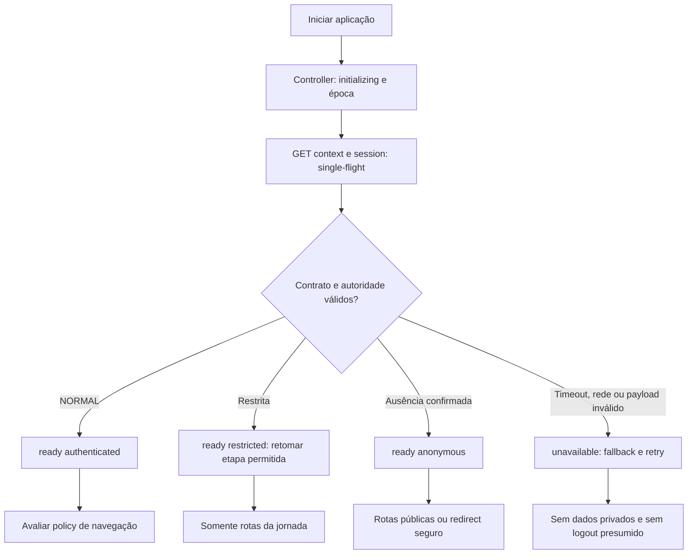

**BOOT-01:** construir controller, QueryClient e Router uma vez por app. Não recriar router em render. Root error boundary e UI de bootstrap devem continuar disponíveis quando sessão falha.

**BOOT-02:** nenhum private loader começa antes do gate correspondente. Public routes podem mostrar conteúdo estático mesmo se sessão indisponível, mas não supor anonymous nem permitir operações dependentes sem contexto válido.

**BOOT-03:** resposta antiga, de outra época ou contrato desconhecido é descartada. Uma sessão válida deve abrir deep link sem salto intermediário ao login.

**BOOT-04:** bootstrap usa fallback acessível, sem retorno null e sem formulário privado parcialmente habilitado. Retry gera nova época/abort apropriado e não acumula operações.

**BOOT-05:** restricted não é authenticated para dados normais. Retomar etapa vem do servidor; pathname não é evidência de conclusão.

<a id="c09"></a>

## 9. Primeiro acesso e ativação

### 9.1 Solicitação e prova de posse

**ACT-01:** CPF é recebido em body, validado e resolvido por lookup HMAC; nunca em URL. Para CPF inexistente ou lifecycle inelegível, criar contexto decoy com forma pública equivalente. Não expor nome, papel, unidade, existência ou telefone de terceiro.

**ACT-02:** response 202 informa accepted e metadados uniformes. Significa solicitação registrada duravelmente, não SMS entregue. Banco indisponível não retorna 202 fictício.

**ACT-03:** registrar challenge, geração, budget e outbox no mesmo commit. Mensagem contém somente envelope cifrado. Telefone é resolvido no consumer a partir da identidade vigente.

**ACT-04:** OTP digest usa HMAC/pepper e inclui transactionId, purpose, generation, identityId e expiry. Sem OTP plaintext no banco/log. O envelope cifrado de entrega é a única persistência temporária do segredo necessária ao envio e deve ser eliminado conforme retenção.

**ACT-05:** validar cookie restrito, CSRF, purpose, generation, expiry, tentativas e estado atual. Erro consome budget de forma atômica. Resend incrementa generation e invalida OTP anterior, sem zerar tentativas nem estender prazo.

**ACT-06:** verificação consome o desafio uma única vez e vincula BOOTSTRAP à identidade provada. Admin phone confirmation só materializa a prova já obtida; não substitui SMS. Resultado externo incerto mantém a autoridade restrita em reconciliação.

### 9.2 Senha e configuração de segurança

1. BOOTSTRAP autoriza somente definição de senha própria e etapa de segurança.
2. Aplicar política de senha do capítulo 12 no servidor.
3. Registrar command durável e consumir/claimar a transição antes da chamada externa.
4. Definir a senha escolhida pelo usuário no provedor, sem persistir seu plaintext ou hash próprio.
5. Reautenticar com a senha escolhida para comprovar o commit externo. Sessão do provedor resultante continua confinada ao BOOTSTRAP.
6. Oferecer enrollment TOTP opcional em SECURITY_SETUP; fator só vale depois de verify.
7. Revalidar conta PENDING, identity binding, geração, senha comprovada, telefone verificado, assignment e estado do fator.
8. No commit final: onboarding COMPLETE, lifecycle ACTIVE, autoridade BOOTSTRAP consumida e NORMAL criada com token novo; audit outbox no mesmo commit.
9. Limpar cookie/segredos transitórios e consultar a projeção NORMAL antes de navegar.

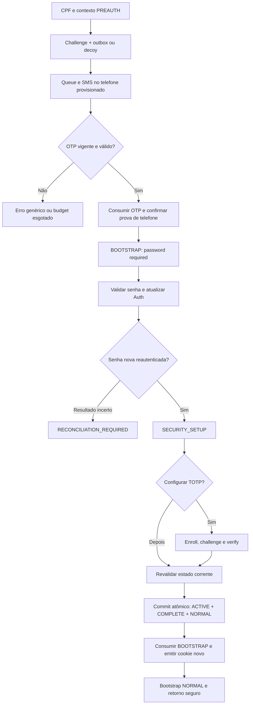

**Pontos de falha a testar:** OTP stale; envelope antigo; conta bloqueada entre verify e complete; unidade desativada; confirmação de telefone perdida; senha atualizada com resposta perdida; reautenticação inválida; TOTP abandonado; conclusão repetida; cookie NORMAL emitido sem commit.

**ACT-07:** completar duas vezes não cria duas sessões. Recuperar resultado de comando concluído exige autoridade válida; possession de commandId não concede sessão.

**ACT-08:** se houver fator verificado inesperado em ativação, não oferecer skip como bypass. Entrar em reconciliação/procedimento aprovado.

<a id="c10"></a>

## 10. Login e exigência de MFA

### 10.1 Login normal

**LOGIN-01:** iniciar contexto PREAUTH/CSRF. O form envia CPF e senha ao BFF, com trava síncrona e pending. Nenhuma lógica de role no formulário.

**LOGIN-02:** limitar abuso antes de processamento caro. Rejeitar body excessivo durante leitura. Consultar identidade de forma que ausência não reduza a prova a um early return distinguível; usar caminho dummy seguro para credencial inexistente.

**LOGIN-03:** provider sign-in resolve credencial; BFF verifica binding entre sub, identityId e provider session. Somente lifecycle ACTIVE + onboarding COMPLETE é elegível.

**LOGIN-04:** descobrir fatores verificados pelo servidor. Nenhum fator → NORMAL aal1. Exatamente um TOTP verificado → MFA_PENDING, sem cookie NORMAL nem dados privados. Mais de um fator verificado ou inconsistência → falha fechada e procedimento de reconciliação; não escolher aleatoriamente.

**LOGIN-05:** erro de credencial/conta retorna mensagem genérica e não indica CPF existente, bloqueio ou MFA antes de prova de senha. Throttling público 429 possui code estável e Retry-After quando conhecido.

**LOGIN-06:** depois de MFA verify, confirmar same provider session, sub, assurance e geração; revalidar estado funcional e emitir NORMAL aal2. AAL informado no body não é aceito.

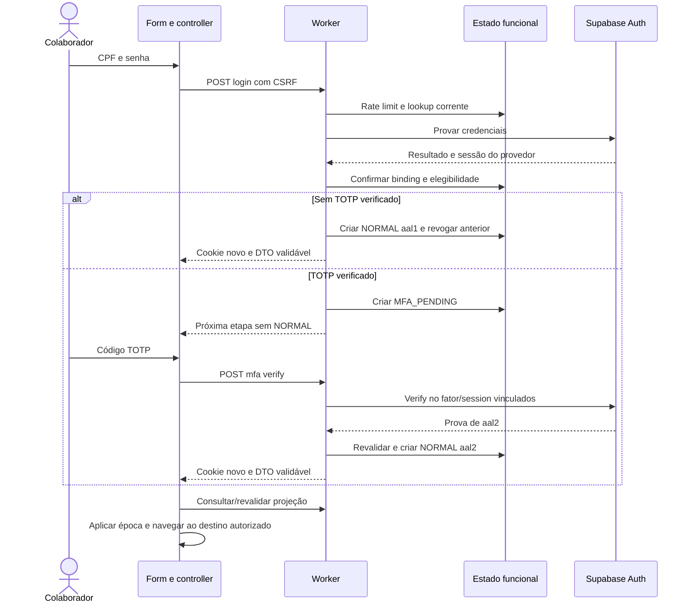

### 10.2 Resultado perdido e login concorrente

**LOGIN-07:** timeout não significa senha inválida nem sucesso. Primeiro consultar sessão/contexto da mesma intenção. Se houver NORMAL válida, adotar depois de decoding. Se não houver autoridade suficiente, não recuperar credencial somente por commandId; pedir reconciliação/reenvio consciente conforme estado.

**LOGIN-08:** não repetir sign-in automaticamente com senha guardada. Credencial permanece apenas no proprietário enquanto necessária; limpar após sucesso, cancelamento ou encerramento.

**LOGIN-09:** operações de credencial em um contexto de browser são serializadas pelo controller; browser/aba adicional não é garantia de serialização, por isso o servidor aplica generation/fence. Login não cria sessões anteriores novamente.

**LOGIN-10:** descartar resposta JS antiga não impede o navegador de aplicar Set-Cookie atrasado. Testar resposta de login atrasada após logout/troca de identidade. Qualquer cookie antigo deve ser invalidado pela geração servidor; a reconciliação pode exigir novo login, mas nunca restaurar autoridade velha.

<a id="c11"></a>

## 11. Enrollment TOTP e fresh step-up

### 11.1 Configuração e proteção do fator

**MFA-01:** TOTP é opcional para entrar no produto sem fator existente. Depois de verificado, é obrigatório no próximo login. Opt-in não autoriza ignorar fator existente.

**MFA-02:** usuário NORMAL aal1 pode abrir sua configuração de segurança para configurar TOTP; isso não lhe concede operação administrativa. Assim, um administrador sem TOTP consegue configurar seu fator antes de usar capability aal2.

**MFA-03:** enrollment cria fator unverified e associa seu ID à transação e usuário. QR/secret só aparecem na memória da UI autorizada. Retornar QR em formato restrito, preferencialmente PNG/data URI validada e limitada; não inserir SVG/HTML remoto não confiável.

**MFA-04:** challenge/verify deve vincular fator, usuário, purpose e mesma sessão do provedor. ID de fator recebido não permite enumerar/verificar fator de terceiro.

**MFA-05:** fechar/cancelar remove somente unverified criado por aquela transação. Não remover fator verificado, de outra jornada ou de outra identidade. Limpar QR/secret no unmount e transição.

**MFA-06:** mudança para aal2 atualiza projeção/contexto; não estende expiry absoluta NORMAL. Remoção self-service de fator verificado está desabilitada no release inicial.

### 11.2 Step-up transacional

Operações privilegiadas exigem requiredAal e, quando indicado, fresh step-up. Timestamp, AMR e AAL vêm de prova assinada verificada e vinculada à sessão/identidade; não de Date.now no browser ou claim decodificada sem verificação.

**STEP-01:** fresh ≤300 s e timestamp futuro ≤30 s. Ausência, AMR incompatível ou sessão diferente falha fechado.

**STEP-02:** o step-up está ligado à intenção server-side: commandId, capability, alvo, versão e hash de campos relevantes sem segredo. Alterar alvo/intenção exige nova autorização e, para operação crítica, nova confirmação.

**STEP-03:** elevar assurance não concede capability inexistente. A sequência é sessão → capability/target/scope → assurance → invariantes de commit.

**STEP-04:** não persistir automaticamente uma senha/OTP/uma mutation privilegiada para repeti-la após step-up. Preservar apenas intenção não sensível e confirmar conscientemente quando a operação exigir.

**STEP-05:** assinatura, issuer/audience esperados, expiry, sub e session_id devem ser verificados pelo adapter. JWT decode isolado é proibido.

Referências: [MFA Supabase](https://supabase.com/docs/guides/auth/auth-mfa), [MFA OWASP](https://cheatsheetseries.owasp.org/cheatsheets/Multifactor_Authentication_Cheat_Sheet.html) e [autorização de transações](https://cheatsheetseries.owasp.org/cheatsheets/Transaction_Authorization_Cheat_Sheet.html).

<a id="c12"></a>

## 12. Política consolidada de senha

| Requisito | Contrato |
|---|---|
| Comprimento | Mínimo 15 e máximo 64 code points; limite adicional do provider de 72 bytes UTF-8 enquanto essa restrição for aplicável. |
| Composição | Sem exigência de maiúscula, minúscula, número e símbolo. |
| Alteração periódica | Não exigir por calendário sem indício de comprometimento. |
| Blocklist | Valores comuns/esperados e termos do serviço; rejeição contextual sem mudar a credencial. |
| Comprometidas | HIBP/proteção hospedada comprovada; indisponibilidade do verificador em create/change/recovery falha fechada. |
| Gestor de senha | Permitir colar, autofill e senha gerada; exibir/ocultar com botão acessível. |
| Unicode | Entrada deve ser Unicode válido; normalização NFC uniforme no BFF em criação, alteração e login. |
| Tratamento | Não trim, lower-case ou truncar senha; NFC é a única transformação declarada. |
| Armazenamento | Hash de senha pertence ao Supabase Auth. Não persistir senha nem outro verifier no RMC. |

A normalização NFC é uma decisão técnica desta implementação do zero: aplicar sempre antes de contagem/bytes e antes de chamar o provider, incluindo scripts administrativos. Não migrar contas antigas silenciosamente para esse comportamento.

A blocklist pode normalizar separadamente valores para comparação contextual; isso não transforma a senha enviada ao provider. A UI apresenta requisitos coerentes e compara confirmação sem decisões de autorização.

NIST SP 800-63B-4 fundamenta mínimo de 15 para fator único, blocklist e ausência de composição/rotação arbitrárias. A recomendação de permitir pelo menos 64 caracteres enfrenta a limitação física do provider; o produto não declara suporte irrestrito a 64 caracteres Unicode nem conformidade formal NIST. SMS/PSTN é restrito e TOTP não é resistente a phishing. Referência: [NIST SP 800-63B-4](https://pages.nist.gov/800-63-4/sp800-63b.html).

A restrição de 72 bytes foi conferida no código Auth v2.195.0 usado como evidência histórica; deve ser novamente provada na versão escolhida para o projeto novo. [Código oficial password.go](https://github.com/supabase/auth/blob/v2.195.0/internal/api/password.go).

A documentação Supabase recomenda composição, mas esta especificação adota a orientação NIST nesse ponto e registra a diferença. Proteção de senhas vazadas depende de plano/configuração hospedados. [Password security Supabase](https://supabase.com/docs/guides/auth/password-security).

A proteção contra comprometimento deve ser provada em **cada caminho de escrita**, incluindo atualização por Admin API no primeiro acesso e na recuperação. Configuração global do projeto ou sucesso de um teste de signup não prova comportamento administrativo. Se o caminho escolhido não aplicar a verificação exigida, o adapter deve realizar uma verificação server-side suportada antes do efeito, com minimização da informação enviada e fail-closed; sem essa prova o caminho permanece desabilitado.

**Aceite:** limites multibyte, combining characters, caracteres inválidos, espaços, paste/autofill, blocklist, HIBP indisponível e senha acima do limite não produzem truncamento silencioso ou credential divergence.

<a id="c13"></a>

## 13. Recuperação e mudança de senha

### 13.1 Password recovery

**REC-01:** solicitar CPF sob PREAUTH/CSRF com resposta pública equivalente; usar telefone vigente provisionado e verificado. Email não recupera conta. Decoy, budgets e outbox seguem o mesmo contrato de ativação.

**REC-02:** OTP válido concede RECOVERY exclusivamente para a identidade vinculada; não concede NORMAL ou remoção de MFA.

**REC-03:** no claim durável da alteração, aplicar application fence/generation e revogar sessões funcionais anteriores. Bloquear novas operações e sign-ins incompatíveis até conclusão/reconciliação. Desafios concorrentes/stale ficam inválidos.

**REC-04:** validar senha, registrar transição e chamar provider; reautenticação com nova senha comprova commit. Em seguida, solicitar global sign-out do provider, consumir transação, limpar cookies e voltar ao login.

**REC-05:** usuário com TOTP continua com o fator. Reautenticação para verificar commit da senha não autoriza bypass desse fator nem emissão NORMAL.

**REC-06:** efeitos incertos → RECONCILIATION_REQUIRED com fence preservado. Não levantar fence porque o timeout expirou. Sem senha persistida, comprovar commit pode exigir o usuário informar novamente a senha escolhida; updated_at do usuário não prova troca correta.

**REC-07:** operador administrativo pode iniciar a recuperação autorizada, mas não escolhe senha pelo colaborador nem recebe seu OTP.

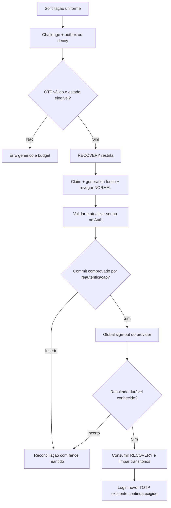

A escolha de não efetuar auto-login e de limitar tentativas está alinhada à [OWASP Forgot Password](https://cheatsheetseries.owasp.org/cheatsheets/Forgot_Password_Cheat_Sheet.html). A igualdade de timing depende de medição, não do diagrama.

### 13.2 Mudança autenticada de senha

**PWD-CHANGE-01:** requer NORMAL atual, senha atual comprovada, CSRF e lifecycle ACTIVE. Havendo TOTP verificado, exigir fresh aal2. Sem fator, requerer reautenticação recente por senha vinculada à intenção e budget.

**PWD-CHANGE-02:** aplicar fence, alterar senha, comprovar commit e encerrar todas as sessões, inclusive a atual; orientar novo login. Não conservar cookies antigos ou assurance de sessão anterior.

**PWD-CHANGE-03:** resultado perdido segue ledger/reconciliação e não repete a alteração automaticamente. Notificar por canal informativo permitido, sem incluir credenciais.

### 13.3 Recuperação administrativa de MFA

Fluxo separado: ator com users.reset_mfa + fresh aal2; prova operacional documentada da identidade do target; autorização de hierarchy/scope; confirmação explícita; ledger durável; fence e revogação; remoção de fatores por Admin API; reconciliação; notificação; próximo login sujeito ao novo estado.

Manager não executa reset_mfa. Nenhuma pergunta de segurança ou dado público de CPF funciona como prova suficiente. Recuperação excepcional de superadmin usa procedimento de dupla responsabilidade fora da API Users comum.

Se o target perder telefone e TOTP, não há fallback automático de email. O procedimento operacional é restrito, auditado e com dupla revisão para recomposição do vínculo. Isso não habilita change_phone no browser.

<a id="c14"></a>

## 14. Sessão normal, refresh, atividade e logout

### 14.1 Autoridade e revogação

**SES-01:** toda chamada protegida valida hash do cookie, sessão ACTIVE, identity binding, generation, lifecycle, expiry absoluta e idle deadline no banco. Não depender da limpeza cron para negar sessão expirada.

**SES-02:** verificar criptograficamente claims do provider e confirmar sub/session_id esperados. Consultar getUser/validação equivalente comprovada para o estado do provider conforme contrato do adapter; invalidade confirmada revoga, indisponibilidade vira 502/503 e não anonymous.

**SES-03:** a validação por assinatura não prova sozinha existência atual da sessão. No Auth v2.195.0 consultado, getUser percorre validação de usuário/sessão; provar o comportamento na versão nova antes de qualquer otimização.

**SES-04:** tokens armazenados no servidor usam AES-GCM, IV novo e AAD com identity/session/purpose/generation. Falha de decrypt é DENY/reconciliação, sem retornar material cifrado ao browser.

**SES-05:** uma NORMAL corrente por identidade. Login novo substitui a anterior em transação serializada. Manutenção de provider session anterior é tarefa de revogação durável, nunca janela de acesso funcional.

Fontes: [getClaims](https://supabase.com/docs/reference/javascript/auth-getclaims), [getUser](https://supabase.com/docs/reference/javascript/auth-getuser), [código Auth v2.195.0](https://raw.githubusercontent.com/supabase/auth/v2.195.0/internal/api/auth.go) e [sessões Supabase](https://supabase.com/docs/guides/auth/sessions).

### 14.2 Refresh distribuído

**REF-01:** lock/lease vive no PostgreSQL, com geração e compare-and-swap. Mutex de módulo, Promise de browser, KV eventual ou Cache API não é autoridade de coordenação.

**REF-02:** o vencedor obtém lease antes da chamada externa; não manter transação de banco aberta enquanto faz fetch. Registrar fencing token e orçamento suficiente para persistir o resultado.

**REF-03:** persistir novos tokens somente se lease/generation/state ainda correspondem. O perdedor aguarda/reconsulta dentro do budget, nunca faz refresh paralelo com o token antigo.

**REF-04:** se houver incerteza externa, marcar estado de reconciliação. Recuperação do lease respeita semântica de rotação/reuso comprovada do provider; não liberar lease e reutilizar token cegamente.

**REF-05:** não estender duração absoluta nem inatividade por refresh. Não devolver 401 só porque outro request está renovando; falha transitória é 502/503.

**REF-06:** refresh bem sucedido não basta para aceite. Medir disponibilidade de todas as requests concorrentes, latências e efeitos de throttling. O teste antigo que aceitava 200 ou 502 não é o critério final deste projeto.

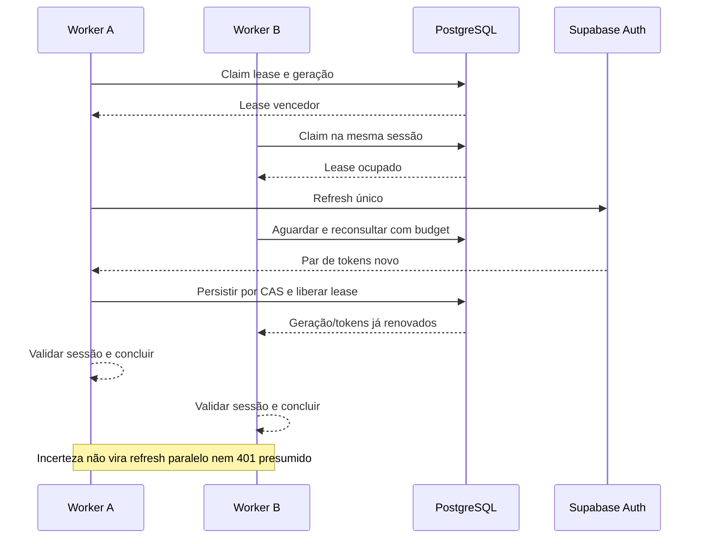

### 14.3 Atividade, abas e retomada

**IDLE-01:** atividade relevante vem de interação humana visível; o filtro isTrusted reduz eventos sintéticos, mas não é prova criptográfica. Não reportar heartbeat, polling ou background refetch como atividade humana.

**IDLE-02:** servidor usa seu relógio e só aceita reporte em sessão ainda válida. Cliente usa serverTime/deadlines para apresentação, sem authority sobre timestamps.

**IDLE-03:** continuar sessão exige ação humana e confirmação do reporte. Sessão já expirada não é ressuscitada por evento atrasado.

**TAB-01:** BroadcastChannel transmite somente eventos fechados de invalidação/reconciliação sem PII/credenciais. Mensagem nunca concede authenticated ou AAL.

**TAB-02:** ao focar/retomar aba ou pageshow de bfcache, ocultar/suspender dados privados até revalidação necessária; não supor que a memória antiga representa sessão corrente.

**TAB-03:** ausência de BroadcastChannel tem fallback por focus/revalidation e resposta de API. A segurança continua no servidor. Evitar tempestade de probes com coalescing/jitter.

### 14.4 Logout com resultado conhecido

**OUT-01:** clique entra em terminating, bloqueia novas mutations, aumenta época e cancela requests/caches privados. Não mostrar “logout concluído” antes de confirmar autoridade funcional encerrada.

**OUT-02:** servidor revoga NORMAL/fence e grava tarefa durável de encerramento provider antes de responder. Cookie é removido com os mesmos Path/atributos. Revogação funcional não espera o provider terminar.

**OUT-03:** logout é idempotente. Resposta perdida inicia GET session/status autorizado: anonymous confirmado encerra; ainda válida permite retry explícito do mesmo logout; upstream indisponível mantém indeterminate e dados privados ocultos.

**OUT-04:** provider global sign-out não torna todos os JWTs criptograficamente inválidos de imediato. O fence funcional impede uso no BFF; qualquer acesso direto ao provider/Data API que escapasse do desenho teria outro risco.

**OUT-05:** broadcast de invalidação, cleanup de cache e redirecionamento seguro somente aplicam ao contexto encerrado. Resultado atrasado não apaga a sessão nova.

Referência: [signout Supabase](https://supabase.com/docs/guides/auth/signout).

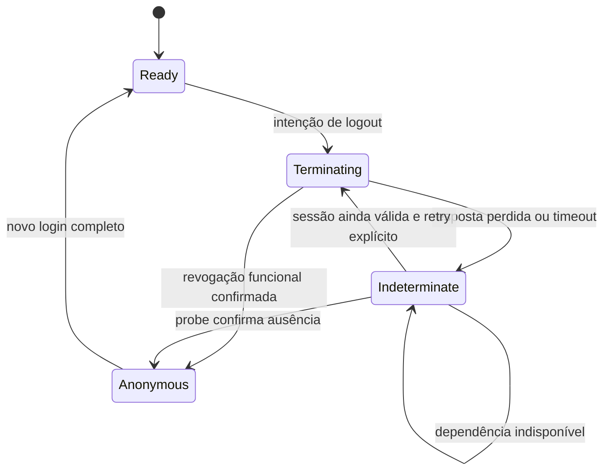

<a id="c15"></a>

## 15. Autorização: matriz e enforcement

### 15.1 Algoritmo obrigatório

**AUTHZ-01:** avaliar autoridade NORMAL → sessão vigente → actor ACTIVE → capability conhecida → ator permitido → target atual → hierarquia → scope → unidade válida → assurance → invariantes de commit.

**AUTHZ-02:** backend carrega role, unit, lifecycle e target correntes. Payload descreve intenção; não substitui registros autoritativos. Não usar user_metadata editável ou claims antigas como fonte de role.

**AUTHZ-03:** evaluator puro recebe valores validados e retorna decisão tipada e reason interno. Não importa React/Router, não faz fetch, não navega e não monta JSX. Serviços carregam fatos; handlers convertem a decisão para contrato público.

**AUTHZ-04:** parent policy e child policy são cumulativas. Negação não é revertida por um filho público, por UI ou por fresh aal2.

**AUTHZ-05:** capability desconhecida/configuração inválida falha fechado e gera evento operacional. Não há fallback “é admin, então permite”.

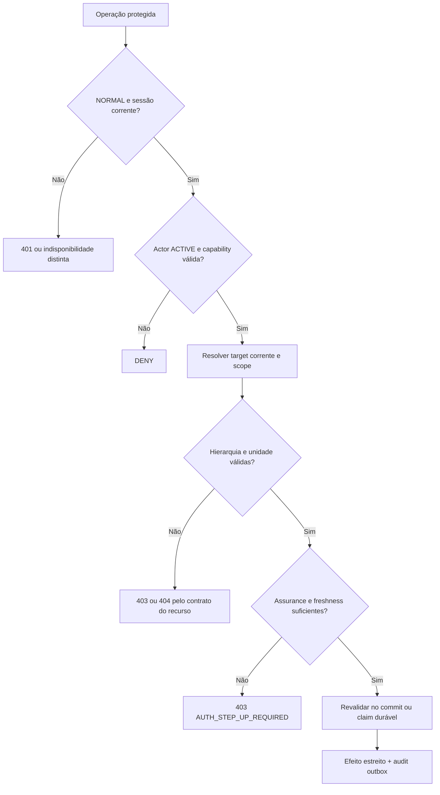

### 15.2 Papéis e matriz inicial Users

Legenda: S=superadmin; A=administrator; R=auditor; M=manager; O=operator.

Hierarquia administrativa: S atua em A/R/M/O; A atua em R/M/O; M somente em O da sua unidade. Mutação do próprio usuário, de equivalente e de superior é negada no fluxo Users comum. Leitura global autorizada não herda essa regra de mutation.

| Capability | Atores | Alvo/scope | AAL | Fresh |
|---|---|---|---|---|
| users.read | S/A/R/M | S/A/R global; M somente O da sua unidade | aal1 | Não |
| users.create | S/A/M | Hierarquia; intenção de unidade validada | aal2 | Sim |
| users.update_profile | S/A | Inferior; sem mudar role/unit | aal2 | Não |
| users.change_role | S/A | Target inferior e nextRole permitida; sem promover a equivalente/superior | aal2 | Sim |
| users.change_unit | S/A | M/O; estado atual e unidade resultante válidos | aal2 | Sim |
| users.resend_activation | S/A/M | Inferior elegível; M→O mesma unidade | aal2 | Não |
| users.start_recovery | S/A/M | Inferior elegível; não muda senha pelo usuário | aal2 | Sim |
| users.suspend | S/A/M | Inferior; transição válida | aal2 | Não |
| users.resume | S/A/M | Inferior SUSPENDED e elegível | aal2 | Não |
| users.block | S/A/M | Inferior; transição válida | aal2 | Não |
| users.unblock | S/A/M | Inferior BLOCKED e elegível | aal2 | Não |
| users.disable | S/A/M | Inferior; fence e preservação do histórico | aal2 | Sim |
| users.reactivate | S/A/M | Inferior DISABLED e elegível | aal2 | Sim |
| users.end_session | S/A/M | Sessão atual de inferior; scope corrente | aal2 | Não |
| users.reset_mfa | S/A | Inferior; procedimento operacional separado | aal2 | Sim |
| users.audit.read | S/A/R | Leitura global autorizada e auditada | aal2 | Não |
| users.cpf.reveal | S/A | Inferior, individual, explícito; sem lote | aal2 | Sim |

Fresh para cpf.reveal é hardening adicional desta especificação. O catalog deve registrar a mesma exigência. Essa capability permanece desabilitada até existir provider privado, justificativa de finalidade e testes.

Manager não recebe update_profile, audit.read, cpf.reveal, reset_mfa, change_role ou change_unit. Operator não recebe gestão administrativa Users. “Perfil próprio” é contrato self separado e não equivale a users.update_profile.

Uma capability na matriz não autoriza expor endpoint sem concluir seus gates. Domínios Units, Clientes, Veículos, Pátio, preços, relatórios e permissões exigem contratos próprios; role global não é wildcard automático.

### 15.3 Listagem, detalhe e dados sensíveis

**READ-01:** resolver dataset autorizado antes de count, filtro, sort, paginação, facets e export. Não buscar global e filtrar depois.

**READ-02:** buscar target usando scope autorizado. Inexistente/fora de scope têm contrato público equivalente 404; falta de capability/hierarquia conhecida para operação produz 403 genérico. Não revelar motivo interno ou unidade de terceiros.

**READ-03:** limite de página e sort allowlist; campos de DTO allowlist. Campos sensíveis não entram em busca, facets ou export por associação.

**READ-04:** lista de terceiros não contém CPF completo nem ciphertext; para manager também não contém CPF mascarado. Reveal não é habilitado pela coluna visível. Acesso a auditoria sensível é auditado.

**READ-05:** comandos de alteração de papel/unidade consideram o estado resultante, não só a autorização sobre o papel anterior. Manager cardinality e máximo de superadmins são invariantes transacionais.

### 15.4 TOCTOU e operações externas

A leitura atual antes da chamada não prova atomicidade com o commit. Para operações locais, bloquear/revalidar registros e versões na mesma transação; definir ordem de locks para evitar deadlocks. Não manter transação aberta durante rede.

Para side effects externos, autorização é fixada em um claim durável de intenção sob estado corrente. Após revogação de ator ou mudança de target, a reconciliação não pode executar novo efeito privilegiado não autorizado. Ela pode completar bookkeeping/compensação do efeito já cometido, sob identidade de serviço restrita e auditável.

Respostas devem distinguir accepted/pending/committed/reconciliation-required, sem declarar sucesso total quando só a intenção foi persistida.

Fontes: [Authorization OWASP](https://cheatsheetseries.owasp.org/cheatsheets/Authorization_Cheat_Sheet.html) e [locks PostgreSQL](https://www.postgresql.org/docs/17/explicit-locking.html).

<a id="c16"></a>

## 16. Roteamento e proteção antes de carregar dados

### 16.1 Arquitetura escolhida

React Router Data Mode com createBrowserRouter. Router é criado uma vez; policy é declarada junto ao registro estático da rota e aplicada por middleware nativo antes dos loaders/actions. Não depender de custom dataStrategy no release inicial.

SessionController é injetado na composição. Context por navegação/fetcher contém a resolução da sessão e a época. Não usar hooks de React dentro de loaders.

**ROUTE-01:** todo registro tem policy explícita: public, guest-only, normal, capability, ou restricted com purpose/step permitidos. Ausência/malformed em rota protegida nega.

**ROUTE-02:** middleware resolve sessão conforme necessidade e avalia policies de todos os matches pertinentes antes do carregamento. Loaders/actions protegidos também consomem contexto validado/assertion comum; não iniciar query enquanto o gate está pendente.

**ROUTE-03:** handlers filhos podem executar em paralelo. Loader pai com redirect não protege automaticamente fetch filho. Não usar Promise.all de sessão e dados privados antes do ALLOW.

**ROUTE-04:** importar lazy module não é carregar dados. Não criar fetch no topo de módulo ou prefetch privado antes de autorização. Lazy não recebe secrets.

**ROUTE-05:** política e routeId necessários ao gate ficam no catálogo estático; não escondidos apenas dentro de chunk lazy. Build verifica unicidade, policy e registro de boundary.

**ROUTE-06:** qualquer 401 recebido pelo domínio passa pelo SessionController, coalescendo revalidação. Não criar navigate("/login") em cada interceptador/feature.

**ROUTE-07:** API nega por si mesma mesmo que client middleware seja removido. Middleware Data Mode é controle de navegação, não firewall servidor.

Documentação: [middleware Data Mode](https://reactrouter.com/how-to/middleware) e [data loading](https://reactrouter.com/start/data/data-loading).

### 16.2 Matriz de navegação

| Policy | Anonymous | NORMAL | Restricted | Unavailable |
|---|---|---|---|---|
| public | Render estático | Render | Render se compatível | Render estático; sem decisão de identidade presumida |
| guest-only login | Form após contexto válido | Destino seguro permitido | Etapa corrente da jornada | Feedback de sessão/serviço e retry |
| normal | Redirect login + returnTo seguro | Permitir | Redirect à jornada corrente | Fallback de indisponibilidade |
| capability | Redirect login | Avaliar capability/assurance | Negar acesso normal | Fallback; sem private loader |
| restricted | Iniciar solicitação ou orientar reinício | Policy específica, sem apagar sessão silenciosamente | Purpose/step corrente permitidos | Feedback e retry |

Guest-only não força usuário NORMAL a logout. Recovery a partir de sessão ativa exige intenção explícita de encerrar/trocar contexto; não apagar sessão por acessar URL pública.

### 16.3 Rotas e etapas de jornada

Rotas públicas de referência: /login, /primeiro-acesso, /recuperar-acesso. Etapas sob paths estáticos registrados; não interpretar um splat desconhecido como etapa inicial permissiva.

A rota de security/self requer NORMAL; step-up é jornada modal/rota associada à operação, sem tornar todo o app privado inacessível ao usuário aal1.

**ROUTE-08:** deep link a password/setup exige servidor confirmar a etapa. “Voltar” não reabre desafio consumido. Refresh da página retoma somente metadados permitidos; nunca repopula senha/OTP/QR de storage.

### 16.4 returnTo

**REDIR-01:** limitar string a 2 KiB e validar como URL relativa à origem canônica. Exigir pathname interno normalizado, sem // inicial, backslash, controles, credenciais ou scheme. Rejeitar percent-encoding ambíguo e double decoding.

**REDIR-02:** resolver pelo catálogo de rotas habilitadas; negar auth loops, rotas reservadas e destinos incompatíveis com a sessão pós-login. Param/query/hash só seguem allowlist da rota e limites; nunca carregam secret/OTP/CPF.

**REDIR-03:** validar novamente depois de autenticar e avaliar autorização. Destino válido sintaticamente pode estar proibido funcionalmente. Fallback é uma rota interna acessível da sessão, não URL fornecida pelo caller.

**REDIR-04:** redirects de loaders/actions usam APIs Router e replace quando adequado. BFF retorna instrução tipada/relative routeId para o client; não redireciona fetch Auth para HTML de login.

Referência: [OWASP Redirects](https://cheatsheetseries.owasp.org/cheatsheets/Unvalidated_Redirects_and_Forwards_Cheat_Sheet.html).

### 16.5 401, 403 e os dois 404

- API protegida sem sessão: 401 e contrato público de autenticação. Navegação pode transformar isso em redirect ao login.
- Sem capability/hierarquia: 403; não encerrar sessão.
- Rota desconhecida: catch-all com feedback de route-not-found.
- Recurso desconhecido/fora de scope: 404 de recurso.
- 502/503/network: indisponibilidade; não encerrar sessão presumidamente.
- SPA servida por fallback de assets pode entregar index.html HTTP 200 em rota desconhecida. A tela 404 e um throw no browser não mudam o status do documento já recebido. HTTP 404 real exige regra de servidor/edge que reconheça o catálogo, sem confundir /api com SPA.

<a id="c17"></a>

## 17. Cache, cancelamento e memorização

### 17.1 Donos e chaves

SessionController possui a projeção de sessão. Router possui resolução de navegação/pending. TanStack Query possui dados de domínio. Não manter payload completo duplicado em loader e query cache; quando uma rota usa Query, loader faz gate/ensure e a feature consome a mesma chave.

**CACHE-01:** queryKey privada contém contextId não secreto, versão de scope/policy, unidade autorizada, recurso e parâmetros normalizados. identityId sozinho não separa duas sessões ou mudanças de permissão.

**CACHE-02:** toda query é declarada public ou identityScoped por factory tipada; default desconhecido é privado/falha de desenvolvimento. Evitar esquecer meta.identityScoped e manter cache invisível ao cleanup.

**CACHE-03:** query privada consome signal de TanStack e época do contexto. Resposta antiga não pode repopular cache depois de removal. Mutation cache e histórico de erros também não armazenam senha/OTP.

**CACHE-04:** factories não permitem overrides que removam cancelamento, classificação de dado ou chave de contexto.

### 17.2 Encerramento e mudança de contexto

Na intenção de logout/fence/perda de autorização: suspender queries/mutations; incrementar época; abortar; cancelar e remover queries privadas; limpar mutation cache/variáveis sensíveis e dados do Router/feature; remover seleção ou object URL privado; impedir late write. Preservar apenas dados explicitamente públicos.

Novo login recebe contextId novo. Mudança de role/unit/policy invalida projeção e cache pertinente mesmo sem trocar identityId. Sem persistência privada em localStorage/IndexedDB/service worker no release inicial.

**CACHE-05:** qualquer cache HTTP/CDN de respostas autenticadas permanece no-store; nunca cachear Set-Cookie ou resposta que contenha autoridade. Cache API não guarda sessões, decisões ALLOW ou locks.

**CACHE-06:** public JWKS/configuração pública pode ser cacheada de acordo com provider, TTL/rotação e invalidation, sem armazenar token ou dado de usuário. Dados públicos realmente anônimos podem ter cache próprio.

**CACHE-07:** staleTime não é autorização e gcTime não é prazo de confidencialidade. Revalidation de sessão/role precede reativação de dados privados.

### 17.3 Performance sem correção dependente de memo

useMemo/useCallback somente para reduzir render/referência quando necessário. Correção de sessão, epoch, lock, TTL ou idempotência não depende da retenção de memo. Separar contexto de estado de contexto de comandos quando medições mostrarem rerenders relevantes.

Evitar cache de autorização cross-request no release inicial. Dentro de uma única request, resultados imutáveis podem ser reutilizados; mutation exige invalidar/revalidar os fatos que alterou.

Fontes: [TanStack defaults](https://tanstack.com/query/latest/docs/framework/react/guides/important-defaults), [query cancellation](https://tanstack.com/query/latest/docs/framework/react/guides/query-cancellation) e [React useMemo](https://react.dev/reference/react/useMemo).

<a id="c18"></a>

## 18. UI, erros, boundaries e acessibilidade

### 18.1 Fronteira de componentes

components/ui contém primitives instalados. components/app contém composições que adicionam contrato visual compartilhado; não fazem fetch, não leem sessão, não decidem role, não classificam erro e não navegam.

A camada de rota/feature converte o estado em título, descrição e callbacks para AppEmpty/Alert/loader. Não criar components/feedback paralelo à convenção vigente. Novo App* requer consumidor real e contrato além de repassar props.

Base UI usa render para triggers/links e primitives nativos de fechamento. Toast segue o toast Base UI já usado pelo projeto, sem introduzir Sonner por copiar exemplo de outro backend.

### 18.2 Matriz visual

| Situação | Apresentação | Conteúdo privado | Ação |
|---|---|---|---|
| Bootstrap | Page loader/status acessível | Oculto | Aguardar/retry após falha |
| Anonymous confirmado | Login ou redirect previsto | Oculto | Autenticar |
| Restricted | Etapa autorizada com progresso | Oculto | Concluir/cancelar jornada |
| Revalidando sessão | Estado discreto; ações sensíveis suspensas | Pode manter só display previamente autorizado, conforme risco | Aguardar confirmação |
| Unavailable/fence/logout incerto | Fallback dedicado | Oculto | Retry/reconciliação |
| Lazy route | Shell autorizado + skeleton da região | Não iniciar dados antes do gate | Aguardar |
| Initial data load | Skeleton compatível com estrutura | Sem resultado inventado | Aguardar |
| Background refetch | Conteúdo do mesmo contexto + indicador | Preservar somente se sessão válida | Retry quando pertinente |
| 403 | Acesso negado no escopo | Sem dado proibido | Voltar/destino permitido |
| 404 route/resource | Feedback sem afirmar causa interna | Sem recurso inexistente/oculto | Navegar/voltar |
| Falha inicial API | Alert/estado de erro no escopo | Sem dados parciais ambíguos | Retry seguro |
| Falha de render | Boundary mais próxima | Conforme isolamento | Reset/reload limitado |
| Chunk antigo | Mensagem de atualização | Não restaurar private state antigo | Reload uma vez, com controle de loop |

Revalidating não permite novas decisões com previousDisplay. Após outage que torne autoridade indeterminada, entrar unavailable e ocultar conteúdo; não preservar indefinidamente dados sensíveis como se fossem válidos.

### 18.3 Formulários e feedback

**UI-01:** FieldGroup/Field/FieldLabel/FieldDescription/FieldError, ID estável, aria-invalid e associação de erro. Campo CPF usa autocomplete=username; senha current-password/new-password conforme fluxo; OTP one-time-code quando suportado.

**UI-02:** pending imediato com Button disabled e Spinner + label acessível; trava síncrona no command/controller e idempotência servidor continuam necessários.

**UI-03:** errors de credencial/validação são inline no formulário, não apenas toast. Persistir mensagem essencial enquanto exigir ação. Não usar alert repetitivo a cada segundo de contador.

**UI-04:** OTP permite colar e usar teclado; não exigir divisão de caracteres que impeça gestor/autofill. Contador de reenvio usa deadline servidor, e disabled não é enforcement.

**UI-05:** títulos, landmarks, foco após navegação/erro, retorno de foco de dialogs e descrição de ações estão no contrato. Testar composição real com teclado, zoom e leitores de tela quando exigido pelo gate.

**UI-06:** Dialog/Sheet têm título acessível. Ação de confirmação crítica tem descrição inequívoca. Toast não comunica perda de sessão sozinho.

Fontes de composição: [Field](https://ui.shadcn.com/docs/components/base/field), [Button](https://ui.shadcn.com/docs/components/base/button), [Empty](https://ui.shadcn.com/docs/components/base/empty), [Spinner](https://ui.shadcn.com/docs/components/base/spinner), [Dialog](https://ui.shadcn.com/docs/components/base/dialog) e [Toast Base UI](https://ui.shadcn.com/docs/components/base/toast).

### 18.4 Boundaries e classificação

**ERR-01:** root boundary é última defesa. Boundaries de rota/feature isolam falhas recuperáveis, mantendo shell quando possível. Não colocar boundary em cada pequeno componente.

**ERR-02:** boundary React não captura arbitrariamente event handler/promise/timeouts. Controller/actions tratam seus erros; callbacks globais de React/Router são telemetria, não substitutos de feedback.

**ERR-03:** Suspense cobre mecanismos de suspensão suportados, lazy/integrações próprias; não captura fetch em effect ou event handler automaticamente.

**ERR-04:** normalizador recebe unknown e retorna SafeError; detalhes/cause ficam fora da UI. Componente visual recebe significado e ações prontos.

**ERR-05:** retry de boundary não repete mutation crítica. Reset de render, revalidation de loader e retry de query são ações distintas; reload é último recurso conhecido e limitado.

Fontes: [Router Error Boundaries](https://reactrouter.com/how-to/error-boundary) e [React Suspense](https://react.dev/reference/react/Suspense).

<a id="c19"></a>

## 19. Contrato HTTP de erros e endpoints

### 19.1 Serialização única

Todos os erros BFF usam application/problem+json conforme RFC 9457, Cache-Control:no-store, nosniff e requestId. Problem code é extensão estável; title/detail públicos são sanitizados. Não refletir erro do SDK, stack, SQL, URL secreta, factorId indevido ou payload do provider.

```json
{
  "type": "about:blank",
  "title": "Service Unavailable",
  "status": 503,
  "code": "AUTH_DEPENDENCY_UNAVAILABLE",
  "requestId": "correlacao-opaca"
}
```

Status do body corresponde ao HTTP. Type pode ser about:blank com code de produto; não inventar URL de catálogo inexistente. Erro interno de configuração é distinto de indisponibilidade, timeout e contrato quebrado.

| Status/código | Uso |
|---|---|
| 400 AUTH_INVALID_REQUEST | Formato/schema inválido, sem refletir segredo. |
| 401 AUTH_SESSION_INVALID | Ausência/invalidade confirmada de NORMAL no endpoint protegido. |
| 401 AUTH_CREDENTIALS_INVALID | Falha genérica de login. |
| 403 AUTH_ORIGIN_DENIED / AUTH_CSRF_INVALID | Requisição não autorizada por proteção de mutation. |
| 403 AUTH_ACCESS_DENIED | Falta de capability/hierarquia. |
| 403 AUTH_STEP_UP_REQUIRED | AAL/freshness insuficiente; nunca converter para logout. |
| 404 RESOURCE_NOT_FOUND | Inexistência/fora de scope conforme contrato. |
| 409 AUTH_STATE_CONFLICT | Estado/generation/idempotência incompatíveis. |
| 413 AUTH_BODY_TOO_LARGE | Body excedente interrompido durante stream. |
| 415 AUTH_UNSUPPORTED_MEDIA_TYPE | Tipo de request incompatível. |
| 429 AUTH_RATE_LIMITED | Limitação local/provider, sem revelar existência. |
| 500 AUTH_CONFIGURATION_ERROR | Configuração inválida identificada. |
| 500 AUTH_UNEXPECTED_ERROR | Erro inesperado, sanitizado e correlacionado. |
| 502 AUTH_PROVIDER_FAILURE | Falha de integração/protocolo upstream. |
| 503 AUTH_DEPENDENCY_UNAVAILABLE | Dependência/fence operacional indisponível. |
| 504 AUTH_DEPENDENCY_TIMEOUT | Budget upstream esgotado. |

Mapeamento exato de upstream é central. Network/abort do browser são categorias locais, não códigos HTTP inventados. Resposta 200 com JSON inválido é contract-error.

Referência: [RFC 9457](https://www.rfc-editor.org/rfc/rfc9457).

### 19.2 Registro inicial de endpoints

Os paths abaixo são a nomenclatura canônica nova; não são afirmação de endpoints existentes. Todos usam same-origin, schema e no-store. POST exige Origin/CSRF. Endpoint não habilitado retorna 404/contrato controlado, jamais stub de sucesso.

| Método e path | Autoridade | Resultado e efeito |
|---|---|---|
| GET /api/auth/context | PREAUTH/journey/NORMAL | Token CSRF e contexto mínimo; não autentica. |
| GET /api/auth/session | Cookie NORMAL ou journey | Snapshot autenticado/restrito/anonymous confirmado; outage distinto. |
| POST /api/auth/login | PREAUTH | NORMAL ou MFA_PENDING depois de prova. |
| POST /api/auth/login/mfa/verify | MFA_PENDING | NORMAL aal2, mesma identidade/session. |
| POST /api/auth/logout | NORMAL/contexto de encerramento | Revogação funcional idempotente; tarefa provider durável. |
| POST /api/auth/activity | NORMAL | Atualiza lastHumanActivity apenas se sessão válida. |
| POST /api/auth/activation/request | PREAUTH | 202 com challenge/decoy + outbox durável. |
| POST /api/auth/activation/resend | Journey activation | Nova generation sem reset de budget/expiry. |
| POST /api/auth/activation/verify | Journey activation | BOOTSTRAP somente após OTP. |
| POST /api/auth/activation/password | BOOTSTRAP | Commit externo comprovado ou pending reconciliation. |
| POST /api/auth/activation/complete | BOOTSTRAP SECURITY_SETUP | Promoção atômica NORMAL. |
| POST /api/auth/recovery/request | PREAUTH | 202 equivalente + outbox. |
| POST /api/auth/recovery/resend | Journey recovery | Nova generation limitada. |
| POST /api/auth/recovery/verify | Journey recovery | RECOVERY restrita. |
| POST /api/auth/recovery/password | RECOVERY | Fence, troca, reautenticação, sign-out e consume. |
| GET /api/auth/journey | Journey | Etapa/metadados atuais sem segredo. |
| POST /api/auth/journey/cancel | Journey | Consumir/inativar contexto, sem reverter side effect confirmado. |
| POST /api/auth/mfa/enroll | BOOTSTRAP setup ou NORMAL | Fator unverified próprio. |
| POST /api/auth/mfa/verify | Contexto vinculado ao enrollment | Fator verified e projeção atual. |
| POST /api/auth/mfa/cancel | Contexto vinculado | Cleanup apenas unverified da transação. |
| POST /api/auth/step-up/challenge | NORMAL + intenção elegível | Desafio no fator vigente. |
| POST /api/auth/step-up/verify | NORMAL + challenge vinculado | Prova fresh sem ampliar capability. |
| POST /api/auth/password/change | NORMAL | Alteração comprovada, fence e novo login. |

Não há endpoint público de refresh token: a autoridade renova no servidor conforme necessidade. Não há /change-phone, /passkey ou /reset-mfa público no release inicial.

### 19.3 Schemas e handlers

Handlers fazem path/method → proteção → decoding → command → encoding. Operações são módulos pequenos, sem duplicar cookie/CSRF/errors. Schema de entrada rejeita propriedades inesperadas quando relevante e valida enums, IDs e comprimentos.

Enforce limites também em response do upstream e body de erros. Prechecks não clonam/consomem body ilimitado. QR/image payload tem tipo e tamanho allowlist; não confiar em generic cast.

Verificadores precisam cobrir comportamento de endpoints, não apenas nomes de funções. Testar que todos os caminhos de erro usam o serializador, incluindo exceptions.

<a id="c20"></a>

## 20. Persistência, RLS, idempotência e efeitos duráveis

### 20.1 Objetos e privilégios

Modelo lógico mínimo: identities; functional_sessions; journey_transactions; challenges; assignments; units_state; command_ledger; delivery_outbox; delivery_attempts; audit_events/outbox; rate_limit_buckets; reconciliation_jobs. Não usar “status” de uma tabela para representar todas essas máquinas.

**DB-01:** exposed schema é escolha explícita. Tabelas/funções não recebem acesso browser/anon/authenticated por padrão. BFF tem acesso mínimo por RPC/role; secret amplo somente nas integrações que exigirem.

**DB-02:** grants e RLS são controles distintos. Exposed tables usam RLS com contraprovas; private schema sem USAGE aos roles API comuns. Default privileges e EXECUTE são revisados em migration.

**DB-03:** preferir SECURITY INVOKER. Definer somente quando necessário, schema privado, search_path seguro, objetos qualificados, grants EXECUTE restritos e argumentos revalidados. Não “resolver” permission error ativando definer.

**DB-04:** secret/service role e BYPASSRLS não são contidos por FORCE RLS. Invariantes privileged precisam de RPC estreita, constraints e testes de operação.

**DB-05:** uniqueness, FK, cardinalidade, one-time consumption, generation e CAS ficam no banco. Plano de schema declarativo deve equivaler às migrations reconstruídas.

Fontes: [RLS PostgreSQL](https://www.postgresql.org/docs/17/ddl-rowsecurity.html), [CREATE FUNCTION](https://www.postgresql.org/docs/17/sql-createfunction.html) e [API keys Supabase](https://supabase.com/docs/guides/api/api-keys).

### 20.2 Ledger e incerteza

Estados de command: CLAIMED → EFFECT_REQUESTED → EFFECT_CONFIRMED → COMMITTED; ou FAILED_CONFIRMED / RECONCILIATION_REQUIRED. Comando durável não armazena credenciais. Request hash cobre campos não secretos da intenção; repetição de senha/OTP nunca é reconstruída do ledger.

Claim único e CAS impedem efeitos concorrentes. Enquanto resultado externo for desconhecido, não repetir side effect sem prova de idempotência do provider. Leitura de status exige cookie/autoridade autorizada e não retorna resultado sensível pelo ID público.

Reconciler documenta, para cada estado, fatos observáveis, ação permitida, prazo, retry, compensação e escalonamento humano. Um timestamp de atualização não substitui prova semântica do efeito.

### 20.3 Outbox banco–Queue

Challenge e delivery_outbox são criados no mesmo commit. Outbox guarda envelope AES-GCM e metadados mínimos, nunca OTP/telefone plaintext. Dispatcher claima lote com lease/CAS, envia à Queue e marca publicação. Falha entre send e mark pode duplicar; consumer precisa tolerar.

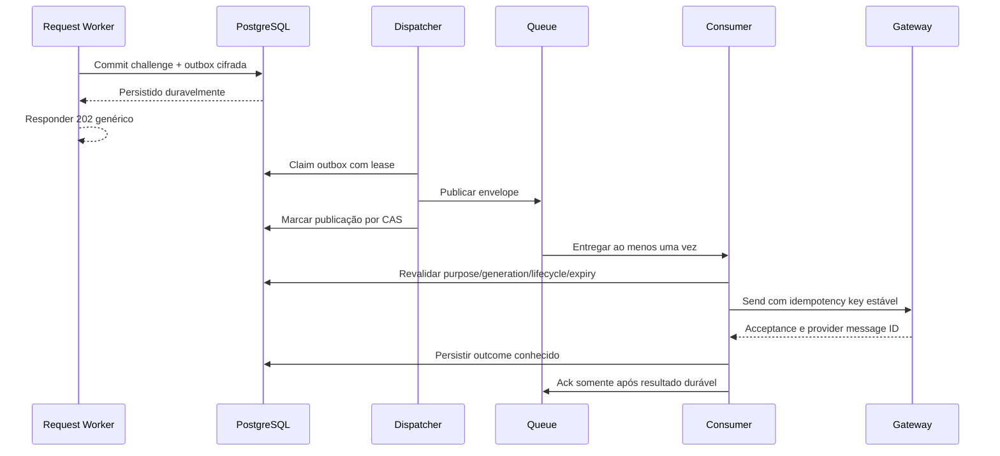

### 20.4 Consumer, SMS e DLQ

**QUEUE-01:** antes de lookup de telefone/outbound, verificar transaction, identity, purpose, generation, CHALLENGE_PENDING, expiry e lifecycle. Stale legítima recebe ack; falha de estado indisponível recebe retry, nunca allow.

**QUEUE-02:** messageId/transactionId:generation é idempotency key estável. Provider deve comprovar deduplication em chamadas simultâneas e janela de retry. Ledger local sozinho não garante exatamente uma entrega quando resposta de SMS se perde.

**QUEUE-03:** gateway sem idempotência/consulta de outcome comprovadas não atende ao release. Não prometer exactly-once delivery sobre Queue at-least-once.

**QUEUE-04:** aceitar HTTP 2xx significa accepted pelo gateway. Delivery/failure física exige receipt/callback assinado ou consulta autenticada do provider. Webhook também tem schema, replay protection, limite, origem/autenticidade e correlação.

Uma entrega autorizada no claim pode chegar ao telefone após resend, expiração ou revogação: não existe rollback de SMS já em trânsito. A propriedade de segurança é que a geração anterior não verifica nem concede autoridade; o consumer não inicia um novo efeito quando a mensagem já está stale no claim. Testar entrega fora de ordem e explicitar na UI a validade do desafio vigente, sem prometer a ordem física de chegada.

**QUEUE-05:** retry tem backoff/jitter, maxAttempts configurado, prazo limitado pela jornada e DLQ. Decoy é descartado sem telefone/outbound. Não reprocessar manualmente DLQ sem revalidar generation/expiry.

**QUEUE-06:** retenção real de Queue, DLQ e outbox determina retenção de chave anterior. Publicação e consumo respeitam feature stage; ao desabilitar fluxo, parar dispatcher e bloquear efeitos de mensagens pendentes conforme política, preservando evidência para eventual descarte.

**QUEUE-07:** usar bindings, não REST pública Cloudflare. waitUntil pode executar trabalho auxiliar, mas não substitui outbox/Queue para efeitos necessários à conclusão.

Fontes: [delivery guarantees](https://developers.cloudflare.com/queues/reference/delivery-guarantees/), [DLQ](https://developers.cloudflare.com/queues/configuration/dead-letter-queues/) e [Workers best practices](https://developers.cloudflare.com/workers/best-practices/workers-best-practices/).

<a id="c21"></a>

## 21. Configuração, secrets e segurança de deployment

### 21.1 Separar ambiente de estágio

Ambientes: LOCAL, LOCAL_PRODUCTION_LIKE, STAGING/TARGET_HOSTED e PRODUCTION. Estágio do fluxo: disabled, candidate ou validated. Uma variável validated não é evidência; o pipeline exige manifesto compatível.

**CFG-01:** build produtivo não aceita flags de preview, fixtures, bypass, loopback auth, mock actor ou initialSessionSnapshot injetado. Existem adapters explícitos para test/dev; não há retorno sintético autenticado no adapter produtivo.

**CFG-02:** habilitar Auth produtivo por configuração própria com domínios/cookies/provider comprovados. Não reutilizar DEV+loopback como mecanismo de release.

**CFG-03:** health público responde liveness mínimo sem PII, secrets ou configuração detalhada. Readiness interna verifica dependências com deadline e cache público restrito; sua falha não é sessão anonymous.

**CFG-04:** registrar recursos necessários: URL Auth allowlisted HTTPS, keys de servidor, signing key/JWKS, keyrings de session/lookup/challenge/delivery/CSRF conforme desenho, queue/DLQ, gateway token/URL, origem canônica, cron, TTLs e policyVersion. Todos verificados ao iniciar/admitir o fluxo; nenhum valor real no Git.

**CFG-05:** Supabase: signup público e provedores anonymous/social desabilitados; TOTP configurado; proteção de senha comprometida habilitada/provada; signing e refresh rotation esperados; Data API/schema/grants mínimos. Config.toml local não prova configuração hospedada.

**CFG-06:** SDK no servidor sem persistência de sessão nem auto-refresh independente do coordenador. Clients e credenciais de usuário são request-scoped; não manter estado mutável de usuário em módulo Worker.

**CFG-07:** /api e /api/* chegam ao Worker antes do SPA fallback. API desconhecida retorna contrato 404, nunca index.html. Redirecionamento upstream é negado/manual conforme adapter e allowlist; não propagar automaticamente Authorization/Cookie recebidos para outro serviço.

### 21.2 Headers e cache de assets

HTML/app: CSP com script-src/connect-src mínimos; frame-ancestors 'none'; base-uri restrita; form-action 'self'; object-src 'none'; Referrer-Policy restritiva; nosniff; Permissions-Policy mínima. HSTS somente HTTPS e após validar subdomínios; preload exige decisão própria.

Primitives/CSS que exigirem hashes ou estilos inline têm exceção específica, documentada e testada. Não relaxar script-src para unsafe-inline ou unsafe-eval por conveniência.

Assets fingerprinted podem usar cache público longo/immutable. HTML revalida para não prender o app em release antigo. /api Auth e dados sensíveis usam no-store; headers de segurança são aplicados em todas as respostas Worker, inclusive catch/configuração/404.

O arquivo _headers cobre assets, não substitui os headers de respostas do Worker. [Cloudflare Static Assets headers](https://developers.cloudflare.com/workers/static-assets/headers/).

### 21.3 Lifecycle de keys e recuperação operacional

**KEY-01:** separar chaves por finalidade; criptografia autenticada e aleatoriedade Web Crypto. Não implementar algoritmo criptográfico próprio.

**KEY-02:** keyring tem versão atual e versões de decrypt/lookup permitidas. Writers usam atual; readers aceitam somente conjunto autorizado. Unknown version falha fechado.

**KEY-03:** retirar chave de delivery somente quando nenhuma Queue/DLQ/outbox vigente precisar dela. Retirar chave de sessão somente após reencrypt/revogação comprovada do conjunto afetado. Rotação de lookup preserva unicidade lógica de CPF.

**KEY-04:** registrar proprietário, armazenamento, rotação, acesso, emergência, revogação e recuperação de backup. Plano de incident response para vazamento: desabilitar fluxo, revogar/fence, rotacionar, reconciliar, comunicar conforme processo e validar retorno.

**KEY-05:** backup contém ciphertext/keyVersion; acesso às chaves é separado. Restore não restaura sessões/challenges antigas como ativas: executar fence e revisão de geração antes de reabrir tráfego.

Fontes: [Workers best practices](https://developers.cloudflare.com/workers/best-practices/workers-best-practices/) e [OWASP Secrets Management](https://cheatsheetseries.owasp.org/cheatsheets/Secrets_Management_Cheat_Sheet.html).

<a id="c22"></a>

## 22. Rate limiting, enumeração, disponibilidade e escala

### 22.1 Limitação de abuso

Perfil inicial é uma **política RMC para começar os testes**; revisar por carga legítima, NAT corporativo e quota do provider antes do gate target. Não remover limites para fazer teste passar.

| Operação | Chave principal | Perfil inicial |
|---|---|---|
| Login | Identity lookup HMAC | 10 tentativas/15 min, com atraso progressivo; não block permanente automático. |
| Login | IP confiável da edge | 60 tentativas/min e controle global de burst. |
| Request/resend SMS | Identidade/purpose | 3 envios/15 min e 10/dia; cooldown 60 s. |
| Request/resend SMS | IP | 30 requests/15 min; quota de custo global independente. |
| Verify OTP | Journey | 5 falhas cumulativas e consume ao esgotar. |
| Verify OTP | Identidade | 10 falhas/30 min, atravessando recriação de jornada. |
| TOTP verify | Contexto/identidade | 5 falhas/5 min; budget adicional do provider. |
| Step-up | NORMAL e identidade | 5 falhas/5 min; não revogar conta por attacker-controlled count. |
| Activity | Sessão | Coalescing 60 s e rejeição de abuso de timestamp/reporte. |

**RATE-01:** usar IP somente de contexto autenticado pela plataforma edge, não X-Forwarded-For arbitrário. Não logar IP/CPF integral por padrão.

**RATE-02:** contadores persistentes/atômicos, bounded keys e TTL. Criar CPF aleatório não pode acumular buckets sem limite. Cleanup/batch e cardinalidade máxima possuem monitoramento.

**RATE-03:** armazenamento do limiter indisponível falha fechado no caminho que depende dele; 503/502, nunca allow nem 429 inventado.

**RATE-04:** responder com status/Retry-After e formato que não revelem identidade existente. Resend não reinicia verify budget. Chaves por identity/purpose/generation são privadas.

**RATE-05:** CAPTCHA/Turnstile pode ser camada adicional acionada por risco, com verificação servidor, binding e tratamento acessível; não substitui rate limit e não entra como dependência obrigatória sem decisão.

Supabase possui seus próprios limites, que podem variar por endpoint/plano. Devem ser registrados e testados no target. [Rate limits Supabase](https://supabase.com/docs/guides/auth/rate-limits).

### 22.2 Anti-enumeração mensurável

**ENUM-01:** comparar ACTIVE, PENDING, BLOCKED, inexistente e entradas inválidas quanto a body, status, headers, tamanho, cookies, Retry-After, p50/p95/p99 e efeitos externos observáveis.

**ENUM-02:** decoy percorre persistência e trabalho equivalentes necessários sem enviar SMS. Outbox reduz diferença de entrega física no caminho público, mas não prova equivalência de timing.

**ENUM-03:** executar distribuição aleatória e intercalada de casos, warm/cold, carga concorrente e mais de um IP/NAT controlado. Registrar amostra, seed, ambiente e intervalos de confiança.

**ENUM-04:** aceitar somente quando análise não mostrar diferença material explorável. Como critério inicial de revisão: pelo menos 500 amostras por grupo, diferença de p50/p95 ≤maior entre 100 ms e 10% da baseline, e investigação de qualquer separação persistente. Esse limiar é do projeto, não prova matemática contra todos os classificadores.

Não adicionar sleeps longos e ilimitados para mascarar falhas. Deadlines, custo e capacidade devem permanecer limitados. Diferenças materiais bloqueiam o release até correção/revisão formal do risco.

### 22.3 SLO e capacidade

Objetivos iniciais de projeto no target, com dependências saudáveis: bootstrap p95≤1,5 s/p99≤4 s; login sem interação humana p95≤3 s/p99≤8 s; erro não intencional em requests legítimas ≤0,1%. São objetivos de aceite, não resultados medidos.

Prova de refresh concorrente saudável: concorrência 2, 5, 10 e 50 sobre a mesma sessão; exatamente uma renovação por geração; todas as respostas legítimas válidas, sem 401/5xx sob o perfil nominal definido. Sob falha injetada, o critério é erro explícito/recuperação e integridade, não sucesso fictício.

Manifesto de capacidade registra usuários simultâneos esperados, RPS nominal/burst, região, latência upstream, quotas Auth/SMS/banco/Queue, fila máxima, age limite e custo. Rodar nominal, 2× pico e burst 10× nominal com limitação controlada. Sem capacidade definida e medida, não aprovar target.

**PERF-01:** consolidar fatos da request em RPC/read boundary e reutilizar somente dentro da request. Não fazer múltiplos fetches de sessão por feature.

**PERF-02:** índices para cookie hash, CPF lookup, journey binding, generation/lease, buckets e outbox status/nextAttempt; consultas paginadas e batches bounded.

**PERF-03:** lock por identidade/sessão/alvo, nunca lock global do app. Ordem de locks definida; deadlock/serialization retry somente em transação local idempotente e dentro do budget.

**PERF-04:** SSR/streaming/Redis/DO/read replica não são exigidos por antecipação. Introduzir somente com gargalo medido e prova das invariantes. Réplica com atraso não decide revogação imediata.

**PERF-05:** desligar fluxo degrada para indisponibilidade explícita e leitura pública estática; não bypassar Auth quando Auth/banco estiverem fora.

<a id="c23"></a>

## 23. Auditoria, observabilidade, jobs e operação

### 23.1 Eventos e proteção de dados

Eventos estruturados allowlisted: AUTH_LOGIN_OUTCOME, MFA_OUTCOME, SESSION_REVOKED, SESSION_REFRESH_OUTCOME, CHALLENGE_REQUESTED/VERIFIED, RECOVERY_OUTCOME, ADMIN_COMMAND_OUTCOME, DELIVERY_OUTCOME, RECONCILIATION_REQUIRED/RESOLVED.

Campos internos mínimos: eventId, requestId, commandId, identityId opaco quando autorizado, purpose, generation, capability, resultado, reasonCode fechado, timestamp servidor, deployment/contractVersion. Proibir corpo livre de exception/request.

Audit durável e log operacional são produtos distintos. Mutations críticas e acesso à auditoria/reveal têm evento no commit/outbox; logs amostrados não substituem trilha. userId/eventId também são dados que exigem controle de acesso e finalidade.

Retenção operacional proposta: logs sanitizados 30 dias e audit durável 12 meses, sujeitos à política de privacidade/requisitos aplicáveis e aprovação no manifesto. Não são prazos legais universais. Guardar credenciais é proibido independentemente do prazo.

Acesso a sink/audit é restrito e auditável; export com finalidade e filtros. Redaction é testada com exemplos sintéticos de senha, OTP, JWT, cookie, CPF e telefone, inclusive exceptions.

Referência: [OWASP Logging](https://cheatsheetseries.owasp.org/cheatsheets/Logging_Cheat_Sheet.html).

### 23.2 Jobs e liveness

Cron/dispatcher/reconciler por minuto, com batches, maxAttempts, nextAttemptAt, leases e circuit breaker por dependência. Não depender de chegada de tráfego para limpar/reconciliar.

Monitorar: oldest outbox age; queue/DLQ backlog; incertezas abertas; retries por dependência; cardinalidade de limiter; refresh collisions; clocks; latência e disponibilidade; falhas de audit writer; config drift.

Alertas possuem limiar, responsável, canal operacional autorizado e ação. Drill prova que alguém consegue diagnosticar e conter o incidente. Não “resolver” DLQ descartando em lote sem verificar purpose/generation.

### 23.3 Runbooks mínimos

| Cenário | Procedimento obrigatório |
|---|---|
| Provider Auth fora | Bloquear efeito, classificar dependência, preservar fence, reconciliar. |
| Banco/limiter fora | Não permitir operações dependentes; alerta de disponibilidade. |
| SMS com resposta perdida | Consultar idempotency/outcome; não reenviar cegamente. |
| Queue/DLQ envelhecida | Inspecionar metadados restritos, revalidar estado, retry/ack justificado. |
| Key comprometida | Desabilitar fluxo afetado, revogar/fence, rotacionar e validar retorno. |
| Usuário sem telefone/TOTP | Procedimento operacional de identidade, sem bypass de email/CPF. |
| Conta admin indisponível | Recuperação restrita de superadmin com dupla responsabilidade. |
| Restore de backup | Fence de sessões/desafios, revisão de migrations/keys e gate antes de tráfego. |
| Deploy/rollback | Manter compatibilidade de contratos/generations; feature flag fechada se houver incompatibilidade. |

Rollback de frontend não pode reativar endpoint/credential antigo. Rollback de banco com dados novos exige plano próprio; não promover restore como simples retorno de versão.

<a id="c24"></a>

## 24. Fases de implementação e critérios de saída

A ordem abaixo é normativa; trabalho visual reversível pode avançar em paralelo, mas não abre gates de segurança. Nenhuma fase autoriza publicação por associação.

| Fase | Entregas | Dependências | Critério de saída |
|---|---|---|---|
| F00 — baseline e ameaça | Pins, versões, domínio pretendido, risk model, contracts IDs, feature flags. | Documento vigente. | Configuração candidata validada sem secrets reais e sem caminhos permissivos. |
| F01 — contratos puros | Estados/DTOs/decoders, policy, errors, clocks, scopes, porta Auth/DB/SMS. | F00. | Contraprovas de malformed/unknown e imports sem domínio na UI. |
| F02 — persistência | Schemas, migrations, grants/RLS, assignments, ledger/outbox/leases/limiter. | F01; contrato Units comprovado para fluxos dependentes. | DB reconstruída; equivalência; constraints e testes positivos/negativos. |
| F03 — fronteira BFF | Transport, body stream, cookies, CSRF/context, headers, routing /api. | F01/F02. | Erros canônicos; limites, origem e csrf comprovados. |
| F04 — provisioning | Day-zero, create administrativo, saga/integração Auth–DB e reconciliação. | F02/F03; authorization base. | Sem senha temporária; duplicidade e falha parcial sem NORMAL. |
| F05 — entrega | Envelope, outbox dispatcher, Queue/consumer, gateway adapter, DLQ. | F02/F03. | Stale/dup/falha/send perdido e rotação local comprovados. |
| F06 — ativação | Request/decoy, verify, BOOTSTRAP, senha, setup e promoção. | F04/F05; password policy. | Fluxo completo e interrupções preservam autoridade restrita. |
| F07 — login e MFA | Credenciais, MFA_PENDING, enrollment e fresh step-up. | F03/F04/F06. | Fator existente nunca ignorado; same session/AAL comprovados. |
| F08 — sessão e logout | Bootstrap, authority, refresh distribuído, idle, fence, abas. | F02/F03/F07. | Concorrência, resposta perdida, stale cookie e logout conhecidos. |
| F09 — recovery/change | RECOVERY, password commit proof, global sign-out, admin MFA runbook. | F05/F07/F08. | Recovery sem NORMAL e sem remoção MFA; incerteza reconciliada. |
| F10 — autorização/Units | Catálogo final, scope antes de query, cardinalidade, commit revalidation. | F01/F02/F08; ERP real. | Tests por capability/hierarquia/unidade; endpoints dependentes gated. |
| F11 — frontend runtime | Controller único, middleware/router, forms, feedback, cache por contexto. | Contratos F01; adapters F03–F10. | Deep links, cancel, double-submit, fallbacks e a11y integrados. |
| F12 — prova local completa | Unit/integration Worker/DB/browser, carga controlada, anti-enum. | F00–F11 no escopo. | PASS_LOCAL do SHA corrente, manifest/checksums e sem testes não iniciados. |
| F13 — prova target | HTTPS, provider/plano, SMS real, Queue/DLQ, jobs, secrets, observabilidade/capacidade. | F12 e infraestrutura final. | PASS_TARGET para cada propriedade hospedada, com procedimentos auditados. |
| F14 — GO e operação | Revisão do manifesto, rollout restrito, rollback, monitoramento e runbooks. | F12/F13 e owner. | Todos os gates do escopo; validated não é editado manualmente para simular prova. |

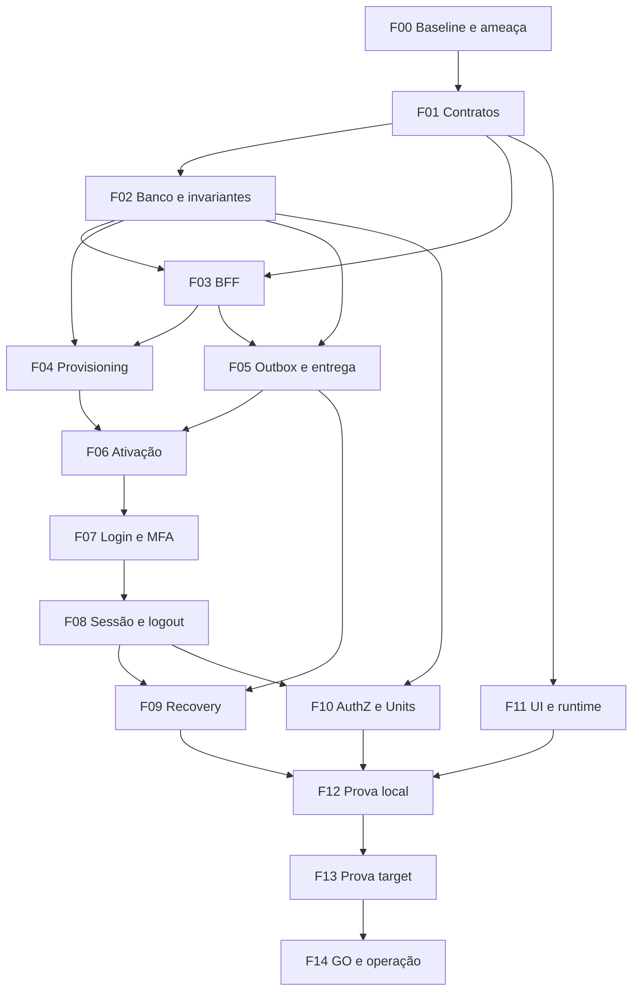

A publicação de Auth pode ter Users/Units não expostos se o manifesto e o catálogo refletirem exatamente isso. Qualquer usuário unit-scoped habilitado precisa de unidade/assignment autoritativos; fixture não atende ao gate.

<a id="c25"></a>

## 25. Plano de testes e evidência reproduzível

### 25.1 Camadas de prova

- **Unit:** decoders, policies, transições, parâmetros, relógios e normalizadores.
- **Integration browser:** controller/router/query/form com transporte controlado e interações reais.
- **Worker runtime:** requests/cookies/headers/signals/bindings no runtime suportado, sem assumir Node equivalente.
- **PostgreSQL/pgTAP:** grants, RLS, functions, constraints, concorrência e invariantes.
- **Provider integration/PoC:** Auth real local/production-like para claims/session/MFA/rotation/update.
- **E2E target:** navegador HTTPS→BFF→provider/banco→resposta; SMS físico e operação hospedada quando necessários.
- **Capacity/fault injection:** timeouts, perda de resposta, duplicidade e dependências indisponíveis.

Não fazer contagem de testes equivaler a coverage de contrato. Inventário estático, último PASS histórico e resultado corrente são campos distintos. Não reutilizar contagens/SHA do projeto anterior.

### 25.2 Matriz mínima de contraprovas

| ID | Prova obrigatória | Requisitos vinculados |
|---|---|---|
| T01 | CPF inexistente/inelegível sem revelação de existência, incluindo timing. | ACT-01, LOGIN-02, ENUM-01–04 |
| T02 | Body sem Content-Length interrompido acima de 8 KiB também em rate precheck. | SEC-11, HTTP, RATE |
| T03 | 200 null/shape inválido/media incorreto não avança nem adota sessão. | SEC-12, HTTP-02 |
| T04 | Double-submit e duas abas não duplicam side effect; geração antiga rejeitada. | STATE, LOGIN-09, ledger |
| T05 | Response tardia após unmount/navegação/logout/troca não restaura UI/cache. | SEC-13, LOGIN-10, CACHE |
| T06 | Cookie/token/session_id/sub errado, duplicado ou expirado produz DENY. | SES-01–03 |
| T07 | Outage não produz anonymous confirmado nem logout presumido. | STATE-01, BOOT, OUT |
| T08 | Login com fator verificado exige TOTP; fator de outro usuário negado. | LOGIN-04–06, MFA |
| T09 | Enrollment abandonado remove só unverified pertencente à jornada. | MFA-05 |
| T10 | Fresh 300 s/skew 30 s/sessão diferente e intenção alterada negados. | STEP |
| T11 | Ativação interrompida nunca acessa capability NORMAL. | SEC-03–04, ACT |
| T12 | Recovery mantém TOTP, fence e retorno ao login sem auto-NORMAL. | REC |
| T13 | Password update com resposta perdida não repete efeito cegamente. | REC-06, ledger |
| T14 | Refresh 2/5/10/50 concorrentes coordena uma geração e atende critério nominal. | REF-01–06 |
| T15 | JWT ainda válido não supera logout/fence/bloqueio no BFF. | SEC-08, OUT-04 |
| T16 | Heartbeat, background poll e idle refresh não renovam atividade. | IDLE |
| T17 | Broadcast falso não concede authenticated/AAL; fallback funciona sem canal. | TAB |
| T18 | Origin inválido, CSRF ausente/errado e Fetch Metadata incompatível negados; reentrega, rotação e bootstrap CSRF em múltiplas abas sem efeito indevido. | SEC-10, CSRF |
| T19 | Parent/child loaders paralelos não iniciam fetch privado sem gate. | ROUTE-02–03 |
| T20 | returnTo externo/encoding/backslash/auth loop/reserved/capability negada não redireciona. | REDIR |
| T21 | 401/403/404/5xx possuem semânticas distintas; 403 não faz logout. | ERR, HTTP |
| T22 | Manager não lê audit/CPF nem opera fora da unidade/equivalente. | AUTHZ, READ |
| T23 | Count/facets/export não revelam dataset fora de scope. | READ-01 |
| T24 | Role/unit/status de ator ou alvo mudados durante mutation invalidam commit indevido. | AUTHZ, TOCTOU |
| T25 | Manager bloqueado continua ocupando assignment; substituição preserva histórico. | Units |
| T26 | Unidade inativa/divergente/ausente nega; sync preserva override local. | SEC-17 |
| T27 | Grants/RLS/RPC e BFF negam operações indevidas; contraprovas com secret/definer/BYPASSRLS demonstram bypass sem alegar contenção inexistente. | DB-01–05 |
| T28 | Crash entre DB/outbox/send/mark/ack gera retry sem efeito indevido. | Outbox, QUEUE |
| T29 | Mensagem stale/duplicada/DLQ e key rotation mantêm generation/purpose. | QUEUE-01–06, KEY |
| T30 | SMS acceptance não é classificado como delivery; gateway dedup/outcome real e entrega fora de ordem sem validação de geração antiga. | QUEUE-02–04 |
| T31 | Senhas limites Unicode/bytes/NFC/comprometidas e falhas do verificador; verificar todos os caminhos de escrita, inclusive Admin API. | Capítulo 12 |
| T32 | Cache privado removido não reaparece por late response; público permanece. | CACHE-01–07 |
| T33 | Bootstrap/loading/offline/chunk failure apresentam feedback acessível e retry correto. | BOOT, UI, ERR |
| T34 | Dialog, foco, keyboard, gestor de senha e OTP paste funcionam na composição real. | UI-01–06 |
| T35 | Headers Worker/asset/API404 e cache sensível observados em HTTP real. | CFG |
| T36 | Restored backup, cron parado, key inválida e job atrasado falham fechado e alertam. | KEY, jobs |
| T37 | Bundle/config/build de produção não contém secret/preview/mock authenticated. | CFG-01 |
| T38 | Drift de docs/registry/params/roles/tests detectado sem falsos PASS abrangentes. | D16 e governança |

Dados de teste são sintéticos. Quando usar contas controladas em target, obter autorização do responsável e cleanup idempotente previsto no procedimento; não executar carga ou SMS indiscriminadamente contra usuários reais.

### 25.3 Testes de UI sem fragilidade desnecessária

Preferir getByRole/getByLabelText, ações, requests, navegação, estado e acesso. Texto é assertado quando mensagem/label é parte funcional/acessível. Não testar classes decorativas ou internals de libs.

Não excluir testes de foco/teclado sob argumento “Base UI já testa isso”: wrappers e composição podem quebrar o contrato. Testar o produto integrado, sem replicar toda suite da biblioteca.

Referências: [Testing Library queries](https://testing-library.com/docs/queries/about/) e [React Router testing](https://reactrouter.com/start/data/testing).

### 25.4 Manifesto e gates

Cada evidência registra: requisito/test ID; SHA inteiro; contractVersion; ambiente; deployment/provider/database versions; configuração não secreta; comando/procedimento exato; início/fim; exit status; casos/totais; checksums dos artefatos sanitizados; responsável; limitações.

PASS_LOCAL: build/lint/types, unit/integration browser+Worker, DB e provider local apropriado, E2E local production-like, contraprovas e fault/capacity locais pertinentes. Falha de runner ou teste não iniciado não é PASS.

PASS_TARGET: configurações/plano/quotas hospedadas, domínio/HTTPS/cookies, SMS físico, Queue/DLQ/retention, rotação, cron/liveness, sink/audit/alerts, capacidade e E2E final. Probes inexistentes precisam ser implementados/revisados ou substituídos por procedimento manual auditável **antes** do gate.

CI pode aplicar gates adicionais, mas não substitui prova do target. Status de cobrança/runner é relatado como limitação externa, sem forçar release.

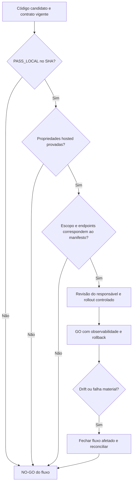

<a id="c26"></a>

## 26. Definition of Done e checklist de liberação

### 26.1 Domínio funcional concluído

- [ ] Identidade, role, lifecycle, onboarding e assignments são dimensões separadas.
- [ ] Provisionamento sem senha temporária; integração e falhas parciais comprovadas.
- [ ] Ativação completa concede NORMAL somente após provas e commit.
- [ ] Login/TOTP/fresh têm binding e enforcement servidor.
- [ ] Recovery não autentica automaticamente nem remove MFA.
- [ ] Senha é validada no servidor sem truncamento ou divergência de normalização.
- [ ] Sessão única, TTL absoluto, idle, fence e refresh distribuído comprovados.
- [ ] Logout e resultado indeterminado têm reconciliação.
- [ ] State/controller único, época, sinais e concorrência integrados.
- [ ] Router protege cada carregamento; API nega independentemente.
- [ ] Scope precede count/filtro/page/export; Units e assignments são reais.
- [ ] Cache privado é classificado, isolado, cancelado e removido.
- [ ] Erros canônicos e DTOs decodificados em todas as rotas.
- [ ] UI não possui tela vazia, fake-success ou lógica de segurança em primitives.
- [ ] Outbox/Queue/SMS idempotência, retries, DLQ e rotação comprovados.
- [ ] RLS/grants/definer e operações privileged têm contraprovas.
- [ ] Observabilidade/audit/runbooks e restore exercitados.

### 26.2 Release autorizado

- [ ] Pins e versões de runtime/provider/DB registrados.
- [ ] Manifesto corresponde ao SHA/deployment final.
- [ ] Todos os requisitos do escopo possuem evidência, inclusive negativa.
- [ ] PASS_LOCAL corrente, sem inferência de execução histórica.
- [ ] PASS_TARGET de toda propriedade dependente de ambiente.
- [ ] Domain/cookies/headers/secrets/flags comprovados.
- [ ] Signup/anon/providers fora do escopo desabilitados.
- [ ] Nenhuma rota reservada ou preview concede acesso funcional.
- [ ] SLO, quotas, backlog e carga legítima dimensionados.
- [ ] Sem gate pendente ocultado como recomendação.
- [ ] Rollback, incident response e responsável operacional definidos.
- [ ] Decisão de GO registrada; não inferida da palavra validated.

Critério de bloqueio: qualquer violação SEC-01–20, evidência ausente material, integração não comprovada, inconsistência de estado ou configuração permissiva impede liberar o fluxo afetado.

<a id="c27"></a>

## 27. Organização recomendada da implementação

A estrutura abaixo é destino arquitetural, não instrução de renomear arquivos nesta entrega. Na implementação, adaptar aos caminhos existentes mantendo uma única responsabilidade por contrato.

```text
shared/
  auth/                 DTOs, schemas puros e códigos
  authorization/        roles, capabilities e evaluator puro
src/
  app/
    app.tsx             composição
    app-router.ts       router singleton
    routing/            catálogo, policies, middleware e boundaries
    session/            controller, provider, epoch e lifecycle
  features/auth/
    login/              formulário e ações
    activation/         jornada e UI
    recovery/           jornada e UI
    mfa/                enrollment e step-up
    infrastructure/     adapter HTTP; sem SDK Supabase browser
  lib/http/             transporte central e normalização
  lib/query/            factory, keys, classification e retry
  components/ui/        primitives shadcn/Base UI
  components/app/       composições visuais compartilhadas
worker/
  http/                 router HTTP, stream, headers e problems
  auth/                 authority e comandos por fluxo
  authorization/        resolução atual e enforcement
  adapters/             Supabase, DB, SMS e criptografia
  jobs/                 dispatcher, consumer e reconciler
supabase/
  migrations/           estado evolutivo revisado
  schemas/              declarativo quando adotado
  tests/                contratos e contraprovas
tests/
  unit/
  integration/
  e2e/
docs/
  auth/                 contrato vigente, índice e evidência
```

Regras de dependência: shared puro não importa React/Worker/SDK; authorization puro não faz I/O; UI não importa auth/router/domain; app compõe providers; handler não implementa SQL/política ad hoc; adapter não renderiza; feature não mantém outro HttpClient.

Não criar wrappers vazios, pastas sem consumidor ou framework de abstração para usos hipotéticos. Evitar copiar o handler denso do projeto anterior como base estrutural.

<a id="c28"></a>

## 28. Rastreabilidade dos achados da auditoria anterior

| Achado anterior | Solução consolidada | Prova/gate |
|---|---|---|
| A01 documentos fora do índice | Fonte única, registry e supersessão explícita | T38 / F00/F12 |
| A02 contagens históricas divergentes | Inventário separado de PASS e SHA | Cap. 25.4 / T38 |
| A03 descrições atuais contraditórias | Decisões D01–18 e versionamento | Cap. 1 / T38 |
| A04 body inteiro antes do limite | Stream limitado em todo caminho | T02 / F03 |
| A05 payload as T | Decoders por operação | T03 / F01/F03 |
| A06 async onboarding frágil | Proprietário, época, signal e servidor fenced | T04/T05 / F11 |
| A07 helpers de erro paralelos | Serializador único e testes de endpoints | Cap. 19 / T21 |
| A08 runtime error como configuração | Taxonomia operacional e telemetry | Cap. 19/23 |
| A09 bootstrap return null | UI acessível e unavailable distinto | T07/T33 / F11 |
| A10 Auth local sem caminho produtivo | Configuração funcional produtiva própria | T37 / F13 |
| A11 rotas sem capability gate | Middleware Data Mode e handlers protegidos | T19 / F11 |
| A12 manager ACTIVE em vez de assignment | Vínculo temporal corrente e Units reais | T25/T26 / F02/F10 |
| A13 confiar em RLS/current read inicial | RPC estreita, commit/claim e contraprovas | T24/T27 |
| A14 PoC refresh aceita 502 nominal | Critério de integridade e disponibilidade | T14 / F08/F12 |
| A15 DB–Queue e SMS sem prova final | Outbox, dedup provider, outcome/receipt | T28–30 / F05/F13 |
| A16 cache sem lifecycle de identidade | Classification e contexto/epoch | T32 / F11 |
| A17 double-submit não vinculado | Synchronizer token por contexto | T18 / F03 |
| A18 probes target indefinidos | Procedimento por requisito antes do gate | Cap. 25.4 / F13 |

<a id="c29"></a>

## 29. Fontes, justificativas e registro da pesquisa

### 29.1 Materiais de entrada

| Material | Identificação |
|---|---|
| Auditoria rmc-estacionamento | Conversa de 28/09/2026; SHA 55acbf6e65bd2e554af61f01a49e89ec1837d655. |
| Dossiê frontend anexado | Arquivo de Downloads, data interna 18/09/2026; SHA-256 5FEB0E27011B252CE1DE644E2D70BB98E177C633B638DE3F39EA3FE52C7529ED. |
| Decisão Auth anterior | docs/governance/auth-flow-forensic-closure-2026-09-18.md; mesma baseline do projeto anterior. |
| Autorização anterior | docs/governance/authorization-contracts.md e ADR 0008; lidos criticamente quanto a snapshots superados. |
| Units anterior | docs/governance/units-source-and-local-state.md; não tratado como prova do identificador ERP. |
| Layout de referência | main 349721f790faa0b490a52673dba49f24fa1fbeb7; package.json, components.json, CLI info e docs/app/architecture.md. |

A consulta ao layout confirmou Vite, Base UI e a camada components/app. Não constitui uma nova auditoria completa do layout nem aprovação do seu estado funcional.

### 29.2 Referências oficiais primárias

As fontes abaixo foram consultadas em 28/09/2026; os links próximos às decisões identificam a justificativa específica. Regras de negócio, defaults e SLO são políticas desta especificação, não transcrições das fontes.

| Fonte | Aplicação no contrato |
|---|---|
| [React versões](https://react.dev/versions) | Baseline temporal. |
| [React useMemo](https://react.dev/reference/react/useMemo) | Memo como otimização. |
| [React Suspense](https://react.dev/reference/react/Suspense) | Limites de fallback. |
| [Router instalação Data Mode](https://reactrouter.com/start/data/installation) | Router singleton e imports. |
| [Router middleware](https://reactrouter.com/how-to/middleware) | Gate/context antes de handlers. |
| [Router data strategy](https://reactrouter.com/how-to/data-strategy) | Loaders paralelos e cuidado com overrides. |
| [Router race conditions](https://reactrouter.com/explanation/race-conditions) | Cancelamento sem rollback servidor. |
| [Router Error Boundaries](https://reactrouter.com/how-to/error-boundary) | Isolamento de erro. |
| [Router Pending UI](https://reactrouter.com/start/data/pending-ui) | Feedback de navegação e submissão. |
| [Router BFF](https://reactrouter.com/explanation/backend-for-frontend) | Browser consome fronteira própria. |
| [TanStack defaults](https://tanstack.com/query/latest/docs/framework/react/guides/important-defaults) | Cache/retry explícitos. |
| [TanStack cancellation](https://tanstack.com/query/latest/docs/framework/react/guides/query-cancellation) | Signal em queries. |
| [Supabase sessions](https://supabase.com/docs/guides/auth/sessions) | Rotação e validade do provider. |
| [Supabase signout](https://supabase.com/docs/guides/auth/signout) | JWT e revogação. |
| [Supabase getClaims](https://supabase.com/docs/reference/javascript/auth-getclaims) | Verificação de claims. |
| [Supabase getUser](https://supabase.com/docs/reference/javascript/auth-getuser) | Consulta autoritativa provider. |
| [Supabase password security](https://supabase.com/docs/guides/auth/password-security) | HIBP e configuração. |
| [Supabase MFA](https://supabase.com/docs/guides/auth/auth-mfa) | Enrollment/challenge/verify. |
| [Supabase Admin update](https://supabase.com/docs/reference/javascript/auth-admin-updateuserbyid) | Alteração administrativa não é prova de posse. |
| [Supabase Admin createUser](https://supabase.com/docs/reference/javascript/auth-admin-createuser) | Provisionamento server-side, confirmação explícita e fronteira da saga. |
| [Supabase passkeys](https://supabase.com/docs/guides/auth/passkeys) | Experimental; fora do release. |
| [Supabase API keys](https://supabase.com/docs/guides/api/api-keys) | Fronteira privilegiada. |
| [Supabase rate limits](https://supabase.com/docs/guides/auth/rate-limits) | Quotas por endpoint. |
| [Supabase changelog](https://supabase.com/changelog) | Drift de plataforma. |
| [NIST SP 800-63B-4](https://pages.nist.gov/800-63-4/sp800-63b.html) | Baseline técnica, sem alegação de conformidade formal. |
| [OWASP Session Management](https://cheatsheetseries.owasp.org/cheatsheets/Session_Management_Cheat_Sheet.html) | Sessão e proteção de credenciais. |
| [OWASP Authorization](https://cheatsheetseries.owasp.org/cheatsheets/Authorization_Cheat_Sheet.html) | Deny-by-default e check servidor. |
| [OWASP CSRF](https://cheatsheetseries.owasp.org/cheatsheets/Cross-Site_Request_Forgery_Prevention_Cheat_Sheet.html) | Synchronizer token e origem. |
| [OWASP Forgot Password](https://cheatsheetseries.owasp.org/cheatsheets/Forgot_Password_Cheat_Sheet.html) | Recovery e uniformidade. |
| [OWASP MFA](https://cheatsheetseries.owasp.org/cheatsheets/Multifactor_Authentication_Cheat_Sheet.html) | Gestão/recuperação de fator. |
| [OWASP Transaction Authorization](https://cheatsheetseries.owasp.org/cheatsheets/Transaction_Authorization_Cheat_Sheet.html) | Binding de intenção. |
| [OWASP Logging](https://cheatsheetseries.owasp.org/cheatsheets/Logging_Cheat_Sheet.html) | Redaction e trilha. |
| [OWASP Secrets](https://cheatsheetseries.owasp.org/cheatsheets/Secrets_Management_Cheat_Sheet.html) | Lifecycle de keys. |
| [RFC 9457](https://www.rfc-editor.org/rfc/rfc9457) | Problem Details. |
| [PostgreSQL RLS](https://www.postgresql.org/docs/17/ddl-rowsecurity.html) | Grants, RLS e bypass. |
| [PostgreSQL functions](https://www.postgresql.org/docs/17/sql-createfunction.html) | Definer/EXECUTE/search_path. |
| [PostgreSQL locks](https://www.postgresql.org/docs/17/explicit-locking.html) | Revalidação transacional. |
| [Cloudflare Workers](https://developers.cloudflare.com/workers/best-practices/workers-best-practices/) | Stream, estado de request e bindings. |
| [Cloudflare Queue delivery](https://developers.cloudflare.com/queues/reference/delivery-guarantees/) | Ao menos uma vez. |
| [Cloudflare DLQ](https://developers.cloudflare.com/queues/configuration/dead-letter-queues/) | Retry e operação. |
| [Cloudflare headers](https://developers.cloudflare.com/workers/static-assets/headers/) | Assets versus Worker. |
| [shadcn Field](https://ui.shadcn.com/docs/components/base/field) | Formulário acessível. |
| [shadcn Input](https://ui.shadcn.com/docs/components/base/input) | Controles. |
| [shadcn Alert](https://ui.shadcn.com/docs/components/base/alert) | Feedback inline. |
| [shadcn Empty](https://ui.shadcn.com/docs/components/base/empty) | Composição visual. |
| [shadcn Skeleton](https://ui.shadcn.com/docs/components/base/skeleton) | Loading estrutural. |
| [shadcn Spinner](https://ui.shadcn.com/docs/components/base/spinner) | Pending de ação. |
| [shadcn Toast](https://ui.shadcn.com/docs/components/base/toast) | Toast Base UI. |
| [Testing Library queries](https://testing-library.com/docs/queries/about/) | Testes semânticos. |
| [Router testing](https://reactrouter.com/start/data/testing) | Testes de contexto/rotas. |
| [Mermaid flowchart](https://mermaid.js.org/syntax/flowchart.html) | Fluxogramas. |
| [Mermaid sequence](https://mermaid.js.org/syntax/sequenceDiagram.html) | Fronteiras/concorrência. |
| [Mermaid state](https://mermaid.js.org/syntax/stateDiagram.html) | Máquinas de estado. |

### 29.3 Método e limites da consolidação

Busca dirigida por autenticação/session/revocation, Router middleware/parallel loaders/cancellation, CSP/cookies, Queue/outbox, RLS/definer, MFA/recovery, password e cache. Foram aceitas fontes oficiais e fontes primárias versionadas; exemplos de comunidade não foram usados como autoridade de segurança.

A consulta confirmou a baseline React/Router do anexo e corrigiu recomendações incompletas quanto a middleware, concurrency, returnTo, testes e fronteiras de estado. Não foi executado nenhum fluxo Auth do novo projeto, nenhum deploy, carga target, SMS físico ou consulta a secrets reais.

Os mecanismos externos continuam sujeitos aos gates definidos; o documento fornece solução e critérios fechados, sem fabricar resultados de validação.

<a id="c30"></a>

## 30. Controle de qualidade desta entrega

A especificação foi revisada quanto a autoridade por etapa, concorrência, efeitos incertos, isolamento de dados, critérios de fase e rastreabilidade dos achados. As verificações do artefato Markdown e dos diagramas são registradas após a validação da entrega; elas não são PASS_LOCAL/PASS_TARGET da autenticação.

| Verificação do artefato | Resultado |
|---|---|
| Estrutura e navegação | 30 capítulos numerados em sequência; 30 entradas de sumário com âncoras existentes e únicas. |
| Decisões e invariantes | 18 decisões consolidadas e 20 invariantes centrais. |
| Requisitos normativos | 157 declarações com identificadores únicos, além das tabelas de regras e endpoints. |
| Implementação e prova | 15 fases F00–F14; 38 cenários mínimos T01–T38. |
| Markdown | 14 blocos de código com fences fechados; tabelas com quantidade consistente de colunas; nenhum placeholder de continuação. |
| Diagramas | 11/11 diagramas passaram no parser e na renderização SVG do Mermaid 12.0.0 em Chromium headless; 7 fluxogramas, 3 sequências e 1 máquina de estados. |
| Referências | 62 URLs HTTPS distintas de fontes oficiais/primárias, com justificativas próximas às decisões e bibliografia no capítulo 29. |
| Repositórios | Working trees do projeto anterior e do layout permaneceram sem alterações; SHAs de referência preservados. |
| Limite da prova | Nenhuma implementação Auth, migration, deploy, carga target ou entrega física SMS foi executada nesta consolidação. |

Os diagramas usam blocos Mermaid e exigem um visualizador Markdown com esse suporte para exibição gráfica. O código textual do diagrama permanece disponível no arquivo. Parsing/renderização comprova a validade do artefato visual; a integridade do sistema depende das contraprovas e dos gates de implementação descritos.
